# 活躍度模塊運作流程圖

## 📊 活躍度系統架構概覽

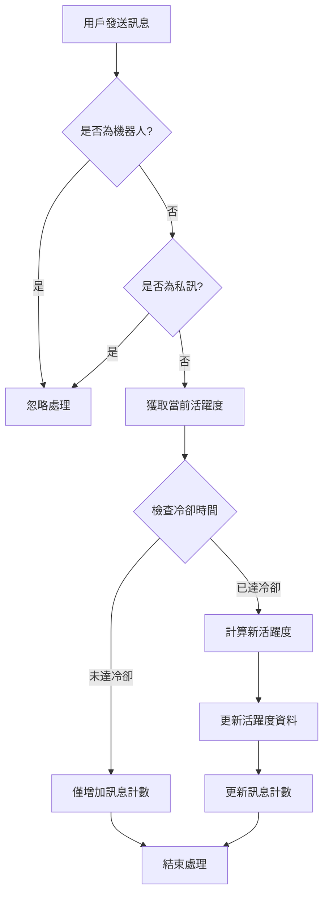

## 🔄 活躍度計算流程

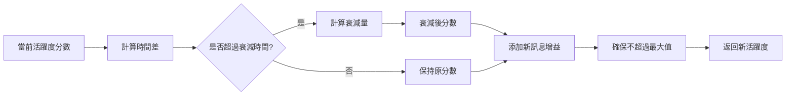

## 📈 排行榜系統流程

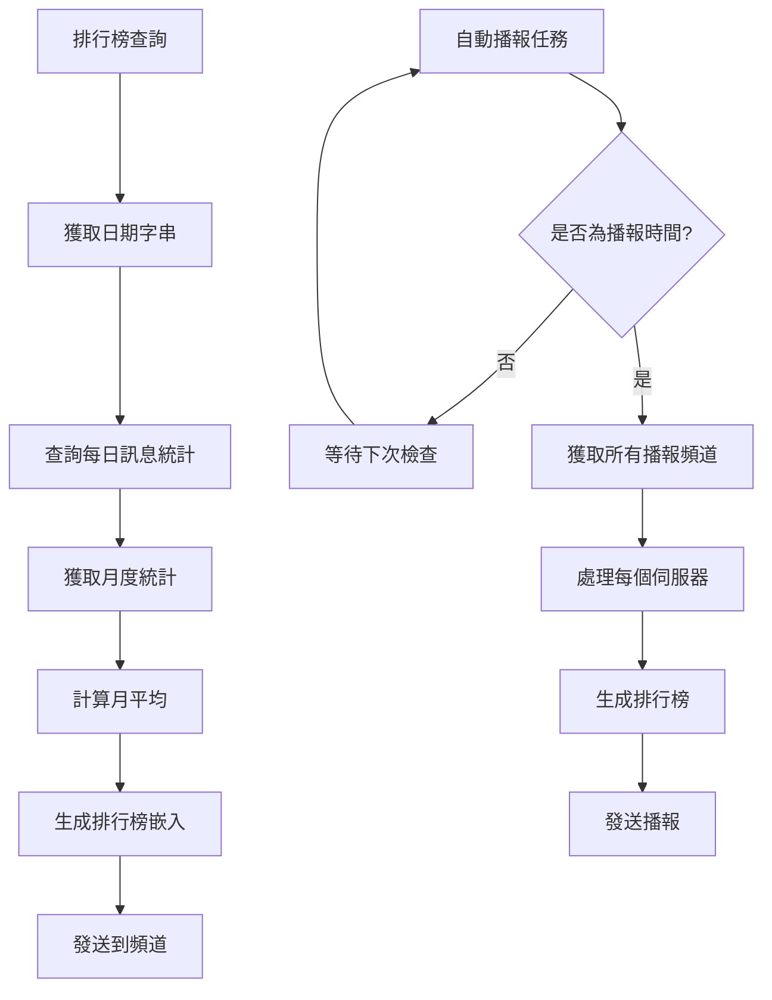

## 🎨 進度條渲染流程

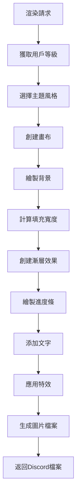

## 🗄️ 資料庫操作流程

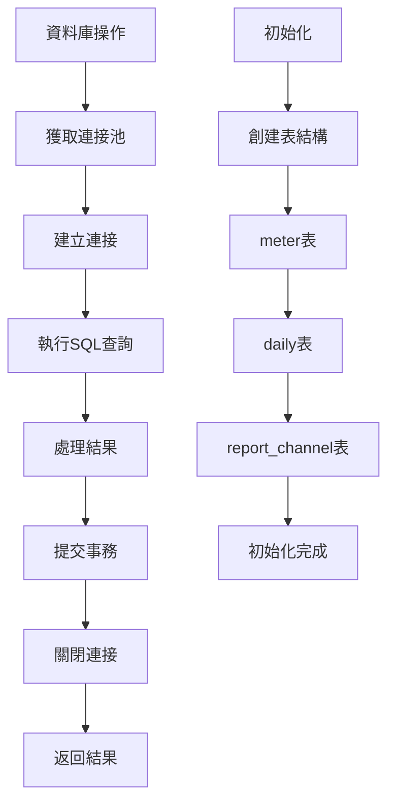

## ⚙️ 模組初始化流程

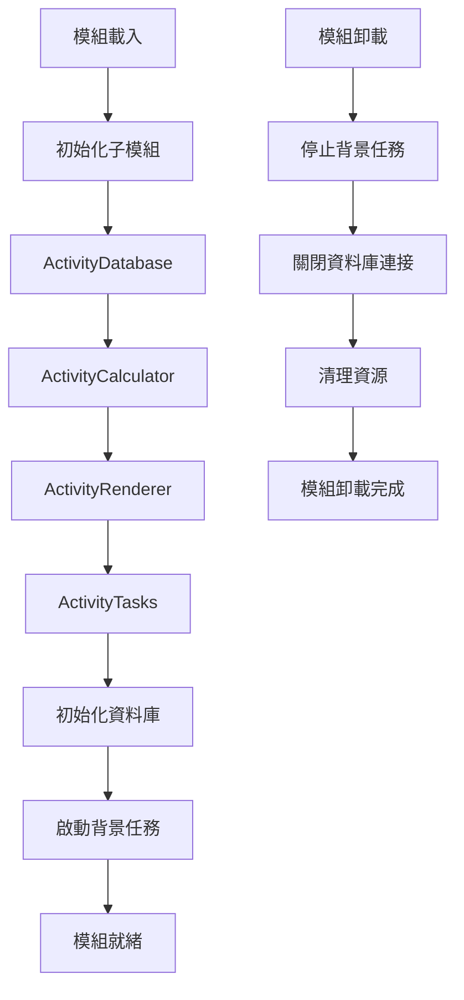

## 🎯 指令處理流程

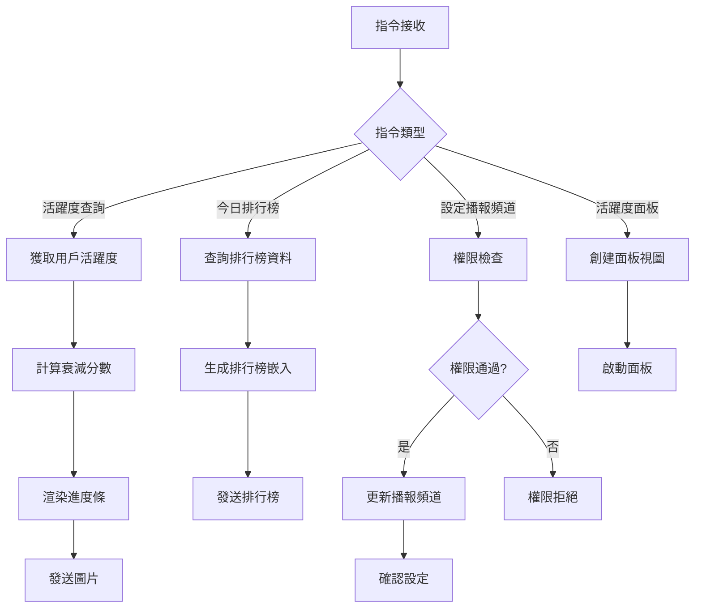

## 🔧 錯誤處理流程

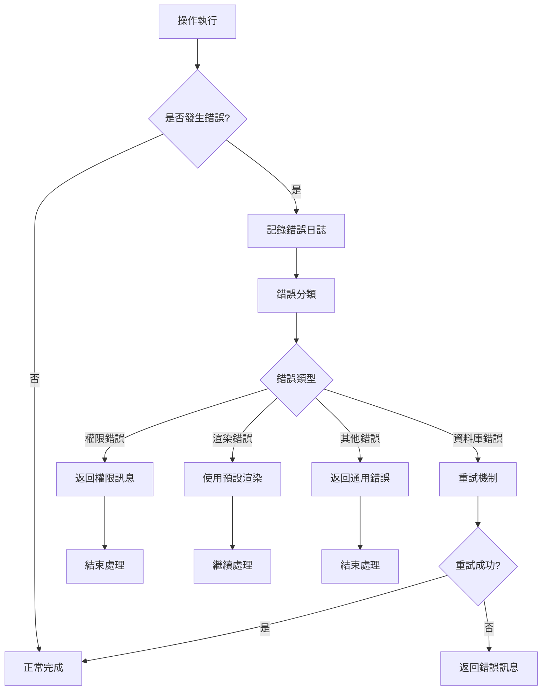

## 📊 活躍度等級系統

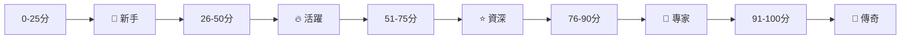

## 🎨 主題風格系統

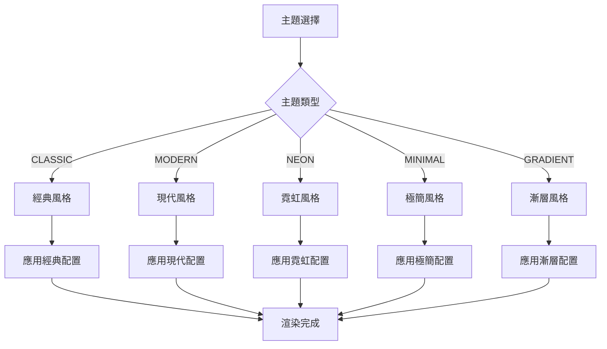

## 📈 統計資料流程

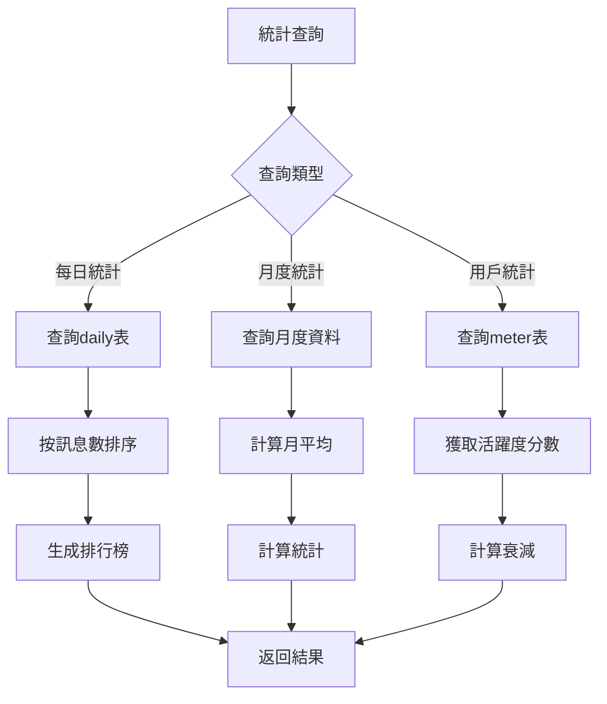

## 🔄 背景任務流程

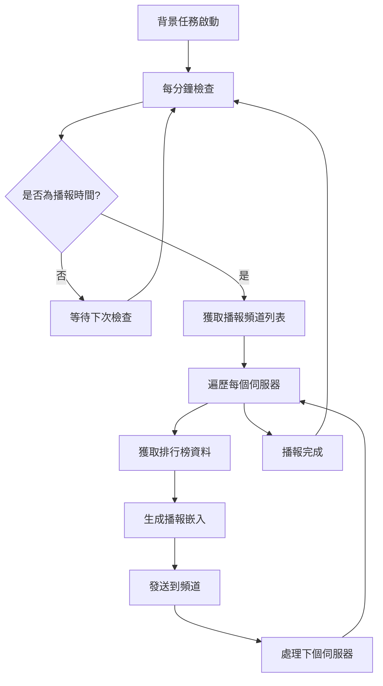

## 🎯 核心功能總結

### 📊 **活躍度計算**
- **分數範圍**: 0-100分
- **增益機制**: 每則訊息+5分
- **衰減機制**: 1小時後開始，每小時-2分
- **冷卻時間**: 60秒內不重複計算

### 🏆 **等級系統**
- **新手** (0-25分): 🌱
- **活躍** (26-50分): 🔥  
- **資深** (51-75分): ⭐
- **專家** (76-90分): 💎
- **傳奇** (91-100分): 👑

### 📈 **排行榜功能**
- **每日排行榜**: 按訊息數排序
- **月平均計算**: 當月平均每日訊息數
- **自動播報**: 每日21:00自動播報
- **自定義頻道**: 可設定播報頻道

### 🎨 **視覺化系統**
- **進度條渲染**: 漸層效果設計
- **主題風格**: 5種不同主題
- **特效系統**: 發光、陰影效果
- **等級徽章**: 動態等級顯示

### 🗄️ **資料管理**
- **SQLite資料庫**: 輕量級本地存儲
- **連接池管理**: 高效連接管理
- **事務處理**: 確保資料一致性
- **錯誤處理**: 完整的錯誤恢復機制

### ⚙️ **系統架構**
- **模組化設計**: 清晰的職責分離
- **非同步處理**: 高效的事件處理
- **背景任務**: 自動化排行榜播報
- **權限控制**: 完整的權限檢查機制