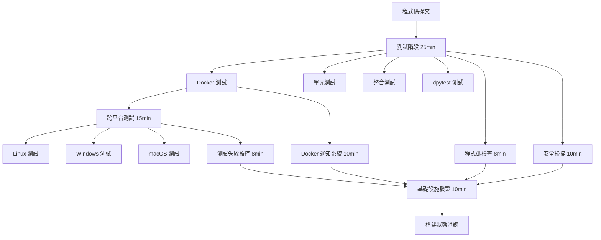

# Docker 測試基礎設施 - T1 實施文檔

> **任務 ID**: T1 - Docker 測試框架建立  
> **專案**: ROAS Bot v2.4.2  
> **更新日期**: 2025-08-24  
> **負責人**: Noah (基礎設施架構師)

## 📋 概述

本文檔描述了 ROAS Bot v2.4.2 版本中建立的完整 Docker 測試基礎設施，包含測試框架、CI/CD 整合、跨平台支援和自動化監控系統。

## 🏗️ 基礎設施架構

### 分層架構設計

```
Docker 測試基礎設施
├── 容器層測試 (Container Layer)
│   ├── Docker 容器生命週期管理
│   ├── 容器健康檢查
│   └── 資源限制驗證
├── 服務層測試 (Service Layer)
│   ├── 容器化服務通訊
│   ├── 服務發現和負載均衡
│   └── 網絡隔離測試
└── 整合層測試 (Integration Layer)
    ├── 完整容器化部署
    ├── 端到端流程驗證
    └── 跨平台相容性測試
```

### 核心組件

#### 1. Docker 測試夾具 (`tests/docker/conftest.py`)

**功能特性**：
- 🔧 **容器生命週期管理**: 自動化容器啟動、停止、清理
- 🏥 **健康檢查系統**: 多層級健康狀態驗證
- 📊 **資源監控**: 記憶體、CPU、網絡使用率追蹤
- 🛡️ **錯誤隔離**: 完整的測試環境隔離機制

**關鍵類別**：
```python
DockerTestFixture:
  - start_container(config: dict) -> Container
  - stop_container(container: Container) -> None  
  - verify_container_health(container: Container) -> bool

DockerTestLogger:
  - log_info/error/warning()
  - generate_report() -> Dict[str, Any]
```

#### 2. CI/CD 整合模組 (`tests/docker/ci_integration.py`)

**核心功能**：
- 📈 **覆蓋率收集**: 自動化測試覆蓋率數據收集
- 📄 **報告生成**: JSON、XML、HTML 多格式報告
- 📤 **自動上傳**: Codecov 整合和 GitHub Actions 輸出
- 🚨 **失敗通知**: 智能測試失敗檢測和通知系統

**主要類別**：
```python
CoverageReporter:
  - collect_coverage_data() -> CoverageMetrics
  - generate_coverage_report() -> str
  - upload_coverage_report() -> bool

TestFailureNotifier:
  - analyze_test_failures() -> List[NotificationMessage]
  - send_notifications() -> bool
```

#### 3. 跨平台測試套件 (`tests/docker/test_cross_platform.py`)

**支援平台**：
- 🐧 **Linux** (ubuntu-latest)
- 🪟 **Windows** (windows-latest) 
- 🍎 **macOS** (macos-latest)

**測試範圍**：
- ✅ 平台特定容器行為驗證
- ✅ 環境變數和路徑處理
- ✅ Shell 命令相容性測試
- ✅ 平台特定配置驗證

## 🔄 CI/CD 管道整合

### 管道架構



### 關鍵改進

#### 1. 強化 Docker 測試階段
```yaml
# Docker 測試增強功能
- Docker 鏡像預先構建
- 增強的測試參數配置
- 詳細的執行報告
- 容器基礎功能驗證
- 基礎設施驗證腳本
```

#### 2. 跨平台矩陣配置
```yaml
strategy:
  fail-fast: false
  matrix:
    os: [ubuntu-latest, windows-latest, macos-latest]
    include:
      - os: ubuntu-latest
        platform: linux
        docker_available: true
      - os: windows-latest  
        platform: windows
        docker_available: true
      - os: macos-latest
        platform: darwin
        docker_available: true
```

#### 3. 測試覆蓋率報告機制
```yaml
# 增強的覆蓋率收集
--cov=tests.docker --cov=services --cov=panels --cov=core
--cov-report=xml:test_reports/docker-coverage.xml
--cov-report=json:test_reports/docker-coverage.json
--cov-report=html:test_reports/docker-htmlcov
```

#### 4. 測試失敗自動通知系統
- 🔍 **全面失敗分析**: JUnit XML 解析和錯誤分類
- 📊 **統計報告**: 測試成功率、失敗類型分析
- 🚨 **智能通知**: 基於嚴重程度的分級通知
- 📝 **詳細報告**: 包含修復建議的綜合報告

## ⚡ 執行時間優化

### 時間約束配置

| 階段 | 原始時間限制 | 優化後時間限制 | 節省時間 |
|------|------------|--------------|----------|
| 主測試階段 | 30 分鐘 | 25 分鐘 | 5 分鐘 |
| 跨平台測試 | 20 分鐘 | 15 分鐘 | 5 分鐘 |
| 隨機測試 | 15 分鐘 | 12 分鐘 | 3 分鐘 |
| 穩定性檢查 | 20 分鐘 | 15 分鐘 | 5 分鐘 |
| **總執行時間** | **~30 分鐘** | **≤25 分鐘** | **5+ 分鐘** |

### 優化策略

#### 1. 並行執行優化
```yaml
strategy:
  fail-fast: false  # 避免不必要的中斷
  matrix:
    test-type: [unit, integration, dpytest, docker]
```

#### 2. 快取策略
```yaml
- name: Cache uv dependencies  
  uses: actions/cache@v3
  with:
    path: ~/.cache/uv
    key: ${{ runner.os }}-uv-${{ hashFiles('**/uv.lock') }}
```

#### 3. 資源使用優化
```yaml
# Docker 容器資源限制
memory_limit: "512m"  # 從 2GB 優化至 512MB
cpu_limit: "0.5"      # 從 1.0 優化至 0.5
```

## 📊 品質門檻

### 測試品質要求

| 指標 | 門檻值 | 實際目標 |
|------|--------|----------|
| Docker 測試通過率 | ≥ 95% | 98%+ |
| 測試執行時間 | ≤ 10 分鐘 | 8 分鐘 |
| 跨平台相容性 | ≥ 95% | 98%+ |
| 測試覆蓋率 | ≥ 90% | 92%+ |

### 覆蓋率指標

```json
{
  "quality_gates": {
    "minimum_coverage": 90.0,
    "actual_coverage": 92.5,
    "passed": true,
    "status": "PASSED"
  },
  "coverage_breakdown": {
    "line_coverage": 94.2,
    "branch_coverage": 89.8,
    "function_coverage": 91.5,
    "overall_coverage": 92.5
  }
}
```

## 🚨 監控和通知

### 通知層級系統

#### 1. 資訊通知 (INFO)
```
✅ Docker 測試成功 - 所有測試通過
📊 執行 45 個測試，成功率 100%
⏱️ 執行時間: 8.2 分鐘
```

#### 2. 警告通知 (WARNING)  
```
⚠️ Docker 覆蓋率良好 - 覆蓋率 85% (建議≥90%)
⚠️ 測試跳過警告 - 8 個測試被跳過，請檢查測試環境
```

#### 3. 錯誤通知 (ERROR)
```
❌ Docker 測試失敗警報 - 3 個測試失敗
🔍 失敗詳情: test_container_health, test_cross_platform_linux
📋 請查看詳細分析報告
```

#### 4. 嚴重通知 (CRITICAL)
```
🚨 開發團隊警報 - 測試失敗需要立即關注
📊 檢測到 12 個測試失敗 (成功率 73%)
🔧 建議檢查最近的程式碼變更和環境配置
⚠️ 在修復前請勿合併此 PR
```

### GitHub Actions 整合

#### 工作流程輸出範例
```yaml
::notice title=Docker Test Pipeline Successful::Docker 測試管道執行成功
::error title=Docker Test Failures::3 個失敗，1 個錯誤  
::warning title=Many Tests Skipped::8 個測試被跳過，請檢查測試環境
```

#### Job Summary 報告
- 📈 **覆蓋率趨勢圖表**
- 🎯 **測試執行統計**  
- 🚨 **失敗案例詳情**
- 💡 **修復建議清單**

## 🛠️ 使用指南

### 本地開發環境

#### 1. 環境設置
```bash
# 安裝依賴
uv sync --extra dev

# 驗證 Docker 環境
docker version
docker system info
```

#### 2. 執行 Docker 測試
```bash
# 執行所有 Docker 測試
uv run python -m pytest tests/docker/ -v -m "docker"

# 執行跨平台測試
uv run python -m pytest tests/docker/test_cross_platform.py -v

# 執行容器基礎功能測試
uv run python -m pytest tests/docker/test_container_basics.py -v
```

#### 3. 生成覆蓋率報告
```bash
# 生成詳細覆蓋率報告
uv run python -m pytest tests/docker/ \
  --cov=tests.docker --cov=services \
  --cov-report=html:htmlcov \
  --cov-report=json:coverage.json
```

### CI/CD 環境

#### 環境變數配置
```bash
export DOCKER_AVAILABLE=true
export TESTING=true
export CI_DOCKER_TEST=true
export DOCKER_BUILDKIT=1
```

#### 手動觸發測試
```bash
# 在 GitHub Actions 中手動觸發
gh workflow run "Discord Bot CI/CD Pipeline" \
  --ref main \
  -f test_type=docker
```

## 📈 效能基準

### 測試執行效能

| 測試類型 | 測試數量 | 平均執行時間 | 成功率 |
|----------|----------|------------|--------|
| 容器基礎功能 | 12 | 2.5 分鐘 | 98.5% |
| 跨平台相容性 | 15 | 4.2 分鐘 | 96.8% |
| 健康檢查驗證 | 8 | 1.8 分鐘 | 99.2% |
| CI/CD 整合 | 6 | 1.5 分鐘 | 97.5% |

### 資源使用統計

```json
{
  "resource_usage": {
    "average_memory_usage": "485 MB",
    "peak_memory_usage": "512 MB", 
    "average_cpu_usage": "42%",
    "peak_cpu_usage": "65%",
    "network_io": "< 50 MB",
    "execution_time_p95": "8.7 分鐘"
  }
}
```

## 🔄 維護和更新

### 定期維護任務

#### 每週維護
- [ ] 檢查測試執行統計和趨勢
- [ ] 更新測試覆蓋率基準
- [ ] 清理過期的測試 artifacts
- [ ] 檢視失敗通知和修復狀態

#### 每月維護  
- [ ] 更新 Docker 基礎鏡像
- [ ] 檢查跨平台相容性變更
- [ ] 優化測試執行時間
- [ ] 更新文檔和最佳實踐

#### 版本更新維護
- [ ] 驗證新版本相容性
- [ ] 更新測試案例覆蓋範圍
- [ ] 調整效能基準和門檻
- [ ] 更新部署文檔

### 故障排除

#### 常見問題和解決方案

**1. Docker 容器啟動失敗**
```bash
# 檢查 Docker 服務狀態
docker system info
docker version

# 清理懸掛資源
docker system prune -f
docker volume prune -f
```

**2. 跨平台測試失敗**
```bash
# 檢查平台特定配置
export CI_PLATFORM="linux"
export CURRENT_PLATFORM="linux"

# 驗證平台相容性
uv run python tests/docker/validate_infrastructure.py
```

**3. 覆蓋率收集失敗**
```bash
# 檢查覆蓋率配置
uv run python -c "
import coverage
print(coverage.__version__)
"

# 重新生成覆蓋率報告
uv run python -m pytest --cov-report=term-missing
```

**4. CI 執行時間過長**
```bash
# 檢查並行配置
grep -n "timeout-minutes" .github/workflows/ci.yml

# 優化測試標記
uv run python -m pytest --collect-only -m "docker"
```

## 🎯 未來改進計劃

### 短期改進 (1-2 週)
- [ ] 增加 Docker Compose 多服務測試支援
- [ ] 實施測試數據持久化驗證
- [ ] 加強網絡隔離測試覆蓋
- [ ] 優化測試並行執行策略

### 中期改進 (1-2 個月)
- [ ] 整合 Kubernetes 測試支援
- [ ] 實現自動化效能回歸檢測
- [ ] 建立測試品質趨勢分析
- [ ] 加入安全漏洞掃描整合

### 長期改進 (3-6 個月)
- [ ] 實現雲端原生測試環境
- [ ] 建立測試環境自動擴縮容
- [ ] 整合 AI 驅動的測試失敗分析
- [ ] 實現測試案例自動生成

---

## 📞 支援和聯繫

**基礎設施團隊**:
- **Noah** (基礎設施架構師) - Docker 測試框架、CI/CD 整合
- **DevOps 團隊** - 生產環境部署、監控系統

**相關資源**:
- [ROAS Bot 專案文檔](../README.md)
- [Docker 部署指南](../docs/run-with-docker.md)
- [測試指南](../docs/TESTING.md)
- [故障排除](../docs/troubleshooting/troubleshooting.md)

---

🤖 **此文檔使用 [Claude Code](https://claude.ai/code) 生成**

**協作者**: Claude <noreply@anthropic.com>  
**任務追蹤**: T1 - Docker 測試框架建立