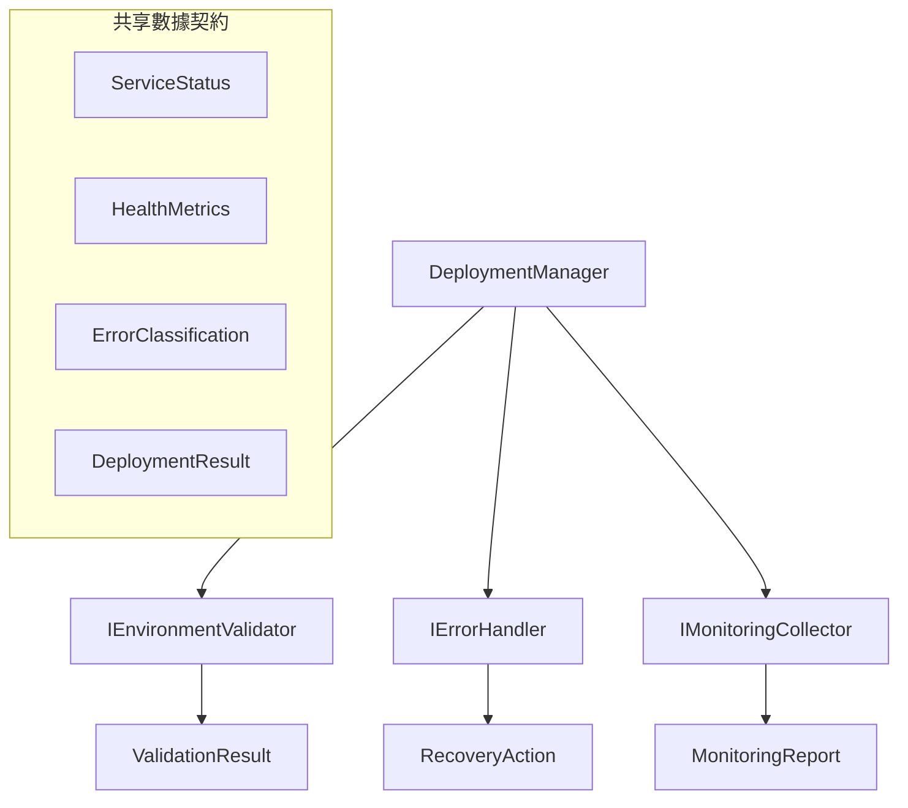

# ROAS Bot v2.4.3 API契約與模組介面設計
**Task ID: 1** - Docker啟動系統修復

## 🔗 模組介面契約總覽

### 核心介面架構



## 📋 核心介面定義

### 1. IEnvironmentValidator 介面

```python
from abc import ABC, abstractmethod
from typing import List, Tuple, Optional
from dataclasses import dataclass
from enum import Enum

class ValidationSeverity(Enum):
    INFO = "info"
    WARNING = "warning"
    ERROR = "error"
    CRITICAL = "critical"

@dataclass
class ValidationCheck:
    name: str
    passed: bool
    message: str
    severity: ValidationSeverity
    suggestions: Optional[List[str]] = None
    metadata: Optional[Dict[str, Any]] = None

@dataclass
class EnvironmentValidationResult:
    overall_passed: bool
    checks: List[ValidationCheck]
    system_info: Dict[str, str]
    recommendations: List[str]
    critical_issues: List[str]
    timestamp: datetime

class IEnvironmentValidator(ABC):
    """環境驗證器介面契約"""
    
    @abstractmethod
    async def validate_environment(self) -> EnvironmentValidationResult:
        """
        完整環境驗證
        
        Returns:
            EnvironmentValidationResult: 驗證結果，包含所有檢查項目
        """
        pass
    
    @abstractmethod
    async def validate_docker_environment(self) -> ValidationCheck:
        """Docker環境專項檢查"""
        pass
    
    @abstractmethod
    async def validate_system_requirements(self) -> List[ValidationCheck]:
        """系統需求檢查"""
        pass
    
    @abstractmethod
    async def validate_project_configuration(self) -> List[ValidationCheck]:
        """專案配置檢查"""
        pass
    
    @abstractmethod
    async def quick_validation(self) -> Tuple[bool, List[str]]:
        """快速驗證，返回簡化結果"""
        pass
```

### 2. IDeploymentManager 介面

```python
from enum import Enum
from typing import Dict, List, Optional, Any

class DeploymentStatus(Enum):
    PENDING = "pending"
    STARTING = "starting" 
    RUNNING = "running"
    STOPPING = "stopping"
    STOPPED = "stopped"
    FAILED = "failed"
    HEALTHY = "healthy"
    UNHEALTHY = "unhealthy"

@dataclass
class ServiceInfo:
    name: str
    status: DeploymentStatus
    container_id: Optional[str]
    health_status: Optional[str]
    uptime_seconds: Optional[float]
    restart_count: int
    last_error: Optional[str]
    resource_usage: Optional[Dict[str, Any]]

@dataclass
class DeploymentResult:
    success: bool
    deployment_id: str
    message: str
    services: List[ServiceInfo]
    duration_seconds: float
    timestamp: datetime
    errors: List[str]
    warnings: List[str]

class IDeploymentManager(ABC):
    """部署管理器介面契約"""
    
    @abstractmethod
    async def start_services(
        self, 
        detach: bool = True, 
        build: bool = True, 
        environment: str = "dev"
    ) -> DeploymentResult:
        """
        啟動服務
        
        Args:
            detach: 是否在背景執行
            build: 是否重新建置映像
            environment: 目標環境
            
        Returns:
            DeploymentResult: 部署結果
        """
        pass
    
    @abstractmethod
    async def stop_services(self, timeout: int = 30) -> DeploymentResult:
        """停止服務"""
        pass
    
    @abstractmethod
    async def restart_services(self, timeout: int = 30) -> DeploymentResult:
        """重啟服務"""
        pass
    
    @abstractmethod
    async def get_deployment_status(self) -> Dict[str, Any]:
        """獲取部署狀態"""
        pass
    
    @abstractmethod
    async def health_check_all_services(self) -> List[ServiceInfo]:
        """檢查所有服務健康狀態"""
        pass
```

### 3. IErrorHandler 介面

```python
from enum import Enum
from typing import List, Optional, Any, Callable

class ErrorCategory(Enum):
    ENVIRONMENT = "environment"
    DOCKER = "docker"
    NETWORK = "network"
    CONFIGURATION = "configuration"
    PERMISSION = "permission"
    RESOURCE = "resource"
    SERVICE = "service"
    DEPENDENCY = "dependency"
    UNKNOWN = "unknown"

class ErrorSeverity(Enum):
    LOW = "low"
    MEDIUM = "medium"
    HIGH = "high"
    CRITICAL = "critical"

@dataclass
class ErrorClassification:
    category: ErrorCategory
    severity: ErrorSeverity
    auto_recoverable: bool
    estimated_recovery_time: Optional[int]  # seconds
    confidence_score: float  # 0.0 - 1.0

@dataclass
class RecoveryAction:
    action_id: str
    action_type: str
    description: str
    command: Optional[str]
    parameters: Dict[str, Any]
    timeout_seconds: int
    retry_attempts: int
    prerequisites: List[str]
    success_criteria: List[str]
    rollback_action: Optional[str]

@dataclass
class ErrorContext:
    operation: str
    component: str
    environment: str
    user_id: Optional[str]
    additional_data: Dict[str, Any]

class IErrorHandler(ABC):
    """錯誤處理器介面契約"""
    
    @abstractmethod
    async def handle_error(
        self, 
        error: Exception, 
        context: ErrorContext
    ) -> RecoveryAction:
        """
        處理錯誤並生成恢復動作
        
        Args:
            error: 異常物件
            context: 錯誤上下文
            
        Returns:
            RecoveryAction: 建議的恢復動作
        """
        pass
    
    @abstractmethod
    async def classify_error(
        self, 
        error: Exception, 
        context: ErrorContext
    ) -> ErrorClassification:
        """錯誤分類"""
        pass
    
    @abstractmethod
    async def execute_recovery_action(
        self, 
        error_id: str, 
        action: RecoveryAction
    ) -> bool:
        """執行恢復動作"""
        pass
    
    @abstractmethod
    async def get_recovery_suggestions(
        self, 
        error_category: ErrorCategory
    ) -> List[RecoveryAction]:
        """獲取恢復建議"""
        pass
    
    @abstractmethod
    async def register_custom_handler(
        self, 
        error_pattern: str, 
        handler: Callable[[Exception, ErrorContext], RecoveryAction]
    ) -> bool:
        """註冊自定義錯誤處理器"""
        pass
```

### 4. IMonitoringCollector 介面

```python
from enum import Enum
from typing import Dict, List, Optional, Any

class HealthStatus(Enum):
    HEALTHY = "healthy"
    DEGRADED = "degraded"
    UNHEALTHY = "unhealthy"
    UNKNOWN = "unknown"

@dataclass
class SystemMetrics:
    timestamp: datetime
    cpu_usage_percent: float
    memory_usage_percent: float
    memory_available_gb: float
    disk_usage_percent: float
    disk_free_gb: float
    network_io: Dict[str, int]
    load_average: List[float]

@dataclass
class ServiceMetrics:
    service_name: str
    status: HealthStatus
    response_time_ms: Optional[float]
    cpu_usage_percent: Optional[float]
    memory_usage_mb: Optional[float]
    error_rate_percent: Optional[float]
    uptime_seconds: Optional[float]
    restart_count: int
    health_checks: Dict[str, bool]
    custom_metrics: Dict[str, Any]

@dataclass
class MonitoringAlert:
    alert_id: str
    alert_type: str
    severity: str
    service_name: Optional[str]
    message: str
    threshold: Optional[float]
    current_value: Optional[float]
    timestamp: datetime
    resolved: bool

@dataclass
class MonitoringReport:
    timestamp: datetime
    overall_status: HealthStatus
    system_metrics: SystemMetrics
    service_metrics: List[ServiceMetrics]
    alerts: List[MonitoringAlert]
    recommendations: List[str]
    summary: Dict[str, Any]

class IMonitoringCollector(ABC):
    """監控收集器介面契約"""
    
    @abstractmethod
    async def collect_all_metrics(self) -> MonitoringReport:
        """
        收集所有監控指標
        
        Returns:
            MonitoringReport: 完整的監控報告
        """
        pass
    
    @abstractmethod
    async def collect_system_metrics(self) -> SystemMetrics:
        """收集系統指標"""
        pass
    
    @abstractmethod
    async def collect_service_metrics(self, service_name: str) -> ServiceMetrics:
        """收集特定服務指標"""
        pass
    
    @abstractmethod
    async def check_service_health(self, service_name: str) -> HealthStatus:
        """檢查服務健康狀態"""
        pass
    
    @abstractmethod
    async def register_custom_metric(
        self, 
        metric_name: str, 
        collector_func: Callable[[], float]
    ) -> bool:
        """註冊自定義指標"""
        pass
    
    @abstractmethod
    async def set_alert_threshold(
        self, 
        metric_name: str, 
        warning_threshold: float, 
        critical_threshold: float
    ) -> bool:
        """設定告警閾值"""
        pass
```

## 🔄 模組間協作流程

### 1. 完整部署流程契約

```python
class IDeploymentOrchestrator(ABC):
    """部署編排器 - 協調各模組協作"""
    
    async def full_deployment_flow(
        self, 
        environment: str,
        options: DeploymentOptions
    ) -> DeploymentResult:
        """
        完整部署流程契約
        
        流程順序：
        1. 環境驗證 (IEnvironmentValidator)
        2. 服務啟動 (IDeploymentManager)  
        3. 健康檢查 (IMonitoringCollector)
        4. 錯誤處理 (IErrorHandler)
        """
        
        deployment_id = generate_deployment_id()
        
        try:
            # 階段1：環境驗證
            validation_result = await self.env_validator.validate_environment()
            if not validation_result.overall_passed:
                critical_issues = [
                    check for check in validation_result.checks 
                    if check.severity == ValidationSeverity.CRITICAL
                ]
                if critical_issues:
                    raise EnvironmentValidationError(critical_issues)
            
            # 階段2：服務啟動
            deployment_result = await self.deployment_manager.start_services(
                detach=options.detach,
                build=options.build,
                environment=environment
            )
            
            if not deployment_result.success:
                raise DeploymentError(deployment_result.errors)
            
            # 階段3：健康檢查
            monitoring_report = await self.monitoring_collector.collect_all_metrics()
            
            if monitoring_report.overall_status == HealthStatus.UNHEALTHY:
                unhealthy_services = [
                    service for service in monitoring_report.service_metrics
                    if service.status == HealthStatus.UNHEALTHY
                ]
                raise HealthCheckError(unhealthy_services)
            
            return DeploymentResult(
                success=True,
                deployment_id=deployment_id,
                message="部署成功完成",
                services=deployment_result.services,
                duration_seconds=deployment_result.duration_seconds,
                timestamp=datetime.now(),
                errors=[],
                warnings=[]
            )
            
        except Exception as e:
            # 階段4：錯誤處理
            error_context = ErrorContext(
                operation="full_deployment",
                component="deployment_orchestrator",
                environment=environment,
                additional_data={"deployment_id": deployment_id}
            )
            
            recovery_action = await self.error_handler.handle_error(e, error_context)
            
            # 嘗試自動恢復
            if recovery_action.action_type != "manual_intervention":
                recovery_success = await self.error_handler.execute_recovery_action(
                    deployment_id, recovery_action
                )
                
                if recovery_success:
                    # 恢復成功，重新檢查狀態
                    final_check = await self.monitoring_collector.collect_all_metrics()
                    if final_check.overall_status != HealthStatus.UNHEALTHY:
                        return DeploymentResult(
                            success=True,
                            deployment_id=deployment_id,
                            message=f"部署成功（經自動恢復）: {recovery_action.description}",
                            services=await self.deployment_manager.health_check_all_services(),
                            duration_seconds=0,  # 需要重新計算
                            timestamp=datetime.now(),
                            errors=[],
                            warnings=[f"已自動恢復錯誤: {str(e)}"]
                        )
            
            # 恢復失敗，返回失敗結果
            return DeploymentResult(
                success=False,
                deployment_id=deployment_id,
                message=f"部署失敗: {str(e)}",
                services=[],
                duration_seconds=0,
                timestamp=datetime.now(),
                errors=[str(e)],
                warnings=[]
            )
```

### 2. 事件驅動協作機制

```python
from typing import Callable, List
from abc import ABC, abstractmethod

class IEventBus(ABC):
    """事件總線介面"""
    
    @abstractmethod
    async def publish(self, event: Event) -> bool:
        """發佈事件"""
        pass
    
    @abstractmethod
    async def subscribe(
        self, 
        event_type: str, 
        handler: Callable[[Event], None]
    ) -> bool:
        """訂閱事件"""
        pass

@dataclass
class Event:
    event_id: str
    event_type: str
    source_module: str
    timestamp: datetime
    data: Dict[str, Any]
    correlation_id: Optional[str] = None

# 定義標準事件類型
class EventTypes:
    # 環境驗證事件
    ENVIRONMENT_VALIDATION_STARTED = "environment.validation.started"
    ENVIRONMENT_VALIDATION_COMPLETED = "environment.validation.completed"
    ENVIRONMENT_VALIDATION_FAILED = "environment.validation.failed"
    
    # 部署事件
    DEPLOYMENT_STARTED = "deployment.started"
    DEPLOYMENT_COMPLETED = "deployment.completed"
    DEPLOYMENT_FAILED = "deployment.failed"
    SERVICE_STARTED = "service.started"
    SERVICE_STOPPED = "service.stopped"
    SERVICE_RESTARTED = "service.restarted"
    
    # 監控事件
    HEALTH_CHECK_COMPLETED = "monitoring.health_check.completed"
    ALERT_TRIGGERED = "monitoring.alert.triggered"
    ALERT_RESOLVED = "monitoring.alert.resolved"
    METRICS_COLLECTED = "monitoring.metrics.collected"
    
    # 錯誤處理事件
    ERROR_DETECTED = "error.detected"
    ERROR_CLASSIFIED = "error.classified"
    RECOVERY_STARTED = "recovery.started"
    RECOVERY_COMPLETED = "recovery.completed"
    RECOVERY_FAILED = "recovery.failed"

# 模組間事件驱动協作範例
class DeploymentManagerEventIntegration:
    """部署管理器事件整合"""
    
    def __init__(self, event_bus: IEventBus):
        self.event_bus = event_bus
        self._setup_event_handlers()
    
    async def _setup_event_handlers(self):
        """設定事件處理器"""
        
        # 訂閱環境驗證完成事件
        await self.event_bus.subscribe(
            EventTypes.ENVIRONMENT_VALIDATION_COMPLETED,
            self._handle_validation_completed
        )
        
        # 訂閱錯誤檢測事件
        await self.event_bus.subscribe(
            EventTypes.ERROR_DETECTED,
            self._handle_error_detected
        )
        
        # 訂閱告警觸發事件
        await self.event_bus.subscribe(
            EventTypes.ALERT_TRIGGERED,
            self._handle_alert_triggered
        )
    
    async def _handle_validation_completed(self, event: Event):
        """處理環境驗證完成事件"""
        validation_result = event.data.get('validation_result')
        
        if validation_result and validation_result.get('overall_passed'):
            # 驗證通過，可以開始部署
            await self.event_bus.publish(Event(
                event_id=generate_event_id(),
                event_type=EventTypes.DEPLOYMENT_STARTED,
                source_module="deployment_manager",
                timestamp=datetime.now(),
                data={"trigger": "validation_success"},
                correlation_id=event.correlation_id
            ))
    
    async def _handle_error_detected(self, event: Event):
        """處理錯誤檢測事件"""
        error_info = event.data.get('error_info')
        
        if error_info and error_info.get('category') == 'deployment':
            # 部署相關錯誤，暫停部署操作
            await self._pause_deployment(event.correlation_id)
            
            # 發佈部署暫停事件
            await self.event_bus.publish(Event(
                event_id=generate_event_id(),
                event_type="deployment.paused",
                source_module="deployment_manager",
                timestamp=datetime.now(),
                data={"reason": "error_detected"},
                correlation_id=event.correlation_id
            ))
```

## 🛡️ 契約驗證機制

### 1. 介面契約測試

```python
import pytest
from typing import Any

class ContractTestBase:
    """契約測試基類"""
    
    async def test_contract_compliance(self, implementation: Any):
        """測試實現是否符合契約"""
        
        # 檢查必要方法是否存在
        required_methods = self.get_required_methods()
        for method_name in required_methods:
            assert hasattr(implementation, method_name), f"缺少必要方法: {method_name}"
        
        # 檢查方法簽名
        await self.verify_method_signatures(implementation)
        
        # 檢查返回值類型
        await self.verify_return_types(implementation)
    
    @abstractmethod
    def get_required_methods(self) -> List[str]:
        """獲取必要方法列表"""
        pass
    
    @abstractmethod
    async def verify_method_signatures(self, implementation: Any):
        """驗證方法簽名"""
        pass
    
    @abstractmethod
    async def verify_return_types(self, implementation: Any):
        """驗證返回值類型"""
        pass

class EnvironmentValidatorContractTest(ContractTestBase):
    """環境驗證器契約測試"""
    
    def get_required_methods(self) -> List[str]:
        return [
            'validate_environment',
            'validate_docker_environment',
            'validate_system_requirements',
            'validate_project_configuration',
            'quick_validation'
        ]
    
    async def verify_method_signatures(self, implementation: IEnvironmentValidator):
        """驗證方法簽名"""
        
        # 測試 validate_environment 方法
        result = await implementation.validate_environment()
        assert isinstance(result, EnvironmentValidationResult)
        assert hasattr(result, 'overall_passed')
        assert hasattr(result, 'checks')
        assert hasattr(result, 'recommendations')
        
        # 測試 quick_validation 方法
        passed, errors = await implementation.quick_validation()
        assert isinstance(passed, bool)
        assert isinstance(errors, list)

# 使用契約測試範例
@pytest.mark.asyncio
async def test_environment_validator_contract():
    """測試環境驗證器契約合規性"""
    from core.environment_validator import EnvironmentValidator
    
    validator = EnvironmentValidator()
    contract_test = EnvironmentValidatorContractTest()
    
    await contract_test.test_contract_compliance(validator)
```

### 2. 資料契約驗證

```python
from pydantic import BaseModel, validator
from typing import List, Optional

class ValidationCheckSchema(BaseModel):
    """驗證檢查資料契約"""
    name: str
    passed: bool
    message: str
    severity: ValidationSeverity
    suggestions: Optional[List[str]]
    metadata: Optional[Dict[str, Any]]
    
    @validator('name')
    def name_not_empty(cls, v):
        assert len(v.strip()) > 0, '檢查名稱不能為空'
        return v
    
    @validator('message')
    def message_not_empty(cls, v):
        assert len(v.strip()) > 0, '檢查訊息不能為空'
        return v

class ServiceInfoSchema(BaseModel):
    """服務資訊資料契約"""
    name: str
    status: DeploymentStatus
    container_id: Optional[str]
    health_status: Optional[str]
    uptime_seconds: Optional[float]
    restart_count: int
    last_error: Optional[str]
    resource_usage: Optional[Dict[str, Any]]
    
    @validator('restart_count')
    def restart_count_non_negative(cls, v):
        assert v >= 0, '重啟次數不能為負數'
        return v

def validate_contract_data(data: Dict[str, Any], schema_class: type) -> bool:
    """驗證資料是否符合契約"""
    try:
        schema_class.parse_obj(data)
        return True
    except Exception as e:
        logger.error(f"契約驗證失敗: {str(e)}")
        return False
```

## 📚 API文檔自動生成

### 1. OpenAPI規範生成

```python
from fastapi import FastAPI
from pydantic import BaseModel

# 創建API文檔應用
api_docs_app = FastAPI(
    title="ROAS Bot v2.4.3 Docker啟動系統 API",
    description="Docker啟動系統修復任務的API文檔",
    version="2.4.3"
)

# 環境驗證API端點
@api_docs_app.post("/api/v1/validation/environment", response_model=EnvironmentValidationResult)
async def validate_environment_api():
    """環境驗證API端點"""
    pass

# 部署管理API端點  
@api_docs_app.post("/api/v1/deployment/start", response_model=DeploymentResult)
async def start_deployment_api(options: DeploymentOptions):
    """啟動部署API端點"""
    pass

# 監控收集API端點
@api_docs_app.get("/api/v1/monitoring/report", response_model=MonitoringReport)
async def get_monitoring_report_api():
    """獲取監控報告API端點"""
    pass

# 錯誤處理API端點
@api_docs_app.post("/api/v1/error/handle", response_model=RecoveryAction)
async def handle_error_api(error_info: Dict[str, Any]):
    """錯誤處理API端點"""
    pass
```

### 2. 介面文檔生成器

```python
import inspect
from typing import get_type_hints

class InterfaceDocGenerator:
    """介面文檔自動生成器"""
    
    def generate_interface_docs(self, interface_class: type) -> str:
        """生成介面文檔"""
        
        doc_lines = [
            f"# {interface_class.__name__} 介面文檔",
            "",
            f"## 描述",
            f"{interface_class.__doc__ or '無描述'}",
            "",
            f"## 方法列表"
        ]
        
        for method_name in dir(interface_class):
            if method_name.startswith('_'):
                continue
                
            method = getattr(interface_class, method_name)
            if not callable(method):
                continue
            
            # 獲取方法簽名
            signature = inspect.signature(method)
            type_hints = get_type_hints(method)
            
            doc_lines.extend([
                f"",
                f"### {method_name}",
                f"",
                f"**簽名**: `{method_name}{signature}`",
                f"",
                f"**描述**: {method.__doc__ or '無描述'}",
                f"",
                f"**參數**:"
            ])
            
            for param_name, param in signature.parameters.items():
                param_type = type_hints.get(param_name, 'Any')
                doc_lines.append(f"- `{param_name}`: {param_type}")
            
            return_type = type_hints.get('return', 'None')
            doc_lines.extend([
                f"",
                f"**返回值**: {return_type}"
            ])
        
        return "\n".join(doc_lines)

# 生成所有介面文檔
interfaces = [
    IEnvironmentValidator,
    IDeploymentManager, 
    IErrorHandler,
    IMonitoringCollector
]

doc_generator = InterfaceDocGenerator()
for interface in interfaces:
    interface_doc = doc_generator.generate_interface_docs(interface)
    
    # 保存文檔文件
    doc_path = f"docs/api/{interface.__name__.lower()}.md"
    with open(doc_path, 'w', encoding='utf-8') as f:
        f.write(interface_doc)
```

## 🎯 契約驗收標準

### 1. 介面合規性檢查清單

- [ ] **方法簽名一致性**：所有實現類的方法簽名與介面定義完全一致
- [ ] **返回值類型正確**：返回值類型符合介面契約規範
- [ ] **異常處理標準**：異常拋出和處理符合契約定義
- [ ] **參數驗證完整**：輸入參數驗證覆蓋所有邊界條件
- [ ] **資料契約遵循**：資料結構符合定義的Schema規範

### 2. 模組間協作驗收

- [ ] **事件驅動完整性**：所有模組間通信都通過定義的事件機制
- [ ] **錯誤傳播正確性**：錯誤能正確在模組間傳播和處理
- [ ] **狀態同步一致性**：模組間狀態保持同步
- [ ] **資源清理完整性**：模組銷毀時能正確清理資源
- [ ] **並發安全性**：模組間協作在併發環境下安全可靠

### 3. API文檔完整性

- [ ] **文檔自動生成**：API文檔能從契約定義自動生成
- [ ] **範例程式碼完整**：每個API都有完整的使用範例
- [ ] **錯誤碼文檔化**：所有可能的錯誤情況都有文檔說明
- [ ] **版本相容性說明**：API版本變化和相容性清晰說明
- [ ] **效能指標說明**：API的效能特性和限制清晰文檔化

這個API契約與模組介面設計確保了：

1. **嚴格的介面規範**：每個模組都有清晰、完整的介面定義
2. **強類型資料契約**：所有資料交換都有明確的類型定義和驗證
3. **事件驅動協作**：模組間通過標準化事件機制進行松耦合協作
4. **自動化契約驗證**：通過測試確保實現符合契約規範
5. **完整的文檔支持**：API文檔自動生成，保持與實現同步

這為ROAS Bot v2.4.3的各模組協作提供了堅實的契約基礎！