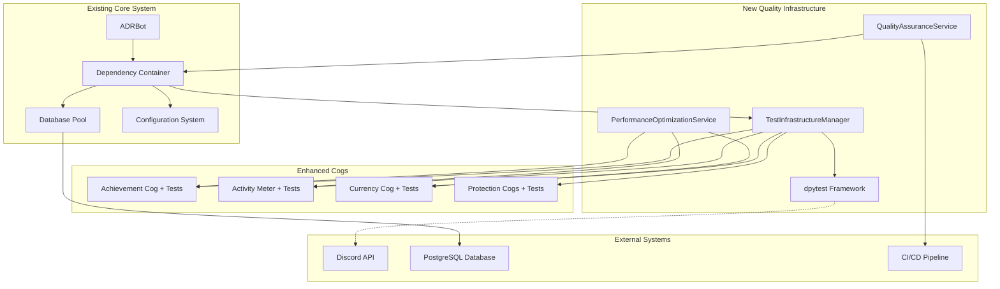

# Component Architecture

Based on my analysis of your existing codebase, I've identified that your project follows a clear modular cog architecture with dependency injection. The new components I'm proposing follow the existing architectural patterns I identified in your codebase: the cog-based module structure, dependency injection through the container system, and the layered approach (config → database → panel → main). The integration interfaces respect your current component structure and communication patterns.

### New Components

#### TestInfrastructureManager
**Responsibility:** Centralized management of testing infrastructure, fixtures, and test data lifecycle
**Integration Points:** Integrates with existing dependency injection container, manages test database lifecycle

**Key Interfaces:**
- setup_test_environment() - Initialize test infrastructure
- cleanup_test_data() - Clean test artifacts
- create_mock_discord_client() - dpytest integration

**Dependencies:**
- **Existing Components:** Core container, database pool, configuration system
- **New Components:** dpytest fixtures, test data factories

**Technology Stack:** pytest fixtures, dpytest, asyncio, PostgreSQL testcontainers

#### QualityAssuranceService
**Responsibility:** Automated code quality enforcement, static analysis integration, and quality metrics tracking
**Integration Points:** CI/CD pipeline integration, pre-commit hooks, quality gate enforcement

**Key Interfaces:**
- run_quality_checks() - Execute ruff + mypy analysis
- generate_quality_report() - Quality metrics and trends
- enforce_quality_gates() - Block non-compliant code

**Dependencies:**
- **Existing Components:** Project configuration, logging system
- **New Components:** ruff configuration, mypy settings

**Technology Stack:** ruff, mypy, pytest-cov, CI/CD integration

#### PerformanceOptimizationService
**Responsibility:** numpy integration across modules, performance monitoring, and optimization of computational operations
**Integration Points:** Existing statistics calculations, activity meter computations, achievement progress tracking

**Key Interfaces:**
- optimize_calculations() - Convert operations to numpy
- benchmark_performance() - Performance measurement
- monitor_memory_usage() - Resource tracking

**Dependencies:**
- **Existing Components:** Activity meter, achievement tracker, statistics modules
- **New Components:** numpy computational engines

**Technology Stack:** numpy, psutil, performance profiling tools

### Component Interaction Diagram


