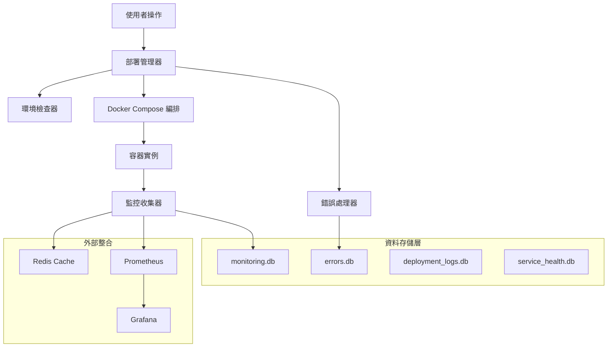

# ROAS Bot v2.4.3 資料流架構設計
**Task ID: 1** - Docker啟動系統修復

## 🏗️ 整體資料流架構

### 分層資料流設計



## 📊 資料庫架構設計

### 1. 部署日誌資料庫 (deployment_logs.db)

```sql
-- 部署操作記錄
CREATE TABLE deployment_operations (
    id INTEGER PRIMARY KEY AUTOINCREMENT,
    deployment_id TEXT NOT NULL UNIQUE,
    operation_type TEXT NOT NULL, -- start, stop, restart, health_check
    environment TEXT NOT NULL,    -- dev, prod
    status TEXT NOT NULL,         -- pending, running, success, failed
    start_time DATETIME DEFAULT CURRENT_TIMESTAMP,
    end_time DATETIME,
    duration_ms INTEGER,
    user_agent TEXT,
    metadata TEXT, -- JSON format
    INDEX idx_deployment_id (deployment_id),
    INDEX idx_operation_type (operation_type),
    INDEX idx_status (status),
    INDEX idx_start_time (start_time)
);

-- 服務狀態變更記錄
CREATE TABLE service_state_changes (
    id INTEGER PRIMARY KEY AUTOINCREMENT,
    deployment_id TEXT NOT NULL,
    service_name TEXT NOT NULL,
    previous_state TEXT,
    new_state TEXT NOT NULL,
    change_time DATETIME DEFAULT CURRENT_TIMESTAMP,
    change_reason TEXT,
    metadata TEXT, -- JSON format
    FOREIGN KEY (deployment_id) REFERENCES deployment_operations(deployment_id),
    INDEX idx_service_name (service_name),
    INDEX idx_change_time (change_time)
);

-- 環境驗證記錄
CREATE TABLE environment_validations (
    id INTEGER PRIMARY KEY AUTOINCREMENT,
    deployment_id TEXT NOT NULL,
    validation_time DATETIME DEFAULT CURRENT_TIMESTAMP,
    overall_result BOOLEAN NOT NULL,
    failed_checks TEXT, -- JSON array
    validation_details TEXT, -- JSON format
    recommendations TEXT, -- JSON array
    FOREIGN KEY (deployment_id) REFERENCES deployment_operations(deployment_id)
);
```

### 2. 擴展現有監控資料庫 (monitoring.db)

```sql
-- 新增：部署健康狀態歷史
CREATE TABLE deployment_health_history (
    id INTEGER PRIMARY KEY AUTOINCREMENT,
    timestamp DATETIME DEFAULT CURRENT_TIMESTAMP,
    deployment_id TEXT,
    overall_health TEXT NOT NULL, -- healthy, degraded, unhealthy
    services_total INTEGER,
    services_healthy INTEGER,
    services_degraded INTEGER,
    services_unhealthy INTEGER,
    system_load_avg REAL,
    critical_alerts_count INTEGER,
    INDEX idx_timestamp (timestamp),
    INDEX idx_deployment_id (deployment_id)
);

-- 新增：服務依賴關係
CREATE TABLE service_dependencies (
    id INTEGER PRIMARY KEY AUTOINCREMENT,
    service_name TEXT NOT NULL,
    depends_on_service TEXT NOT NULL,
    dependency_type TEXT NOT NULL, -- required, optional, performance
    health_impact TEXT NOT NULL,   -- critical, moderate, low
    last_check DATETIME DEFAULT CURRENT_TIMESTAMP,
    status TEXT DEFAULT 'active',  -- active, inactive, failed
    UNIQUE(service_name, depends_on_service)
);

-- 新增：效能基準線
CREATE TABLE performance_baselines (
    id INTEGER PRIMARY KEY AUTOINCREMENT,
    service_name TEXT NOT NULL,
    metric_name TEXT NOT NULL,     -- response_time, cpu_usage, memory_usage
    baseline_value REAL NOT NULL,
    threshold_warning REAL,
    threshold_critical REAL,
    created_at DATETIME DEFAULT CURRENT_TIMESTAMP,
    updated_at DATETIME DEFAULT CURRENT_TIMESTAMP,
    UNIQUE(service_name, metric_name)
);
```

### 3. 擴展錯誤處理資料庫 (errors.db)

```sql
-- 新增：錯誤模式分析
CREATE TABLE error_patterns (
    id INTEGER PRIMARY KEY AUTOINCREMENT,
    pattern_name TEXT NOT NULL UNIQUE,
    pattern_regex TEXT NOT NULL,
    category TEXT NOT NULL,
    severity TEXT NOT NULL,
    auto_recovery_possible BOOLEAN DEFAULT FALSE,
    recovery_script_path TEXT,
    created_at DATETIME DEFAULT CURRENT_TIMESTAMP,
    last_matched DATETIME,
    match_count INTEGER DEFAULT 0
);

-- 新增：錯誤影響分析
CREATE TABLE error_impact_analysis (
    id INTEGER PRIMARY KEY AUTOINCREMENT,
    error_id TEXT NOT NULL,
    impact_type TEXT NOT NULL,      -- service_down, performance_degraded, data_loss
    affected_services TEXT,         -- JSON array
    estimated_recovery_time INTEGER, -- seconds
    business_impact TEXT,           -- low, medium, high, critical
    created_at DATETIME DEFAULT CURRENT_TIMESTAMP,
    FOREIGN KEY (error_id) REFERENCES deployment_errors(error_id)
);

-- 新增：自動恢復執行記錄
CREATE TABLE auto_recovery_executions (
    id INTEGER PRIMARY KEY AUTOINCREMENT,
    error_id TEXT NOT NULL,
    recovery_strategy TEXT NOT NULL,
    execution_start DATETIME DEFAULT CURRENT_TIMESTAMP,
    execution_end DATETIME,
    success BOOLEAN,
    steps_executed TEXT,            -- JSON array
    final_status TEXT,
    manual_intervention_required BOOLEAN DEFAULT FALSE,
    FOREIGN KEY (error_id) REFERENCES deployment_errors(error_id)
);
```

## 🔄 核心資料流程

### 1. 部署啟動流程

```python
async def deployment_startup_flow(environment: str) -> DeploymentResult:
    """部署啟動資料流"""
    deployment_id = generate_deployment_id()
    
    try:
        # 1. 記錄部署開始
        await log_deployment_start(deployment_id, environment)
        
        # 2. 環境檢查
        env_result = await environment_validator.validate_environment()
        await log_environment_validation(deployment_id, env_result)
        
        if not env_result.passed:
            await log_deployment_failure(deployment_id, "Environment validation failed")
            return DeploymentResult(success=False, errors=env_result.errors)
        
        # 3. 啟動服務
        services_result = await deployment_manager.start_services()
        await log_service_state_changes(deployment_id, services_result.state_changes)
        
        # 4. 健康檢查
        health_result = await monitoring_collector.comprehensive_health_check()
        await log_deployment_health(deployment_id, health_result)
        
        # 5. 記錄部署成功
        await log_deployment_success(deployment_id, services_result.duration)
        
        return DeploymentResult(
            success=True,
            deployment_id=deployment_id,
            services=services_result.services,
            health_status=health_result.overall_status
        )
        
    except Exception as e:
        # 錯誤處理流程
        await error_handler.handle_error(e, {"deployment_id": deployment_id})
        await log_deployment_failure(deployment_id, str(e))
        raise
```

### 2. 監控數據收集流程

```python
async def monitoring_collection_flow() -> MonitoringReport:
    """監控數據收集流程"""
    
    # 並行收集各類指標
    tasks = [
        collect_system_metrics(),
        collect_service_metrics(),
        collect_dependency_status(),
        collect_performance_baselines()
    ]
    
    system_metrics, service_metrics, dependencies, baselines = await asyncio.gather(*tasks)
    
    # 分析健康狀態
    health_analysis = analyze_overall_health(system_metrics, service_metrics, dependencies)
    
    # 生成告警
    alerts = generate_smart_alerts(service_metrics, baselines)
    
    # 更新效能基準線
    await update_performance_baselines(service_metrics)
    
    # 存儲監控數據
    await store_monitoring_data(system_metrics, service_metrics, health_analysis)
    
    return MonitoringReport(
        timestamp=datetime.now(),
        overall_status=health_analysis.status,
        system_metrics=system_metrics,
        service_metrics=service_metrics,
        alerts=alerts,
        recommendations=generate_recommendations(health_analysis)
    )
```

### 3. 錯誤處理與恢復流程

```python
async def error_handling_flow(error: Exception, context: Dict[str, Any]) -> RecoveryResult:
    """錯誤處理與恢復流程"""
    
    # 1. 錯誤分類和模式匹配
    error_pattern = await match_error_pattern(error)
    classification = classify_error(error, context, error_pattern)
    
    # 2. 影響分析
    impact_analysis = await analyze_error_impact(error, context)
    
    # 3. 自動恢復評估
    recovery_possible = assess_auto_recovery_possibility(classification, impact_analysis)
    
    if recovery_possible:
        # 4. 執行自動恢復
        recovery_result = await execute_auto_recovery(error, classification)
        await log_auto_recovery_execution(error.error_id, recovery_result)
        
        if recovery_result.success:
            await mark_error_resolved(error.error_id)
            return RecoveryResult(success=True, method="automatic")
    
    # 5. 手動干預建議
    manual_steps = generate_manual_recovery_steps(classification, impact_analysis)
    await create_manual_intervention_ticket(error.error_id, manual_steps)
    
    return RecoveryResult(
        success=False, 
        method="manual_required",
        steps=manual_steps
    )
```

## 🔗 模組間資料交互

### 1. EnvironmentValidator ↔ DeploymentManager

```python
@dataclass
class EnvironmentValidationResult:
    passed: bool
    failed_checks: List[ValidationCheck]
    system_resources: SystemResourceInfo
    docker_status: DockerEnvironmentInfo
    recommendations: List[str]
    
# DeploymentManager使用驗證結果
async def pre_deployment_validation(self) -> bool:
    validation_result = await self.env_validator.validate_environment()
    
    # 記錄驗證結果到資料庫
    await self._log_validation_result(self.deployment_id, validation_result)
    
    # 根據驗證結果決定是否繼續部署
    if not validation_result.passed:
        critical_failures = [
            check for check in validation_result.failed_checks 
            if check.severity == CheckSeverity.CRITICAL
        ]
        if critical_failures:
            return False
    
    return True
```

### 2. MonitoringCollector ↔ ErrorHandler

```python
async def proactive_error_detection(self):
    """主動錯誤檢測機制"""
    
    # MonitoringCollector檢測到異常指標
    monitoring_data = await self.monitoring_collector.collect_metrics()
    
    for service_metric in monitoring_data.service_metrics:
        # 檢查是否超過閾值
        anomalies = detect_anomalies(service_metric)
        
        for anomaly in anomalies:
            # 創建預警錯誤
            predictive_error = create_predictive_error(anomaly)
            
            # 使用ErrorHandler處理預警
            recovery_action = await self.error_handler.handle_error(
                predictive_error, 
                {"source": "monitoring", "service": service_metric.service_name}
            )
            
            # 如果可以自動恢復，立即執行
            if recovery_action.auto_executable:
                await self.error_handler.execute_recovery_action(
                    predictive_error.error_id, 
                    recovery_action
                )
```

### 3. 資料庫連接池管理

```python
class DatabaseConnectionManager:
    """統一的資料庫連接管理"""
    
    def __init__(self):
        self.connections = {
            'monitoring': AsyncSQLiteConnection('data/monitoring.db'),
            'errors': AsyncSQLiteConnection('data/errors.db'),
            'deployment': AsyncSQLiteConnection('data/deployment_logs.db')
        }
    
    @asynccontextmanager
    async def get_connection(self, db_name: str):
        """獲取資料庫連接"""
        conn = self.connections[db_name]
        try:
            await conn.connect()
            yield conn
        finally:
            await conn.close()
    
    async def execute_cross_db_transaction(self, operations: List[DatabaseOperation]):
        """跨資料庫事務執行"""
        # 實現跨多個SQLite資料庫的事務一致性
        pass
```

## 📈 資料分析與報告

### 1. 部署成功率分析

```python
async def analyze_deployment_success_rate(days: int = 30) -> DeploymentAnalysis:
    """分析部署成功率趨勢"""
    
    query = """
    SELECT 
        DATE(start_time) as deployment_date,
        COUNT(*) as total_deployments,
        SUM(CASE WHEN status = 'success' THEN 1 ELSE 0 END) as successful_deployments,
        AVG(duration_ms) as avg_duration_ms
    FROM deployment_operations 
    WHERE start_time >= datetime('now', '-{} days')
    GROUP BY DATE(start_time)
    ORDER BY deployment_date
    """.format(days)
    
    results = await execute_query('deployment', query)
    
    return DeploymentAnalysis(
        success_rate_trend=calculate_trend(results),
        performance_trend=calculate_performance_trend(results),
        recommendations=generate_deployment_recommendations(results)
    )
```

### 2. 服務健康度評分

```python
async def calculate_service_health_score(service_name: str) -> ServiceHealthScore:
    """計算服務健康度評分"""
    
    # 收集多維度數據
    uptime_score = await calculate_uptime_score(service_name)
    performance_score = await calculate_performance_score(service_name)
    error_rate_score = await calculate_error_rate_score(service_name)
    dependency_score = await calculate_dependency_score(service_name)
    
    # 加權計算總分
    total_score = (
        uptime_score * 0.3 +
        performance_score * 0.25 +
        error_rate_score * 0.25 +
        dependency_score * 0.2
    )
    
    return ServiceHealthScore(
        service_name=service_name,
        total_score=total_score,
        uptime_score=uptime_score,
        performance_score=performance_score,
        error_rate_score=error_rate_score,
        dependency_score=dependency_score,
        grade=calculate_grade(total_score),
        improvement_suggestions=generate_improvement_suggestions(
            service_name, uptime_score, performance_score, error_rate_score, dependency_score
        )
    )
```

## 🚀 資料流優化策略

### 1. 批量處理優化

```python
class BatchDataProcessor:
    """批量數據處理器"""
    
    def __init__(self):
        self.batch_size = 100
        self.flush_interval = 30  # 秒
        self.pending_operations = []
    
    async def add_operation(self, operation: DatabaseOperation):
        """添加操作到批處理隊列"""
        self.pending_operations.append(operation)
        
        if len(self.pending_operations) >= self.batch_size:
            await self.flush_batch()
    
    async def flush_batch(self):
        """批量提交操作"""
        if not self.pending_operations:
            return
        
        try:
            async with database_transaction() as tx:
                for operation in self.pending_operations:
                    await tx.execute(operation.query, operation.params)
                await tx.commit()
            
            logger.info(f"批量提交 {len(self.pending_operations)} 個操作")
            self.pending_operations.clear()
            
        except Exception as e:
            logger.error(f"批量操作失敗: {str(e)}")
            # 實現重試邏輯
            await self.retry_failed_operations()
```

### 2. 資料壓縮與清理

```python
async def data_lifecycle_management():
    """資料生命週期管理"""
    
    # 壓縮歷史數據
    await compress_old_monitoring_data(days_old=90)
    
    # 清理過期錯誤記錄
    await cleanup_resolved_errors(days_old=30)
    
    # 歸檔部署日誌
    await archive_deployment_logs(days_old=180)
    
    # 優化資料庫
    await optimize_database_indexes()
    await vacuum_databases()
```

這個資料流架構設計確保了：

1. **完整的資料追蹤**：從部署開始到錯誤恢復的完整鏈路
2. **高效的資料處理**：批量操作、連接池管理、異步處理
3. **智能的錯誤處理**：模式識別、自動恢復、影響分析  
4. **全面的監控分析**：健康度評分、趨勢分析、效能基準
5. **優秀的資料管理**：生命週期管理、壓縮歸檔、索引優化

這為ROAS Bot v2.4.3提供了堅實的資料架構基礎！