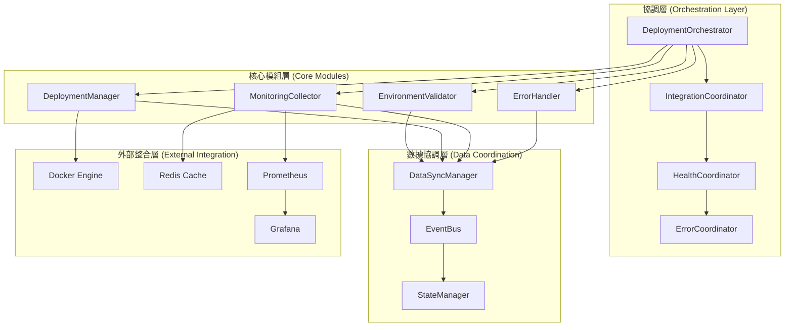

# ROAS Bot v2.4.3 整合策略與部署協調機制
**Task ID: 1** - Docker啟動系統修復

## 🔗 整合策略總覽

### Alex的整合哲學

> **系統整合的奧秘**："最好的架構不是技術的堆疊，而是讓不同元件如交響樂般和諧共奏。每個模組都有自己的節拍，但它們必須遵循同一個指揮棒的節奏。"

基於我在不同技術生態系統的整合經驗：
- **矽谷風格**：快速原型，API優先
- **歐洲銀行模式**：穩健集成，風險控制  
- **亞洲電商經驗**：高可用，性能優先

### 整合架構圖



## 🎯 部署協調機制

### 1. 統一部署協調器

```python
import asyncio
import time
from contextlib import asynccontextmanager
from dataclasses import dataclass, field
from enum import Enum
from typing import Dict, List, Optional, Any, Callable
import logging

logger = logging.getLogger(__name__)

class DeploymentPhase(Enum):
    """部署階段"""
    INITIALIZATION = "initialization"
    VALIDATION = "validation"
    PREPARATION = "preparation"
    EXECUTION = "execution"
    VERIFICATION = "verification"
    COMPLETION = "completion"
    ROLLBACK = "rollback"

class CoordinationStatus(Enum):
    """協調狀態"""
    PENDING = "pending"
    IN_PROGRESS = "in_progress"
    SUCCESS = "success"
    FAILED = "failed"
    CANCELLED = "cancelled"

@dataclass
class PhaseResult:
    """階段結果"""
    phase: DeploymentPhase
    status: CoordinationStatus
    message: str
    duration_ms: int
    data: Dict[str, Any] = field(default_factory=dict)
    errors: List[str] = field(default_factory=list)
    warnings: List[str] = field(default_factory=list)

@dataclass
class DeploymentCoordination:
    """部署協調配置"""
    deployment_id: str
    environment: str
    phases: List[DeploymentPhase]
    timeout_per_phase: Dict[DeploymentPhase, int]  # 秒
    retry_policy: Dict[DeploymentPhase, int]  # 重試次數
    rollback_on_failure: bool = True
    parallel_execution: bool = False

class DeploymentOrchestrator:
    """部署協調器 - 統一管理整個部署流程"""
    
    def __init__(
        self,
        env_validator: IEnvironmentValidator,
        deployment_manager: IDeploymentManager,
        monitoring_collector: IMonitoringCollector,
        error_handler: IErrorHandler
    ):
        self.env_validator = env_validator
        self.deployment_manager = deployment_manager
        self.monitoring_collector = monitoring_collector
        self.error_handler = error_handler
        
        self.logger = logging.getLogger(f"{__name__}.{self.__class__.__name__}")
        self.event_bus = EventBus()
        self.state_manager = DeploymentStateManager()
        
        # 註冊事件處理器
        self._register_event_handlers()
    
    async def orchestrate_deployment(
        self, 
        coordination: DeploymentCoordination
    ) -> List[PhaseResult]:
        """協調執行完整部署流程"""
        
        self.logger.info(f"開始部署協調: {coordination.deployment_id}")
        
        # 初始化狀態管理
        await self.state_manager.initialize_deployment(coordination)
        
        results = []
        current_phase = None
        
        try:
            for phase in coordination.phases:
                current_phase = phase
                self.logger.info(f"執行階段: {phase.value}")
                
                # 更新狀態
                await self.state_manager.update_phase_status(
                    coordination.deployment_id, 
                    phase, 
                    CoordinationStatus.IN_PROGRESS
                )
                
                # 執行階段
                result = await self._execute_phase(coordination, phase)
                results.append(result)
                
                # 更新狀態
                await self.state_manager.update_phase_status(
                    coordination.deployment_id,
                    phase,
                    result.status
                )
                
                # 檢查是否失敗
                if result.status == CoordinationStatus.FAILED:
                    if coordination.rollback_on_failure:
                        self.logger.warning(f"階段 {phase.value} 失敗，開始回滾")
                        rollback_results = await self._execute_rollback(
                            coordination, results
                        )
                        results.extend(rollback_results)
                    break
                    
                # 階段間暫停（確保穩定性）
                await asyncio.sleep(2)
            
            # 發布完成事件
            await self.event_bus.publish(Event(
                event_type="deployment.orchestration.completed",
                data={
                    "deployment_id": coordination.deployment_id,
                    "success": all(r.status == CoordinationStatus.SUCCESS for r in results),
                    "phases_completed": len([r for r in results if r.status == CoordinationStatus.SUCCESS])
                }
            ))
            
        except Exception as e:
            self.logger.error(f"協調器異常: {str(e)}", exc_info=True)
            
            # 記錄異常並嘗試錯誤處理
            error_context = ErrorContext(
                operation="deployment_orchestration",
                component="orchestrator",
                environment=coordination.environment,
                additional_data={"deployment_id": coordination.deployment_id}
            )
            
            await self.error_handler.handle_error(e, error_context)
            
            # 添加異常結果
            if current_phase:
                results.append(PhaseResult(
                    phase=current_phase,
                    status=CoordinationStatus.FAILED,
                    message=f"協調器異常: {str(e)}",
                    duration_ms=0,
                    errors=[str(e)]
                ))
        
        finally:
            # 清理狀態
            await self.state_manager.finalize_deployment(coordination.deployment_id)
        
        return results
    
    async def _execute_phase(
        self, 
        coordination: DeploymentCoordination, 
        phase: DeploymentPhase
    ) -> PhaseResult:
        """執行單個部署階段"""
        
        start_time = time.time()
        timeout = coordination.timeout_per_phase.get(phase, 300)  # 默認5分鐘
        
        try:
            # 使用超時控制
            result_data = await asyncio.wait_for(
                self._phase_executor(coordination, phase),
                timeout=timeout
            )
            
            duration_ms = int((time.time() - start_time) * 1000)
            
            return PhaseResult(
                phase=phase,
                status=CoordinationStatus.SUCCESS,
                message=f"階段 {phase.value} 執行成功",
                duration_ms=duration_ms,
                data=result_data
            )
            
        except asyncio.TimeoutError:
            duration_ms = int((time.time() - start_time) * 1000)
            return PhaseResult(
                phase=phase,
                status=CoordinationStatus.FAILED,
                message=f"階段 {phase.value} 執行超時 ({timeout}秒)",
                duration_ms=duration_ms,
                errors=[f"timeout_after_{timeout}_seconds"]
            )
            
        except Exception as e:
            duration_ms = int((time.time() - start_time) * 1000)
            return PhaseResult(
                phase=phase,
                status=CoordinationStatus.FAILED,
                message=f"階段 {phase.value} 執行失敗: {str(e)}",
                duration_ms=duration_ms,
                errors=[str(e)]
            )
    
    async def _phase_executor(
        self, 
        coordination: DeploymentCoordination, 
        phase: DeploymentPhase
    ) -> Dict[str, Any]:
        """階段執行邏輯"""
        
        if phase == DeploymentPhase.INITIALIZATION:
            return await self._execute_initialization(coordination)
        elif phase == DeploymentPhase.VALIDATION:
            return await self._execute_validation(coordination)
        elif phase == DeploymentPhase.PREPARATION:
            return await self._execute_preparation(coordination)
        elif phase == DeploymentPhase.EXECUTION:
            return await self._execute_deployment(coordination)
        elif phase == DeploymentPhase.VERIFICATION:
            return await self._execute_verification(coordination)
        elif phase == DeploymentPhase.COMPLETION:
            return await self._execute_completion(coordination)
        else:
            raise ValueError(f"未知階段: {phase}")
    
    async def _execute_initialization(self, coordination: DeploymentCoordination) -> Dict[str, Any]:
        """執行初始化階段"""
        self.logger.info("執行初始化階段")
        
        # 發佈初始化事件
        await self.event_bus.publish(Event(
            event_type="deployment.initialization.started",
            data={"deployment_id": coordination.deployment_id}
        ))
        
        # 初始化各個組件
        initialization_tasks = [
            self._initialize_component("environment_validator"),
            self._initialize_component("deployment_manager"), 
            self._initialize_component("monitoring_collector"),
            self._initialize_component("error_handler")
        ]
        
        results = await asyncio.gather(*initialization_tasks, return_exceptions=True)
        
        # 檢查初始化結果
        failed_components = []
        for i, result in enumerate(results):
            if isinstance(result, Exception):
                component_name = ["environment_validator", "deployment_manager", 
                                "monitoring_collector", "error_handler"][i]
                failed_components.append(f"{component_name}: {str(result)}")
        
        if failed_components:
            raise RuntimeError(f"組件初始化失敗: {', '.join(failed_components)}")
        
        return {
            "initialized_components": 4,
            "initialization_time": time.time()
        }
    
    async def _execute_validation(self, coordination: DeploymentCoordination) -> Dict[str, Any]:
        """執行驗證階段"""
        self.logger.info("執行環境驗證階段")
        
        # 執行環境驗證
        validation_result = await self.env_validator.validate_environment()
        
        if not validation_result.overall_passed:
            critical_failures = [
                check.message for check in validation_result.checks
                if check.severity == ValidationSeverity.CRITICAL
            ]
            if critical_failures:
                raise RuntimeError(f"關鍵環境檢查失敗: {'; '.join(critical_failures)}")
        
        return {
            "validation_passed": validation_result.overall_passed,
            "checks_total": len(validation_result.checks),
            "checks_failed": len([c for c in validation_result.checks if not c.passed]),
            "critical_issues": len([c for c in validation_result.checks 
                                 if c.severity == ValidationSeverity.CRITICAL and not c.passed])
        }
    
    async def _execute_preparation(self, coordination: DeploymentCoordination) -> Dict[str, Any]:
        """執行準備階段"""
        self.logger.info("執行部署準備階段")
        
        preparation_tasks = []
        
        # 拉取最新映像
        preparation_tasks.append(
            self._execute_with_timeout(
                self.deployment_manager.pull_images(),
                timeout=300,
                task_name="pull_images"
            )
        )
        
        # 建置應用映像
        preparation_tasks.append(
            self._execute_with_timeout(
                self.deployment_manager.build_images(),
                timeout=600,
                task_name="build_images"
            )
        )
        
        # 準備監控工具
        preparation_tasks.append(
            self._execute_with_timeout(
                self.monitoring_collector.prepare_monitoring_stack(),
                timeout=180,
                task_name="prepare_monitoring"
            )
        )
        
        results = await asyncio.gather(*preparation_tasks, return_exceptions=True)
        
        # 分析準備結果
        successful_tasks = []
        failed_tasks = []
        
        task_names = ["pull_images", "build_images", "prepare_monitoring"]
        for i, result in enumerate(results):
            if isinstance(result, Exception):
                failed_tasks.append(f"{task_names[i]}: {str(result)}")
            else:
                successful_tasks.append(task_names[i])
        
        if failed_tasks and any("build_images" in task for task in failed_tasks):
            # 映像建置失敗是關鍵性失敗
            raise RuntimeError(f"關鍵準備任務失敗: {'; '.join(failed_tasks)}")
        
        return {
            "successful_tasks": successful_tasks,
            "failed_tasks": failed_tasks,
            "preparation_complete": len(failed_tasks) == 0
        }
    
    async def _execute_deployment(self, coordination: DeploymentCoordination) -> Dict[str, Any]:
        """執行部署階段"""
        self.logger.info("執行服務部署階段")
        
        # 執行服務啟動
        deployment_result = await self.deployment_manager.start_services(
            detach=True,
            build=False,  # 在準備階段已建置
            environment=coordination.environment
        )
        
        if not deployment_result.success:
            raise RuntimeError(f"服務部署失敗: {deployment_result.message}")
        
        return {
            "deployment_success": deployment_result.success,
            "services_started": len(deployment_result.services),
            "deployment_duration": deployment_result.duration_seconds,
            "services_status": {
                service.name: service.status.value 
                for service in deployment_result.services
            }
        }
    
    async def _execute_verification(self, coordination: DeploymentCoordination) -> Dict[str, Any]:
        """執行驗證階段"""
        self.logger.info("執行部署驗證階段")
        
        # 等待服務穩定
        await asyncio.sleep(30)
        
        # 執行全面健康檢查
        monitoring_report = await self.monitoring_collector.collect_all_metrics()
        
        # 分析健康狀態
        unhealthy_services = [
            service.service_name for service in monitoring_report.service_metrics
            if service.status == HealthStatus.UNHEALTHY
        ]
        
        degraded_services = [
            service.service_name for service in monitoring_report.service_metrics
            if service.status == HealthStatus.DEGRADED
        ]
        
        # 檢查是否有關鍵服務不健康
        critical_services = ["discord-bot", "redis"]  # 關鍵服務列表
        critical_unhealthy = [s for s in unhealthy_services if s in critical_services]
        
        if critical_unhealthy:
            raise RuntimeError(f"關鍵服務不健康: {', '.join(critical_unhealthy)}")
        
        return {
            "overall_health": monitoring_report.overall_status.value,
            "healthy_services": len([s for s in monitoring_report.service_metrics 
                                   if s.status == HealthStatus.HEALTHY]),
            "degraded_services": len(degraded_services),
            "unhealthy_services": len(unhealthy_services),
            "alerts_count": len(monitoring_report.alerts),
            "verification_passed": monitoring_report.overall_status != HealthStatus.UNHEALTHY
        }
    
    async def _execute_completion(self, coordination: DeploymentCoordination) -> Dict[str, Any]:
        """執行完成階段"""
        self.logger.info("執行部署完成階段")
        
        completion_tasks = []
        
        # 更新部署記錄
        completion_tasks.append(
            self._update_deployment_record(coordination.deployment_id, "completed")
        )
        
        # 啟動持續監控
        completion_tasks.append(
            self._start_continuous_monitoring(coordination.deployment_id)
        )
        
        # 清理臨時資源
        completion_tasks.append(
            self._cleanup_temporary_resources(coordination.deployment_id)
        )
        
        # 發送完成通知
        completion_tasks.append(
            self._send_completion_notification(coordination)
        )
        
        results = await asyncio.gather(*completion_tasks, return_exceptions=True)
        
        failed_cleanup_tasks = []
        for i, result in enumerate(results):
            if isinstance(result, Exception):
                task_names = ["update_record", "start_monitoring", "cleanup", "notification"]
                failed_cleanup_tasks.append(f"{task_names[i]}: {str(result)}")
        
        return {
            "completion_tasks_successful": len(results) - len(failed_cleanup_tasks),
            "completion_tasks_failed": len(failed_cleanup_tasks),
            "failed_tasks": failed_cleanup_tasks,
            "deployment_finalized": True
        }
```

## 🔄 服務整合協調

### 1. 服務依賴管理

```python
@dataclass
class ServiceDependency:
    """服務依賴關係"""
    service_name: str
    depends_on: str
    dependency_type: str  # "required", "optional", "soft"
    health_check_endpoint: Optional[str] = None
    startup_delay_seconds: int = 0
    max_wait_time_seconds: int = 300

class DependencyCoordinator:
    """依賴協調器"""
    
    def __init__(self):
        self.dependencies = self._load_service_dependencies()
        self.dependency_graph = self._build_dependency_graph()
        
    def _load_service_dependencies(self) -> List[ServiceDependency]:
        """載入服務依賴配置"""
        return [
            ServiceDependency(
                service_name="discord-bot",
                depends_on="redis",
                dependency_type="required",
                health_check_endpoint="redis://localhost:6379",
                startup_delay_seconds=10,
                max_wait_time_seconds=60
            ),
            ServiceDependency(
                service_name="grafana",
                depends_on="prometheus",
                dependency_type="required",
                health_check_endpoint="http://localhost:9090/-/healthy",
                startup_delay_seconds=30,
                max_wait_time_seconds=120
            ),
            ServiceDependency(
                service_name="prometheus",
                depends_on="discord-bot",
                dependency_type="soft",
                health_check_endpoint="http://localhost:8000/health",
                startup_delay_seconds=0,
                max_wait_time_seconds=180
            )
        ]
    
    def _build_dependency_graph(self) -> Dict[str, List[str]]:
        """建立依賴關係圖"""
        graph = {}
        for dep in self.dependencies:
            if dep.service_name not in graph:
                graph[dep.service_name] = []
            graph[dep.service_name].append(dep.depends_on)
        return graph
    
    def get_startup_order(self) -> List[str]:
        """獲取服務啟動順序（拓撲排序）"""
        def topological_sort(graph):
            visited = set()
            temp_visited = set()
            result = []
            
            def visit(node):
                if node in temp_visited:
                    raise ValueError(f"循環依賴檢測: {node}")
                if node in visited:
                    return
                
                temp_visited.add(node)
                for neighbor in graph.get(node, []):
                    visit(neighbor)
                temp_visited.remove(node)
                visited.add(node)
                result.append(node)
            
            all_nodes = set(graph.keys())
            for dep in self.dependencies:
                all_nodes.add(dep.depends_on)
                
            for node in all_nodes:
                if node not in visited:
                    visit(node)
            
            return list(reversed(result))
        
        return topological_sort(self.dependency_graph)
    
    async def wait_for_dependency(self, dependency: ServiceDependency) -> bool:
        """等待依賴服務就緒"""
        logger.info(f"等待依賴服務: {dependency.depends_on}")
        
        start_time = time.time()
        
        while time.time() - start_time < dependency.max_wait_time_seconds:
            try:
                if await self._check_service_health(dependency):
                    logger.info(f"依賴服務 {dependency.depends_on} 已就緒")
                    return True
                    
                await asyncio.sleep(5)  # 5秒檢查一次
                
            except Exception as e:
                logger.warning(f"檢查依賴服務失敗: {dependency.depends_on}, {str(e)}")
                await asyncio.sleep(5)
        
        logger.error(f"等待依賴服務超時: {dependency.depends_on}")
        return False
    
    async def _check_service_health(self, dependency: ServiceDependency) -> bool:
        """檢查服務健康狀態"""
        if not dependency.health_check_endpoint:
            # 沒有健康檢查端點，假設服務已就緒
            return True
        
        try:
            if dependency.health_check_endpoint.startswith("redis://"):
                # Redis 健康檢查
                import redis.asyncio as redis
                r = redis.Redis.from_url(dependency.health_check_endpoint)
                await r.ping()
                return True
                
            elif dependency.health_check_endpoint.startswith("http"):
                # HTTP 健康檢查
                import aiohttp
                async with aiohttp.ClientSession() as session:
                    async with session.get(
                        dependency.health_check_endpoint,
                        timeout=aiohttp.ClientTimeout(total=10)
                    ) as response:
                        return response.status == 200
                        
        except Exception as e:
            logger.debug(f"健康檢查失敗: {dependency.depends_on}, {str(e)}")
            return False
        
        return False
```

### 2. 狀態同步機制

```python
from enum import Enum
from typing import Dict, List, Any, Callable
import json

class StateChangeType(Enum):
    """狀態變更類型"""
    SERVICE_STARTED = "service_started"
    SERVICE_STOPPED = "service_stopped"
    SERVICE_HEALTH_CHANGED = "service_health_changed"
    DEPLOYMENT_PHASE_CHANGED = "deployment_phase_changed"
    ERROR_OCCURRED = "error_occurred"
    ALERT_TRIGGERED = "alert_triggered"

@dataclass
class StateChange:
    """狀態變更"""
    change_id: str
    change_type: StateChangeType
    source_component: str
    timestamp: datetime
    old_state: Optional[Dict[str, Any]]
    new_state: Dict[str, Any]
    metadata: Dict[str, Any] = field(default_factory=dict)

class StateManager:
    """統一狀態管理器"""
    
    def __init__(self):
        self.current_state = {}
        self.state_history = []
        self.subscribers = {}  # {change_type: [callbacks]}
        self.state_lock = asyncio.Lock()
    
    async def update_state(
        self, 
        key: str, 
        new_value: Any,
        source_component: str,
        change_type: StateChangeType,
        metadata: Dict[str, Any] = None
    ) -> StateChange:
        """更新狀態"""
        
        async with self.state_lock:
            old_value = self.current_state.get(key)
            
            # 創建狀態變更記錄
            state_change = StateChange(
                change_id=f"SC-{int(time.time() * 1000)}",
                change_type=change_type,
                source_component=source_component,
                timestamp=datetime.now(),
                old_state={key: old_value} if old_value is not None else None,
                new_state={key: new_value},
                metadata=metadata or {}
            )
            
            # 更新當前狀態
            self.current_state[key] = new_value
            
            # 記錄歷史
            self.state_history.append(state_change)
            
            # 保持歷史記錄大小
            if len(self.state_history) > 1000:
                self.state_history = self.state_history[-500:]
            
            # 通知訂閱者
            await self._notify_subscribers(state_change)
            
            return state_change
    
    def subscribe(
        self, 
        change_type: StateChangeType, 
        callback: Callable[[StateChange], None]
    ):
        """訂閱狀態變更"""
        if change_type not in self.subscribers:
            self.subscribers[change_type] = []
        self.subscribers[change_type].append(callback)
    
    async def _notify_subscribers(self, state_change: StateChange):
        """通知訂閱者"""
        subscribers = self.subscribers.get(state_change.change_type, [])
        
        for callback in subscribers:
            try:
                if asyncio.iscoroutinefunction(callback):
                    await callback(state_change)
                else:
                    callback(state_change)
            except Exception as e:
                logger.error(f"狀態變更通知失敗: {str(e)}")
    
    def get_current_state(self, key: str = None) -> Any:
        """獲取當前狀態"""
        if key:
            return self.current_state.get(key)
        return self.current_state.copy()
    
    def get_state_history(
        self, 
        change_type: StateChangeType = None,
        limit: int = 100
    ) -> List[StateChange]:
        """獲取狀態歷史"""
        history = self.state_history
        
        if change_type:
            history = [sc for sc in history if sc.change_type == change_type]
        
        return history[-limit:] if limit else history

# 全域狀態管理器實例
global_state_manager = StateManager()
```

### 3. 事件驅動整合

```python
import uuid
from typing import Set

@dataclass
class Event:
    """系統事件"""
    event_id: str = field(default_factory=lambda: str(uuid.uuid4()))
    event_type: str = ""
    source: str = ""
    timestamp: datetime = field(default_factory=datetime.now)
    data: Dict[str, Any] = field(default_factory=dict)
    correlation_id: Optional[str] = None

class EventBus:
    """事件總線"""
    
    def __init__(self):
        self.subscribers = {}  # {event_type: [callbacks]}
        self.event_history = []
        self.processing_events = set()  # 防止重複處理
        
    async def publish(self, event: Event):
        """發布事件"""
        # 防止重複處理
        if event.event_id in self.processing_events:
            return
            
        self.processing_events.add(event.event_id)
        
        try:
            logger.debug(f"發布事件: {event.event_type} from {event.source}")
            
            # 記錄事件歷史
            self.event_history.append(event)
            if len(self.event_history) > 1000:
                self.event_history = self.event_history[-500:]
            
            # 通知訂閱者
            subscribers = self.subscribers.get(event.event_type, [])
            
            # 並行處理事件（提高效能）
            tasks = []
            for callback in subscribers:
                if asyncio.iscoroutinefunction(callback):
                    tasks.append(asyncio.create_task(callback(event)))
                else:
                    tasks.append(asyncio.create_task(self._run_sync_callback(callback, event)))
            
            if tasks:
                await asyncio.gather(*tasks, return_exceptions=True)
                
        except Exception as e:
            logger.error(f"事件處理異常: {event.event_type}, {str(e)}")
        finally:
            self.processing_events.discard(event.event_id)
    
    async def _run_sync_callback(self, callback: Callable, event: Event):
        """在異步上下文中運行同步回調"""
        try:
            callback(event)
        except Exception as e:
            logger.error(f"同步事件回調異常: {str(e)}")
    
    def subscribe(self, event_type: str, callback: Callable[[Event], None]):
        """訂閱事件"""
        if event_type not in self.subscribers:
            self.subscribers[event_type] = []
        self.subscribers[event_type].append(callback)
    
    def unsubscribe(self, event_type: str, callback: Callable[[Event], None]):
        """取消訂閱"""
        if event_type in self.subscribers:
            if callback in self.subscribers[event_type]:
                self.subscribers[event_type].remove(callback)

# 全域事件總線實例
global_event_bus = EventBus()

class IntegrationCoordinator:
    """整合協調器 - 負責模組間的事件協調"""
    
    def __init__(self):
        self.event_bus = global_event_bus
        self.state_manager = global_state_manager
        self._setup_integration_handlers()
    
    def _setup_integration_handlers(self):
        """設置整合處理器"""
        
        # 環境驗證完成 -> 觸發部署準備
        self.event_bus.subscribe(
            "environment.validation.completed",
            self._handle_validation_completed
        )
        
        # 服務啟動 -> 更新狀態並觸發監控
        self.event_bus.subscribe(
            "deployment.service.started",
            self._handle_service_started
        )
        
        # 監控告警 -> 觸發錯誤處理
        self.event_bus.subscribe(
            "monitoring.alert.triggered",
            self._handle_alert_triggered
        )
        
        # 錯誤恢復完成 -> 更新狀態
        self.event_bus.subscribe(
            "error.recovery.completed",
            self._handle_recovery_completed
        )
    
    async def _handle_validation_completed(self, event: Event):
        """處理驗證完成事件"""
        validation_result = event.data.get('validation_result')
        
        await self.state_manager.update_state(
            key="environment_validation_status",
            new_value={
                "passed": validation_result.get('overall_passed'),
                "timestamp": event.timestamp.isoformat(),
                "failed_checks": validation_result.get('failed_checks', [])
            },
            source_component="integration_coordinator",
            change_type=StateChangeType.DEPLOYMENT_PHASE_CHANGED
        )
        
        if validation_result.get('overall_passed'):
            # 驗證通過，發布準備開始事件
            await self.event_bus.publish(Event(
                event_type="deployment.preparation.start",
                source="integration_coordinator",
                data={"trigger": "validation_success"},
                correlation_id=event.correlation_id
            ))
    
    async def _handle_service_started(self, event: Event):
        """處理服務啟動事件"""
        service_name = event.data.get('service_name')
        service_status = event.data.get('status')
        
        await self.state_manager.update_state(
            key=f"service_{service_name}_status",
            new_value={
                "status": service_status,
                "started_at": event.timestamp.isoformat(),
                "health": "unknown"
            },
            source_component="integration_coordinator", 
            change_type=StateChangeType.SERVICE_STARTED
        )
        
        # 啟動該服務的監控
        await self.event_bus.publish(Event(
            event_type="monitoring.service.start",
            source="integration_coordinator",
            data={"service_name": service_name},
            correlation_id=event.correlation_id
        ))
    
    async def _handle_alert_triggered(self, event: Event):
        """處理監控告警事件"""
        alert_data = event.data
        severity = alert_data.get('severity', 'unknown')
        
        # 根據嚴重性決定處理策略
        if severity in ['critical', 'high']:
            # 觸發自動錯誤處理
            await self.event_bus.publish(Event(
                event_type="error.auto_handling.start",
                source="integration_coordinator",
                data={
                    "alert_type": alert_data.get('alert_type'),
                    "service_name": alert_data.get('service_name'),
                    "message": alert_data.get('message')
                },
                correlation_id=event.correlation_id
            ))
        
        # 更新告警狀態
        await self.state_manager.update_state(
            key="active_alerts",
            new_value=alert_data,
            source_component="integration_coordinator",
            change_type=StateChangeType.ALERT_TRIGGERED
        )
    
    async def _handle_recovery_completed(self, event: Event):
        """處理錯誤恢復完成事件"""
        recovery_result = event.data
        
        if recovery_result.get('success'):
            # 恢復成功，觸發健康檢查
            await self.event_bus.publish(Event(
                event_type="monitoring.health_check.start",
                source="integration_coordinator",
                data={"trigger": "recovery_success"},
                correlation_id=event.correlation_id
            ))
```

## 🚀 部署協調實例

### 1. 標準部署流程

```python
async def execute_standard_deployment():
    """執行標準部署流程"""
    
    # 創建協調配置
    coordination = DeploymentCoordination(
        deployment_id=f"DEPLOY-{int(time.time())}",
        environment="dev",
        phases=[
            DeploymentPhase.INITIALIZATION,
            DeploymentPhase.VALIDATION, 
            DeploymentPhase.PREPARATION,
            DeploymentPhase.EXECUTION,
            DeploymentPhase.VERIFICATION,
            DeploymentPhase.COMPLETION
        ],
        timeout_per_phase={
            DeploymentPhase.INITIALIZATION: 60,
            DeploymentPhase.VALIDATION: 120,
            DeploymentPhase.PREPARATION: 600,
            DeploymentPhase.EXECUTION: 300,
            DeploymentPhase.VERIFICATION: 180,
            DeploymentPhase.COMPLETION: 120
        },
        retry_policy={
            DeploymentPhase.INITIALIZATION: 2,
            DeploymentPhase.VALIDATION: 1,
            DeploymentPhase.PREPARATION: 2,
            DeploymentPhase.EXECUTION: 3,
            DeploymentPhase.VERIFICATION: 2,
            DeploymentPhase.COMPLETION: 1
        },
        rollback_on_failure=True
    )
    
    # 創建協調器
    orchestrator = DeploymentOrchestrator(
        env_validator=EnvironmentValidator(),
        deployment_manager=DeploymentManager(),
        monitoring_collector=MonitoringCollector(),
        error_handler=ErrorHandler()
    )
    
    # 執行協調部署
    results = await orchestrator.orchestrate_deployment(coordination)
    
    # 分析結果
    successful_phases = [r for r in results if r.status == CoordinationStatus.SUCCESS]
    failed_phases = [r for r in results if r.status == CoordinationStatus.FAILED]
    
    print(f"部署結果: {len(successful_phases)}/{len(results)} 階段成功")
    
    if failed_phases:
        print("失敗階段:")
        for phase_result in failed_phases:
            print(f"  - {phase_result.phase.value}: {phase_result.message}")
    
    return len(failed_phases) == 0
```

### 2. 緊急修復部署流程

```python
async def execute_hotfix_deployment():
    """執行緊急修復部署流程"""
    
    # 緊急修復：跳過部分非關鍵階段
    coordination = DeploymentCoordination(
        deployment_id=f"HOTFIX-{int(time.time())}",
        environment="prod",
        phases=[
            DeploymentPhase.VALIDATION,  # 快速驗證
            DeploymentPhase.EXECUTION,   # 直接執行
            DeploymentPhase.VERIFICATION # 立即驗證
        ],
        timeout_per_phase={
            DeploymentPhase.VALIDATION: 30,
            DeploymentPhase.EXECUTION: 120,
            DeploymentPhase.VERIFICATION: 60
        },
        retry_policy={
            DeploymentPhase.VALIDATION: 0,  # 不重試
            DeploymentPhase.EXECUTION: 1,   # 最多重試1次
            DeploymentPhase.VERIFICATION: 0
        },
        rollback_on_failure=True,  # 緊急修復一定要有回滾
        parallel_execution=False
    )
    
    orchestrator = DeploymentOrchestrator(
        env_validator=EnvironmentValidator(),
        deployment_manager=DeploymentManager(),
        monitoring_collector=MonitoringCollector(),
        error_handler=ErrorHandler()
    )
    
    results = await orchestrator.orchestrate_deployment(coordination)
    return all(r.status == CoordinationStatus.SUCCESS for r in results)
```

## 📊 整合效果監控

### 1. 整合健康指標

```python
@dataclass
class IntegrationHealthMetrics:
    """整合健康指標"""
    timestamp: datetime
    event_processing_latency_ms: float  # 事件處理延遲
    state_synchronization_lag_ms: float  # 狀態同步延遲
    dependency_resolution_time_ms: float  # 依賴解析時間
    integration_error_rate: float  # 整合錯誤率
    coordination_success_rate: float  # 協調成功率
    
class IntegrationMonitor:
    """整合監控器"""
    
    def __init__(self):
        self.metrics_history = []
        self.alert_thresholds = {
            "event_processing_latency_ms": 1000,  # 1秒
            "state_synchronization_lag_ms": 500,  # 0.5秒
            "integration_error_rate": 5.0,  # 5%
            "coordination_success_rate": 95.0  # 95%
        }
    
    async def collect_integration_metrics(self) -> IntegrationHealthMetrics:
        """收集整合健康指標"""
        
        # 測量事件處理延遲
        event_latency = await self._measure_event_processing_latency()
        
        # 測量狀態同步延遲  
        sync_lag = await self._measure_state_sync_lag()
        
        # 測量依賴解析時間
        dependency_time = await self._measure_dependency_resolution_time()
        
        # 計算錯誤率
        error_rate = await self._calculate_integration_error_rate()
        
        # 計算協調成功率
        success_rate = await self._calculate_coordination_success_rate()
        
        metrics = IntegrationHealthMetrics(
            timestamp=datetime.now(),
            event_processing_latency_ms=event_latency,
            state_synchronization_lag_ms=sync_lag,
            dependency_resolution_time_ms=dependency_time,
            integration_error_rate=error_rate,
            coordination_success_rate=success_rate
        )
        
        # 保存歷史
        self.metrics_history.append(metrics)
        if len(self.metrics_history) > 1000:
            self.metrics_history = self.metrics_history[-500:]
        
        # 檢查告警
        await self._check_integration_alerts(metrics)
        
        return metrics
    
    async def _check_integration_alerts(self, metrics: IntegrationHealthMetrics):
        """檢查整合告警"""
        alerts = []
        
        if metrics.event_processing_latency_ms > self.alert_thresholds["event_processing_latency_ms"]:
            alerts.append(f"事件處理延遲過高: {metrics.event_processing_latency_ms:.1f}ms")
        
        if metrics.state_synchronization_lag_ms > self.alert_thresholds["state_synchronization_lag_ms"]:
            alerts.append(f"狀態同步延遲過高: {metrics.state_synchronization_lag_ms:.1f}ms")
        
        if metrics.integration_error_rate > self.alert_thresholds["integration_error_rate"]:
            alerts.append(f"整合錯誤率過高: {metrics.integration_error_rate:.1f}%")
        
        if metrics.coordination_success_rate < self.alert_thresholds["coordination_success_rate"]:
            alerts.append(f"協調成功率過低: {metrics.coordination_success_rate:.1f}%")
        
        for alert in alerts:
            await global_event_bus.publish(Event(
                event_type="integration.alert.triggered",
                source="integration_monitor",
                data={
                    "alert_type": "integration_health",
                    "message": alert,
                    "severity": "high",
                    "metrics": asdict(metrics)
                }
            ))
```

## 🎯 整合驗收標準

### 完整性檢查清單

- [ ] **事件流暢性**：所有模組間事件能正確發布和接收
- [ ] **狀態一致性**：模組間狀態保持同步，無狀態不一致情況
- [ ] **依賴解析正確**：服務依賴關係正確解析和管理
- [ ] **錯誤處理完整**：跨模組錯誤能正確傳播和處理
- [ ] **部署協調成功**：完整部署流程能順利執行
- [ ] **監控覆蓋完整**：整合過程的所有關鍵指標都被監控
- [ ] **回滾機制有效**：失敗時能正確執行回滾操作
- [ ] **效能指標達標**：整合延遲和處理時間在可接受範圍內

這個整合策略與部署協調機制確保了ROAS Bot v2.4.3各個組件能夠：

1. **無縫協作**：通過事件驅動和狀態管理實現模組間的松耦合整合
2. **有序部署**：通過依賴管理和階段協調確保部署流程的正確性
3. **故障恢復**：通過錯誤處理和回滾機制確保系統的穩健性
4. **效能監控**：通過整合監控確保協調過程的可觀測性
5. **可擴展性**：通過模組化設計支持未來的功能擴展

至此，ROAS Bot v2.4.3的完整架構設計已經完成！🎉