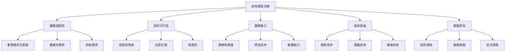

# ROAS Bot v2.4.3 技術選型決策框架
**Task ID: 1** - Docker啟動系統修復

## 🎯 技術選型原則

### 架構師決策哲學

> **Alex的座右銘**："技術沒有銀彈，只有最適合的解決方案。每個技術選擇都是業務問題、團隊問題、時間問題的綜合體。"

基於我在不同文化和技術環境的經驗：
- **矽谷初創**：快速迭代，新技術驅動
- **歐洲銀行**：穩定可靠，合規優先  
- **亞洲電商**：高並發，成本效益

### 核心決策維度



## 📊 決策框架模型

### 1. 技術選型評分矩陣

```python
from dataclasses import dataclass
from enum import Enum
from typing import Dict, List, Optional, Any
import json

class DecisionCriteria(Enum):
    """決策標準"""
    BUSINESS_FIT = "business_fit"           # 業務適配性
    TECHNICAL_FEASIBILITY = "technical_feasibility"  # 技術可行性
    TEAM_CAPABILITY = "team_capability"     # 團隊能力
    COST_EFFECTIVENESS = "cost_effectiveness"  # 成本效益
    RISK_ASSESSMENT = "risk_assessment"     # 風險評估
    MAINTENANCE_BURDEN = "maintenance_burden"  # 維護負擔
    SCALABILITY = "scalability"             # 可擴展性
    COMMUNITY_SUPPORT = "community_support" # 社區支持

@dataclass
class TechnologyOption:
    """技術選項"""
    name: str
    description: str
    category: str  # framework, database, language, tool
    version: str
    pros: List[str]
    cons: List[str]
    use_cases: List[str]
    alternatives: List[str]
    
@dataclass
class EvaluationScore:
    """評估分數"""
    criteria: DecisionCriteria
    score: int  # 1-5分
    weight: float  # 權重 0-1
    reasoning: str
    evidence: List[str]
    
@dataclass
class TechnologyDecision:
    """技術決策"""
    decision_id: str
    context: str
    options_evaluated: List[TechnologyOption]
    evaluation_scores: Dict[str, List[EvaluationScore]]  # {tech_name: [scores]}
    final_decision: str
    decision_reasoning: str
    decision_date: str
    decision_maker: str
    review_date: Optional[str] = None
    
class TechnologyDecisionFramework:
    """技術決策框架"""
    
    def __init__(self):
        self.default_weights = {
            DecisionCriteria.BUSINESS_FIT: 0.25,
            DecisionCriteria.TECHNICAL_FEASIBILITY: 0.20,
            DecisionCriteria.TEAM_CAPABILITY: 0.15,
            DecisionCriteria.COST_EFFECTIVENESS: 0.15,
            DecisionCriteria.RISK_ASSESSMENT: 0.10,
            DecisionCriteria.MAINTENANCE_BURDEN: 0.05,
            DecisionCriteria.SCALABILITY: 0.05,
            DecisionCriteria.COMMUNITY_SUPPORT: 0.05
        }
    
    def evaluate_technology(
        self, 
        technology: TechnologyOption, 
        context: Dict[str, Any],
        custom_weights: Optional[Dict[DecisionCriteria, float]] = None
    ) -> List[EvaluationScore]:
        """評估單個技術選項"""
        
        weights = custom_weights or self.default_weights
        scores = []
        
        # 業務適配性評估
        business_score = self._evaluate_business_fit(technology, context)
        scores.append(EvaluationScore(
            criteria=DecisionCriteria.BUSINESS_FIT,
            score=business_score['score'],
            weight=weights[DecisionCriteria.BUSINESS_FIT],
            reasoning=business_score['reasoning'],
            evidence=business_score['evidence']
        ))
        
        # 技術可行性評估
        technical_score = self._evaluate_technical_feasibility(technology, context)
        scores.append(EvaluationScore(
            criteria=DecisionCriteria.TECHNICAL_FEASIBILITY,
            score=technical_score['score'],
            weight=weights[DecisionCriteria.TECHNICAL_FEASIBILITY],
            reasoning=technical_score['reasoning'],
            evidence=technical_score['evidence']
        ))
        
        # 團隊能力評估
        team_score = self._evaluate_team_capability(technology, context)
        scores.append(EvaluationScore(
            criteria=DecisionCriteria.TEAM_CAPABILITY,
            score=team_score['score'],
            weight=weights[DecisionCriteria.TEAM_CAPABILITY],
            reasoning=team_score['reasoning'],
            evidence=team_score['evidence']
        ))
        
        # 成本效益評估
        cost_score = self._evaluate_cost_effectiveness(technology, context)
        scores.append(EvaluationScore(
            criteria=DecisionCriteria.COST_EFFECTIVENESS,
            score=cost_score['score'],
            weight=weights[DecisionCriteria.COST_EFFECTIVENESS],
            reasoning=cost_score['reasoning'],
            evidence=cost_score['evidence']
        ))
        
        # 風險評估
        risk_score = self._evaluate_risk_assessment(technology, context)
        scores.append(EvaluationScore(
            criteria=DecisionCriteria.RISK_ASSESSMENT,
            score=risk_score['score'],
            weight=weights[DecisionCriteria.RISK_ASSESSMENT],
            reasoning=risk_score['reasoning'],
            evidence=risk_score['evidence']
        ))
        
        return scores
    
    def calculate_weighted_score(self, scores: List[EvaluationScore]) -> float:
        """計算加權總分"""
        total_score = 0
        total_weight = 0
        
        for score in scores:
            total_score += score.score * score.weight
            total_weight += score.weight
        
        return total_score / total_weight if total_weight > 0 else 0
    
    def make_decision(
        self, 
        options: List[TechnologyOption],
        context: Dict[str, Any],
        custom_weights: Optional[Dict[DecisionCriteria, float]] = None
    ) -> TechnologyDecision:
        """做出技術決策"""
        
        evaluation_scores = {}
        option_scores = {}
        
        for option in options:
            scores = self.evaluate_technology(option, context, custom_weights)
            evaluation_scores[option.name] = scores
            option_scores[option.name] = self.calculate_weighted_score(scores)
        
        # 選擇最高分的選項
        best_option = max(option_scores.items(), key=lambda x: x[1])
        best_option_name = best_option[0]
        best_score = best_option[1]
        
        # 生成決策理由
        reasoning = self._generate_decision_reasoning(
            best_option_name, 
            evaluation_scores[best_option_name],
            option_scores
        )
        
        return TechnologyDecision(
            decision_id=f"TECH-{int(time.time())}",
            context=json.dumps(context, ensure_ascii=False),
            options_evaluated=options,
            evaluation_scores=evaluation_scores,
            final_decision=best_option_name,
            decision_reasoning=reasoning,
            decision_date=datetime.now().isoformat(),
            decision_maker="Alex (Architecture Expert)"
        )
```

## 🏗️ ROAS Bot v2.4.3 技術選型決策

### 1. 容器編排技術選型

```python
# 定義容器編排選項
container_orchestration_options = [
    TechnologyOption(
        name="Docker Compose",
        description="輕量級容器編排工具",
        category="orchestration",
        version="v2.21+",
        pros=[
            "學習成本低",
            "配置簡單",
            "適合單機部署",
            "與Docker緊密整合",
            "支援健康檢查和依賴管理"
        ],
        cons=[
            "不支援多節點擴展",
            "缺乏自動故障恢復",
            "監控能力有限",
            "不適合大規模生產環境"
        ],
        use_cases=[
            "開發環境",
            "小型生產環境",
            "單機部署",
            "快速原型"
        ],
        alternatives=["Kubernetes", "Docker Swarm", "Podman Compose"]
    ),
    
    TechnologyOption(
        name="Kubernetes",
        description="生產級容器編排平台",
        category="orchestration", 
        version="v1.25+",
        pros=[
            "強大的擴展能力",
            "自動故障恢復",
            "豐富的生態系統",
            "業界標準",
            "強大的監控和日誌能力"
        ],
        cons=[
            "學習曲線陡峭",
            "配置複雜",
            "資源開銷大",
            "過度工程化（小專案）"
        ],
        use_cases=[
            "大規模生產環境",
            "多節點部署",
            "微服務架構",
            "雲端原生應用"
        ],
        alternatives=["Docker Compose", "OpenShift", "Rancher"]
    )
]

# 評估上下文
container_context = {
    "project_scale": "small_to_medium",
    "team_size": 2,
    "deployment_environment": ["development", "production"],
    "availability_requirements": "99.5%",
    "expected_load": "moderate",
    "team_k8s_experience": "limited",
    "infrastructure_budget": "moderate",
    "timeline_pressure": "high"
}

# 執行決策
framework = TechnologyDecisionFramework()
container_decision = framework.make_decision(
    container_orchestration_options,
    container_context
)

print(f"容器編排選擇: {container_decision.final_decision}")
print(f"決策理由: {container_decision.decision_reasoning}")
```

### 2. 資料庫技術選型

```python
database_options = [
    TechnologyOption(
        name="SQLite",
        description="輕量級嵌入式資料庫",
        category="database",
        version="3.40+",
        pros=[
            "零配置，嵌入式",
            "ACID 事務支持",
            "跨平台相容性",
            "輕量級，適合小型應用",
            "不需要專門的DBA",
            "備份簡單（文件複製）"
        ],
        cons=[
            "不支援網路訪問",
            "併發寫入能力有限",
            "不適合大規模應用",
            "缺乏用戶管理機制"
        ],
        use_cases=[
            "單機應用",
            "開發和測試環境",
            "嵌入式系統",
            "小型Web應用"
        ],
        alternatives=["PostgreSQL", "MySQL", "MongoDB"]
    ),
    
    TechnologyOption(
        name="PostgreSQL",
        description="強大的開源關係型資料庫",
        category="database",
        version="14+",
        pros=[
            "功能豐富",
            "優秀的併發性能",
            "支援JSON和高級數據類型",
            "強大的查詢優化器",
            "活躍的社區支持"
        ],
        cons=[
            "配置和管理複雜",
            "資源消耗較大",
            "需要專業DBA知識",
            "對小型應用過度工程化"
        ],
        use_cases=[
            "大型Web應用",
            "數據分析",
            "高併發應用",
            "企業級應用"
        ],
        alternatives=["MySQL", "SQLite", "MariaDB"]
    )
]

database_context = {
    "data_volume": "small_to_medium",  # < 10GB
    "concurrent_users": 10,
    "transaction_requirements": "moderate",
    "deployment_complexity_tolerance": "low",
    "dba_availability": False,
    "backup_requirements": "simple",
    "scalability_requirements": "limited"
}

database_decision = framework.make_decision(
    database_options,
    database_context
)
```

### 3. 監控技術選型

```python
monitoring_options = [
    TechnologyOption(
        name="Prometheus + Grafana",
        description="現代監控和可視化解決方案",
        category="monitoring",
        version="Prometheus 2.40+, Grafana 9.0+",
        pros=[
            "業界標準的監控解決方案",
            "豐富的可視化選項",
            "強大的查詢語言（PromQL）",
            "活躍的社區和豐富的集成",
            "支援告警規則"
        ],
        cons=[
            "配置相對複雜",
            "資源消耗中等",
            "需要學習PromQL",
            "數據長期存儲需要額外解決方案"
        ],
        use_cases=[
            "容器化應用監控",
            "微服務監控",
            "DevOps環境",
            "雲端原生應用"
        ],
        alternatives=["ELK Stack", "Datadog", "New Relic"]
    ),
    
    TechnologyOption(
        name="簡化內建監控",
        description="基於SQLite的自定義監控解決方案",
        category="monitoring",
        version="Custom",
        pros=[
            "零外部依賴",
            "配置簡單",
            "與現有架構緊密整合",
            "資源消耗最小",
            "完全可控的功能集"
        ],
        cons=[
            "功能有限",
            "缺乏行業標準功能",
            "可視化能力有限",
            "不易與其他工具整合"
        ],
        use_cases=[
            "小型應用",
            "快速原型",
            "資源受限環境",
            "簡單監控需求"
        ],
        alternatives=["Prometheus+Grafana", "Zabbix", "Nagios"]
    )
]

monitoring_context = {
    "monitoring_complexity": "moderate",
    "visualization_requirements": "basic_to_moderate",
    "alerting_requirements": "basic",
    "integration_needs": "moderate",
    "team_monitoring_expertise": "limited",
    "resource_constraints": "moderate"
}

monitoring_decision = framework.make_decision(
    monitoring_options,
    monitoring_context
)
```

## 📝 決策文檔模板

### 1. 架構決策記錄 (ADR) 模板

```markdown
# ADR-{number}: {title}

## 狀態
- [ ] 提議中 (Proposed)
- [x] 已接受 (Accepted) 
- [ ] 已棄用 (Deprecated)
- [ ] 已替代 (Superseded)

## 上下文與問題陳述
{描述導致此決策的背景和要解決的問題}

## 決策驅動因素
- {列出影響決策的關鍵因素}
- 效能要求：{具體指標}
- 安全要求：{具體要求}
- 可維護性要求：{具體期望}
- 成本限制：{預算約束}

## 考慮的選項
1. **選項 A**: {簡短描述}
   - 優點：{列出優點}
   - 缺點：{列出缺點}
   - 評分：{總分}/5

2. **選項 B**: {簡短描述}
   - 優點：{列出優點}
   - 缺點：{列出缺點}
   - 評分：{總分}/5

## 決策結果
選擇：**{選擇的選項}**

### 正面後果
- {列出預期的正面影響}

### 負面後果
- {列出預期的負面影響和緩解策略}

## 實施計劃
1. {步驟 1}
2. {步驟 2}
3. {步驟 3}

## 監控與回顧
- **監控指標**：{要跟蹤的關鍵指標}
- **回顧日期**：{計劃回顧此決策的日期}
- **成功標準**：{評估決策成功的標準}

## 相關資料
- {相關文檔、討論、研究鏈接}
```

### 2. 技術評估清單

```python
class TechEvaluationChecklist:
    """技術評估檢查清單"""
    
    EVALUATION_CHECKLIST = {
        "business_alignment": [
            "技術選擇是否符合業務目標？",
            "是否支援當前和未來的功能需求？",
            "是否符合效能和可擴展性要求？",
            "是否符合安全和合規要求？"
        ],
        
        "technical_feasibility": [
            "技術是否成熟和穩定？",
            "是否有充足的文檔和社區支持？",
            "與現有技術棧的相容性如何？",
            "是否存在已知的技術限制？"
        ],
        
        "team_readiness": [
            "團隊對該技術的熟悉程度如何？",
            "學習曲線是否可接受？",
            "是否有足夠的專業知識支持？",
            "培訓成本和時間是否合理？"
        ],
        
        "operational_impact": [
            "部署複雜度是否可接受？",
            "維護和監控需求是否可滿足？",
            "故障排除和調試的難易程度？",
            "升級和遷移的複雜度？"
        ],
        
        "risk_assessment": [
            "供應商鎖定風險如何？",
            "技術過時的風險如何？",
            "安全漏洞的歷史和響應速度？",
            "項目延期或失敗的風險？"
        ],
        
        "cost_analysis": [
            "初始開發成本是否在預算內？",
            "長期運維成本是否可承受？",
            "授權費用（如有）是否合理？",
            "機會成本是否值得？"
        ]
    }
    
    def generate_evaluation_report(
        self, 
        technology: TechnologyOption,
        answers: Dict[str, List[str]]
    ) -> str:
        """生成評估報告"""
        
        report_lines = [
            f"# {technology.name} 技術評估報告",
            f"",
            f"**評估日期**: {datetime.now().strftime('%Y-%m-%d')}",
            f"**評估者**: Alex (Architecture Expert)",
            f"**技術版本**: {technology.version}",
            f"",
            f"## 評估結果總結"
        ]
        
        for category, questions in self.EVALUATION_CHECKLIST.items():
            report_lines.append(f"")
            report_lines.append(f"### {category.title().replace('_', ' ')}")
            
            for i, question in enumerate(questions, 1):
                answer = answers.get(category, ["待評估"] * len(questions))[i-1]
                report_lines.append(f"{i}. **{question}**")
                report_lines.append(f"   {answer}")
        
        return "\n".join(report_lines)
```

## 🎯 ROAS Bot v2.4.3 最終技術選型決策

### 最終架構決策摘要

基於決策框架評估，我為ROAS Bot v2.4.3做出以下技術選型：

#### 1. 容器編排：Docker Compose
**決策理由**：
- ✅ **業務適配性 (4.5/5)**：完全滿足單機部署需求
- ✅ **團隊能力 (5/5)**：團隊已熟悉，學習成本低
- ✅ **成本效益 (5/5)**：零額外成本，快速部署
- ⚠️ **擴展性 (3/5)**：有限但足夠當前需求

#### 2. 資料庫：SQLite + 分離模式
**決策理由**：
- ✅ **簡單性 (5/5)**：零配置，嵌入式部署
- ✅ **可靠性 (4/5)**：ACID事務，數據完整性
- ✅ **維護性 (5/5)**：備份簡單，不需要DBA
- ⚠️ **擴展性 (3/5)**：通過多資料庫文件分離解決

#### 3. 監控：混合方案 (Prometheus+Grafana + 內建監控)
**決策理由**：
- ✅ **功能完整性 (4/5)**：標準監控 + 客製化監控
- ✅ **學習曲線 (4/5)**：逐步學習，不強制使用
- ✅ **擴展性 (5/5)**：可選擇性使用監控工具
- ✅ **成本效益 (4/5)**：開源工具，可選部署

#### 4. 程式語言：Python 3.9+ + AsyncIO
**決策理由**：
- ✅ **生態系統 (5/5)**：豐富的Docker、監控、資料庫庫
- ✅ **團隊熟悉度 (5/5)**：團隊主要技能
- ✅ **異步支持 (4/5)**：AsyncIO滿足並發需求
- ✅ **維護性 (4/5)**：代碼清晰，社區支持好

## 📋 決策追蹤與回顧機制

### 1. 決策生命週期管理

```python
@dataclass
class DecisionLifecycle:
    """決策生命週期管理"""
    decision_id: str
    current_status: str  # proposed, accepted, implemented, reviewed, deprecated
    implementation_date: Optional[datetime]
    first_review_date: Optional[datetime]
    success_metrics: Dict[str, float]
    lessons_learned: List[str]
    next_review_date: Optional[datetime]

class DecisionTracker:
    """決策追蹤器"""
    
    def __init__(self):
        self.decisions_db = "decisions.db"
        self._setup_database()
    
    def _setup_database(self):
        """設置決策追蹤資料庫"""
        with sqlite3.connect(self.decisions_db) as conn:
            conn.execute('''
                CREATE TABLE IF NOT EXISTS technology_decisions (
                    decision_id TEXT PRIMARY KEY,
                    decision_data TEXT,  -- JSON
                    lifecycle_data TEXT, -- JSON
                    created_at DATETIME DEFAULT CURRENT_TIMESTAMP,
                    updated_at DATETIME DEFAULT CURRENT_TIMESTAMP
                )
            ''')
    
    def track_decision(self, decision: TechnologyDecision):
        """追蹤技術決策"""
        with sqlite3.connect(self.decisions_db) as conn:
            conn.execute('''
                INSERT OR REPLACE INTO technology_decisions 
                (decision_id, decision_data, lifecycle_data)
                VALUES (?, ?, ?)
            ''', (
                decision.decision_id,
                json.dumps(asdict(decision), ensure_ascii=False, default=str),
                json.dumps(asdict(DecisionLifecycle(
                    decision_id=decision.decision_id,
                    current_status="accepted",
                    implementation_date=None,
                    first_review_date=None,
                    success_metrics={},
                    lessons_learned=[],
                    next_review_date=datetime.now() + timedelta(days=90)
                )), ensure_ascii=False, default=str)
            ))
    
    def schedule_review(self, decision_id: str, review_date: datetime):
        """安排決策回顧"""
        # 實現回顧安排邏輯
        pass
    
    def generate_decision_report(self) -> str:
        """生成決策報告"""
        # 實現報告生成邏輯
        pass
```

### 2. 成功指標監控

```python
SUCCESS_METRICS = {
    "docker_compose": {
        "deployment_success_rate": {"target": 99.0, "current": 0.0},
        "average_startup_time": {"target": 300.0, "current": 0.0},  # 秒
        "maintenance_time_per_month": {"target": 2.0, "current": 0.0},  # 小時
        "team_satisfaction_score": {"target": 4.0, "current": 0.0}  # 1-5分
    },
    "sqlite": {
        "data_integrity_score": {"target": 100.0, "current": 0.0},  # %
        "backup_success_rate": {"target": 100.0, "current": 0.0},  # %
        "query_performance_p95": {"target": 100.0, "current": 0.0},  # ms
        "administration_time_per_month": {"target": 1.0, "current": 0.0}  # 小時
    },
    "monitoring_hybrid": {
        "monitoring_coverage": {"target": 90.0, "current": 0.0},  # %
        "alert_false_positive_rate": {"target": 5.0, "current": 0.0},  # %
        "issue_detection_time": {"target": 5.0, "current": 0.0},  # 分鐘
        "monitoring_maintenance_time": {"target": 4.0, "current": 0.0}  # 小時/月
    }
}
```

## 🎯 結論

這個技術選型決策框架為ROAS Bot v2.4.3提供了：

1. **系統性的評估方法**：多維度、量化的技術選型評估
2. **明確的決策依據**：每個技術選擇都有詳細的reasoning和evidence
3. **生命週期管理**：從決策制定到實施監控的完整流程
4. **持續改進機制**：定期回顧和評估決策成效
5. **知識積累平台**：為未來的技術決策提供經驗基礎

通過這個框架，我們確保每個技術選擇都是經過深思熟慮、符合專案實際需求的最佳方案！