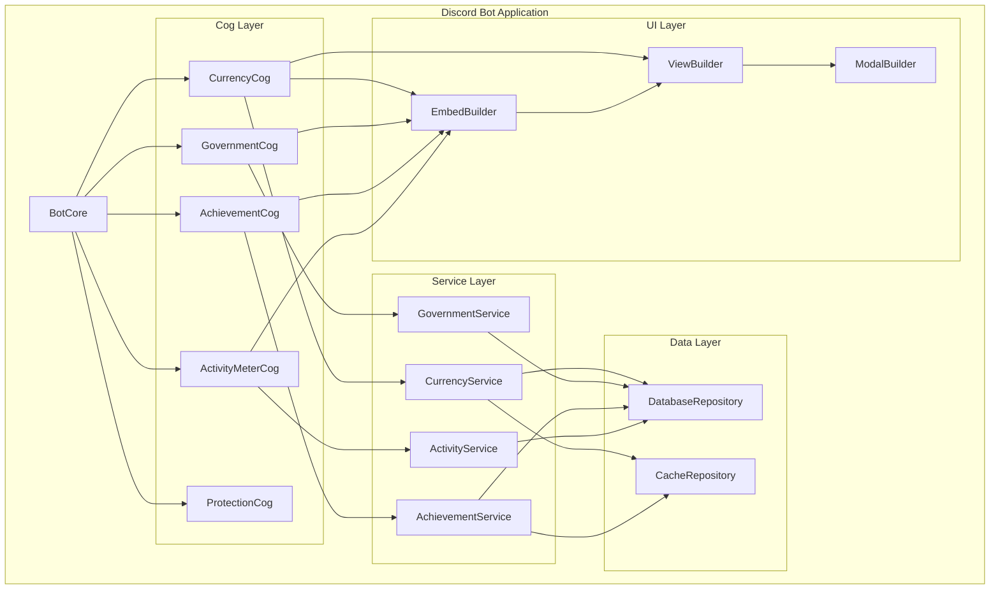

# 元件架構

## 核心元件

### BotCore
**職責：** Discord Bot 的主要控制器，管理事件分發和 Cog 載入

**主要介面：**

- `load_cog(cog_name: str)` - 載入指定 Cog
- `unload_cog(cog_name: str)` - 卸載指定 Cog
- `handle_event(event_type: str, data: Dict)` - 處理 Discord 事件

**依賴：** DatabaseManager, ConfigManager, Logger

**技術堆疊：** discord.py 2.x, asyncio

### CurrencyCog
**職責：** 處理所有貨幣相關功能，包括餘額查詢、轉帳和排行榜

**主要介面：**

- Slash Commands: `/balance`, `/transfer`, `/leaderboard`
- UI Components: Balance embeds, Transfer modals
- Events: 貨幣變動事件

**依賴：** CurrencyService, DatabaseRepository

**技術堆疊：** discord.py, NumPy (計算優化)

### GovernmentCog
**職責：** 管理政府部門結構和角色指派

**主要介面：**

- Slash Commands: `/department`, `/assign_role`
- UI Components: Department management panels
- Integration: departments.json 同步

**依賴：** GovernmentService, DiscordRoleManager

**技術堆疊：** discord.py, JSON 處理

### AchievementCog
**職責：** 成就系統的核心邏輯，包括條件檢查和獎勵發放

**主要介面：**

- Event Handlers: 監聽各種 Discord 事件
- UI Components: Achievement browser, Progress displays
- Achievement Engine: 條件匹配和獎勵邏輯

**依賴：** AchievementService, EventProcessor

**技術堆疊：** discord.py, asyncio 事件處理

### ActivityMeterCog
**職責：** 追蹤和計算使用者活躍度分數

**主要介面：**

- Score Calculation: NumPy 優化的分數計算
- UI Components: Activity charts, Progress bars
- Decay System: 時間衰減算法

**依賴：** ActivityService, NumPy

**技術堆疊：** discord.py, NumPy, 數據視覺化

## 元件關係圖

