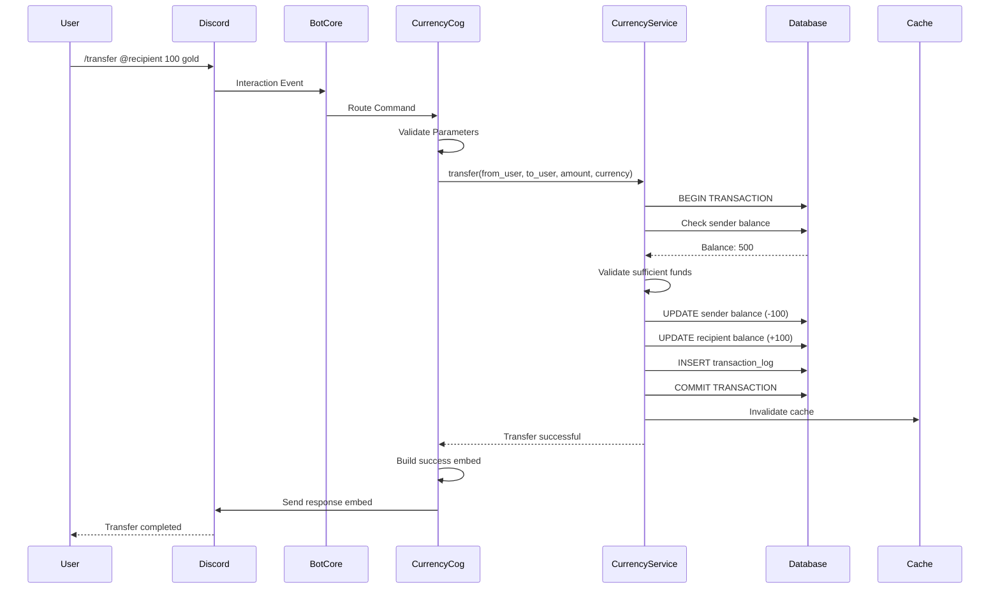
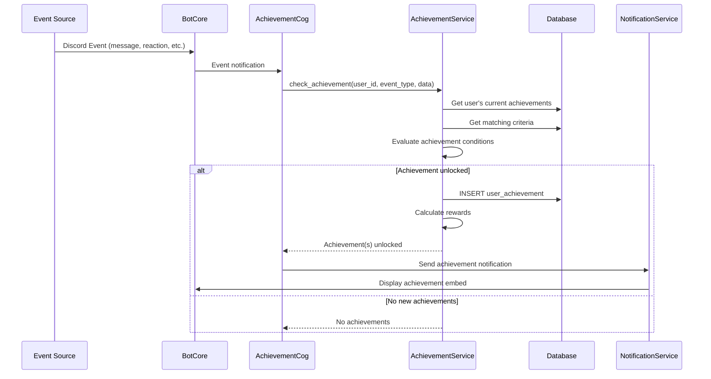

# 核心工作流程

## 貨幣轉帳流程

```mermaid
sequenceDiagram
    participant U as User
    participant D as Discord
    participant BC as BotCore
    participant CC as CurrencyCog
    participant CS as CurrencyService
    participant DB as Database
    participant C as Cache
    
    U->>D: /transfer @recipient 100 gold
    D->>BC: Interaction Event
    BC->>CC: Route Command
    CC->>CC: Validate Parameters
    CC->>CS: transfer(from_user, to_user, amount, currency)
    CS->>DB: BEGIN TRANSACTION
    CS->>DB: Check sender balance
    DB-->>CS: Balance: 500
    CS->>CS: Validate sufficient funds
    CS->>DB: UPDATE sender balance (-100)
    CS->>DB: UPDATE recipient balance (+100)
    CS->>DB: INSERT transaction_log
    CS->>DB: COMMIT TRANSACTION
    CS->>C: Invalidate cache
    CS-->>CC: Transfer successful
    CC->>CC: Build success embed
    CC->>D: Send response embed
    D-->>U: Transfer completed
```

## 成就檢查流程

```mermaid
sequenceDiagram
    participant E as Event Source
    participant BC as BotCore
    participant AC as AchievementCog
    participant AS as AchievementService
    participant DB as Database
    participant N as NotificationService
    
    E->>BC: Discord Event (message, reaction, etc.)
    BC->>AC: Event notification
    AC->>AS: check_achievement(user_id, event_type, data)
    AS->>DB: Get user's current achievements
    AS->>DB: Get matching criteria
    AS->>AS: Evaluate achievement conditions
    alt Achievement unlocked
        AS->>DB: INSERT user_achievement
        AS->>AS: Calculate rewards
        AS-->>AC: Achievement(s) unlocked
        AC->>N: Send achievement notification
        N->>BC: Display achievement embed
    else No new achievements
        AS-->>AC: No achievements
    end
```
