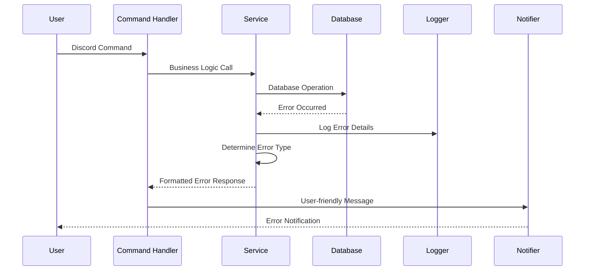

# 錯誤處理策略

## 錯誤流程



## 錯誤回應格式

```python
class BotError(Exception):
    def __init__(self, message: str, error_code: str, details: dict = None):
        self.message = message
        self.error_code = error_code
        self.details = details or {}
        self.timestamp = datetime.utcnow()
        super().__init__(message)
