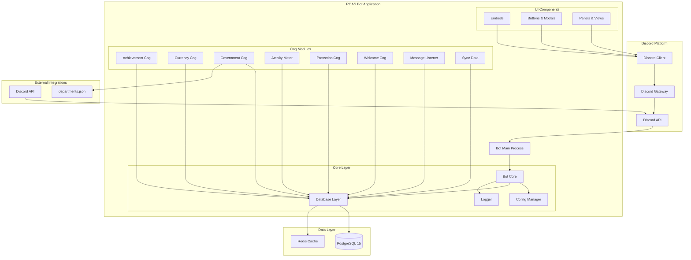

# 高階架構

## 技術摘要

Discord ROAS Bot v2.2 採用模組化 Discord Bot 架構，使用 Python 3.12.10 和 discord.py 2.x 作為核心框架。系統採用 Cog 模式組織功能模組，整合 PostgreSQL 15 資料庫進行資料持久化，並透過 Discord 的原生 UI 元件（Embeds、Buttons、Modals）提供使用者介面。架構設計支援水平擴展、模組化開發，並通過 NumPy 優化實現高效能數據處理，滿足社群伺服器管理和經濟系統的 PRD 目標。

## 平台與基礎設施選擇

**平台：** 自建部署 (Self-hosted)
**核心服務：** 
- Discord Bot Hosting (VM/VPS)
- PostgreSQL 15 Database
- uv Package Management
- GitHub Actions CI/CD

**部署主機與區域：** 可配置的 VPS/雲端實例，建議選擇延遲最低的地區

## 版本庫結構

**結構：** 單一版本庫 (Monorepo)
**套件管理工具：** uv (replacing Docker-Compose)
**套件組織：** 按功能模組分層的 cogs 架構

## 高階架構圖

## 架構模式

- **Cog-based Modular Architecture:** 使用 discord.py 的 Cog 系統進行模組化設計 - _理由：_ 實現清晰的關注點分離和熱重載能力
- **Component-based UI:** 可重複使用的 Discord UI 元件與 TypeScript 型別定義 - _理由：_ 在大型程式碼庫中實現可維護性和型別安全
- **Repository Pattern:** 抽象資料存取邏輯 - _理由：_ 支援測試並提供未來資料庫遷移的靈活性
- **Event-driven Architecture:** 基於 Discord 事件的響應式系統 - _理由：_ 與 Discord 平台的自然整合和即時響應能力
- **Service Layer Pattern:** 業務邏輯封裝在服務層 - _理由：_ 分離關注點並提高代碼可測試性
