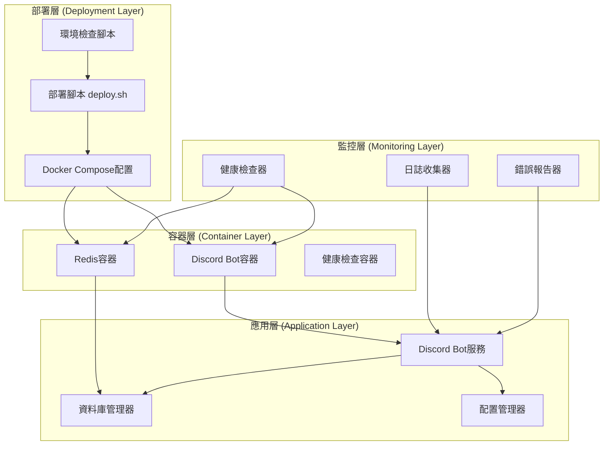

# 設計文件

## 概述

本設計文件描述了ROAS Bot v2.4.3版本的架構設計，主要目標是修復Docker啟動腳本啟動失敗問題，提升系統的穩定性和可靠性。設計遵循模組化、可維護性和錯誤處理最佳實踐原則。

## 架構

### 整體架構圖



### 分層架構設計

#### 1. 部署層 (Deployment Layer)
部署層負責系統的部署、啟動和配置管理。

**職責：**
- 環境變數驗證和配置
- Docker服務啟動和停止
- 依賴服務檢查
- 部署狀態監控

**設計原則：**
- 失敗快速原則：檢測到問題立即停止並報告
- 重試機制：對於暫時性問題提供重試選項
- 詳細日誌：記錄所有操作步驟和結果

#### 2. 容器層 (Container Layer)
容器層管理Docker容器的生命週期和資源分配。

**職責：**
- 容器啟動和停止
- 資源限制和分配
- 容器間通信配置
- 健康狀態監控

**設計原則：**
- 資源隔離：每個服務獨立的資源配置
- 健康檢查：定期驗證服務可用性
- 優雅關閉：確保服務正常關閉

#### 3. 應用層 (Application Layer)
應用層包含核心業務邏輯和服務組件。

**職責：**
- Discord Bot核心功能
- 資料庫操作和緩存
- 配置管理和驗證
- 錯誤處理和恢復

**設計原則：**
- 模組化設計：功能獨立且可替換
- 依賴注入：降低組件間耦合
- 異常安全：確保錯誤不會導致系統崩潰

#### 4. 監控層 (Monitoring Layer)
監控層提供系統運行狀態的實時監控和報告。

**職責：**
- 系統性能監控
- 錯誤日誌收集
- 健康狀態報告
- 告警通知

**設計原則：**
- 非侵入性：不影響主要業務邏輯
- 實時性：及時發現和報告問題
- 可配置性：支持不同級別的監控

## 元件和介面

### 部署管理器抽象類別

```python
from abc import ABC, abstractmethod
from typing import Dict, List, Optional, Tuple
import subprocess
import logging
import time

class DeploymentManager(ABC):
    """部署管理器抽象類別"""
    
    @abstractmethod
    async def validate_environment(self) -> Tuple[bool, List[str]]:
        """驗證環境配置"""
        pass
    
    @abstractmethod
    async def check_dependencies(self) -> Tuple[bool, List[str]]:
        """檢查依賴服務"""
        pass
    
    @abstractmethod
    async def start_services(self) -> Tuple[bool, str]:
        """啟動服務"""
        pass
    
    @abstractmethod
    async def stop_services(self) -> Tuple[bool, str]:
        """停止服務"""
        pass
    
    @abstractmethod
    async def health_check(self) -> Dict[str, str]:
        """健康檢查"""
        pass
```

### Docker部署服務設計

```python
import docker
import docker.errors
from typing import Dict, List, Optional, Tuple
import asyncio
import logging

class DockerDeploymentService:
    """Docker部署服務"""
    
    def __init__(self, compose_file: str, project_name: str):
        self.compose_file = compose_file
        self.project_name = project_name
        self.client = docker.from_env()
        self.logger = logging.getLogger(__name__)
    
    async def validate_compose_file(self) -> Tuple[bool, List[str]]:
        """驗證Docker Compose文件"""
        try:
            # 檢查文件存在性
            if not os.path.exists(self.compose_file):
                return False, [f"Compose file not found: {self.compose_file}"]
            
            # 驗證YAML語法
            with open(self.compose_file, 'r') as f:
                yaml.safe_load(f)
            
            return True, []
        except Exception as e:
            return False, [f"Compose file validation failed: {str(e)}"]
    
    async def check_docker_service(self) -> Tuple[bool, str]:
        """檢查Docker服務狀態"""
        try:
            self.client.ping()
            return True, "Docker service is running"
        except docker.errors.DockerException as e:
            return False, f"Docker service error: {str(e)}"
    
    async def start_services(self, detach: bool = False) -> Tuple[bool, str]:
        """啟動服務"""
        try:
            cmd = ["docker-compose", "-f", self.compose_file, "-p", self.project_name, "up"]
            if detach:
                cmd.append("-d")
            
            result = subprocess.run(cmd, capture_output=True, text=True, timeout=300)
            
            if result.returncode == 0:
                return True, "Services started successfully"
            else:
                return False, f"Service start failed: {result.stderr}"
                
        except subprocess.TimeoutExpired:
            return False, "Service start timeout after 5 minutes"
        except Exception as e:
            return False, f"Unexpected error: {str(e)}"
    
    async def wait_for_services(self, timeout: int = 300) -> Tuple[bool, str]:
        """等待服務啟動完成"""
        start_time = time.time()
        
        while time.time() - start_time < timeout:
            if await self.health_check():
                return True, "All services are healthy"
            await asyncio.sleep(5)
        
        return False, "Service startup timeout"
```

## 資料模型

### 部署狀態資料模型

#### 部署記錄表 (deployment_logs)
```sql
CREATE TABLE deployment_logs (
    id INTEGER PRIMARY KEY AUTOINCREMENT,
    deployment_id TEXT NOT NULL,
    timestamp DATETIME DEFAULT CURRENT_TIMESTAMP,
    service_name TEXT NOT NULL,
    action TEXT NOT NULL,
    status TEXT NOT NULL,
    message TEXT,
    duration_ms INTEGER,
    error_details TEXT,
    environment TEXT NOT NULL,
    created_at DATETIME DEFAULT CURRENT_TIMESTAMP
);

CREATE INDEX idx_deployment_logs_deployment_id ON deployment_logs(deployment_id);
CREATE INDEX idx_deployment_logs_timestamp ON deployment_logs(timestamp);
CREATE INDEX idx_deployment_logs_service_name ON deployment_logs(service_name);
```

#### 服務健康狀態表 (service_health)
```sql
CREATE TABLE service_health (
    id INTEGER PRIMARY KEY AUTOINCREMENT,
    service_name TEXT NOT NULL,
    status TEXT NOT NULL,
    last_check DATETIME DEFAULT CURRENT_TIMESTAMP,
    response_time_ms INTEGER,
    error_count INTEGER DEFAULT 0,
    last_error TEXT,
    created_at DATETIME DEFAULT CURRENT_TIMESTAMP,
    updated_at DATETIME DEFAULT CURRENT_TIMESTAMP
);

CREATE INDEX idx_service_health_service_name ON service_health(service_name);
CREATE INDEX idx_service_health_status ON service_health(status);
```

## 錯誤處理

### 錯誤類別層次結構
```python
class DeploymentError(Exception):
    """部署錯誤基類"""
    def __init__(self, message: str, service: str = None, details: str = None):
        super().__init__(message)
        self.service = service
        self.details = details

class EnvironmentValidationError(DeploymentError):
    """環境驗證錯誤"""
    pass

class DependencyCheckError(DeploymentError):
    """依賴檢查錯誤"""
    pass

class ServiceStartupError(DeploymentError):
    """服務啟動錯誤"""
    pass

class HealthCheckError(DeploymentError):
    """健康檢查錯誤"""
    pass

class TimeoutError(DeploymentError):
    """超時錯誤"""
    pass

class PermissionError(DeploymentError):
    """權限錯誤"""
    pass
```

### 錯誤處理策略
1. **預防性檢查**：在啟動前檢查所有必要條件
2. **重試機制**：對於暫時性問題提供自動重試
3. **優雅降級**：部分服務失敗時保持系統基本功能
4. **詳細報告**：提供完整的錯誤信息和解決建議
5. **自動恢復**：對於可恢復的錯誤提供自動修復

## 測試策略

### 測試層次
1. **單元測試**：測試各個組件的獨立功能
2. **整合測試**：測試組件間的交互
3. **端到端測試**：測試完整的部署流程
4. **負載測試**：測試系統在高負載下的表現
5. **故障注入測試**：測試系統在各種故障情況下的行為

### 測試工具
- **pytest**：Python測試框架
- **docker-compose-test**：Docker Compose測試工具
- **tox**：多環境測試管理
- **coverage**：代碼覆蓋率分析

### 測試資料管理
- 使用測試專用的環境變數和配置
- 測試資料庫與生產資料庫分離
- 自動清理測試產生的資源

## 效能考量

### 啟動時間優化
1. **並行啟動**：同時啟動多個服務
2. **依賴優化**：減少不必要的依賴檢查
3. **緩存機制**：緩存驗證結果
4. **資源預分配**：預先分配必要的資源

### 資源使用優化
1. **容器大小優化**：使用多階段構建減少鏡像大小
2. **資源限制**：設置合理的CPU和記憶體限制
3. **垃圾回收**：及時清理不需要的資源

## 安全性

### 權限管理
1. **最小權限原則**：只授予必要的權限
2. **非root用戶**：使用非特權用戶運行服務
3. **權限檢查**：啟動前驗證權限配置

### 配置安全
1. **敏感信息保護**：使用環境變數和密鑰管理
2. **配置驗證**：驗證所有配置參數
3. **安全掃描**：定期掃描容器安全漏洞

## 部署和維護

### 部署流程
1. **環境準備**：檢查和準備部署環境
2. **配置驗證**：驗證所有配置參數
3. **服務啟動**：按順序啟動各個服務
4. **健康檢查**：驗證服務運行狀態
5. **部署完成**：記錄部署結果

### 維護策略
1. **定期檢查**：定期檢查系統健康狀態
2. **日誌分析**：分析日誌發現潛在問題
3. **性能監控**：監控系統性能指標
4. **備份策略**：定期備份重要數據
