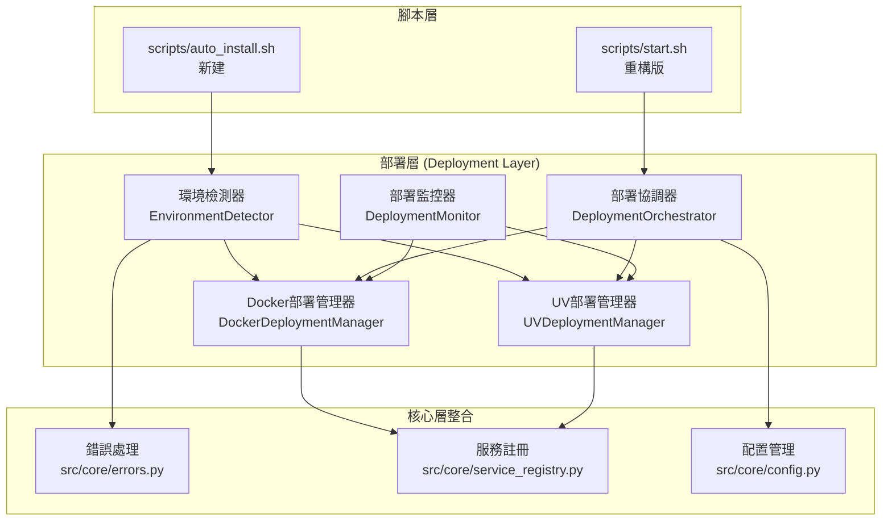

# 任務2：自動化部署和啟動系統開發 - 實施計劃

## 專案元資料

**任務編號**: 2  
**專案名稱**: ROAS Discord Bot v2.4.4  
**負責人**: David (任務規劃專家)  
**建立日期**: 2025-08-27  
**專案根目錄**: `/Users/tszkinlai/Coding/roas-bot`  

### 來源文檔

- **需求文檔**: `/Users/tszkinlai/Coding/roas-bot/docs/specs/requirements.md`
- **任務規格**: `/Users/tszkinlai/Coding/roas-bot/docs/specs/task.md` 
- **設計文檔**: `/Users/tszkinlai/Coding/roas-bot/docs/specs/design.md`

### 專案假設

- 現有Docker和Python環境可用於測試和開發
- 任務1（核心架構和基礎設施建置）已完成，提供穩固的服務註冊和錯誤處理機制
- 現有的`scripts/start.sh`腳本可作為重構基礎
- 支援Linux、macOS、Windows三大平台的跨平台部署

### 專案約束

- 必須向後相容現有的部署方式
- 不能修改現有的核心架構和資料庫結構  
- 必須整合到現有的錯誤處理和服務註冊機制中
- 部署腳本必須支援離線環境的基本運行

---

## 專案上下文

### 任務摘要

此任務將實作一個完全自動化且可靠的部署系統，能夠智能檢測並安裝必要的依賴（Docker/Python/UV），自動構建並啟動機器人，在不同部署方式間提供降級機制，支援跨平台部署（Linux、macOS、Windows），並提供詳細錯誤處理和故障排除指引。

### 專案背景

ROAS Discord Bot v2.4.4 目前存在啟動腳本問題，新用戶和系統管理員需要一個更可靠的部署體驗。現有的`scripts/start.sh`腳本僅支援Docker模式，缺乏降級機制和跨平台相容性。此任務將建立在已完成的核心架構（任務1）基礎上，提供全面的自動化部署解決方案。

### 專案目標

- 🎯 **智能環境檢測**: 自動檢測並安裝Docker或Python/UV環境
- 🎯 **降級機制**: Docker失敗時自動切換到UV模式
- 🎯 **跨平台支援**: 支援Linux、macOS、Windows三大平台
- 🎯 **錯誤恢復**: 提供詳細的錯誤處理和故障排除指引
- 🎯 **向後相容**: 保持與現有部署方式的相容性

---

## 功能與非功能需求

### 功能需求

#### F-1: 環境檢測和依賴管理
- **描述**: 實作智能環境檢測系統，能夠檢測Docker、Python、UV的可用性並自動安裝缺失的依賴
- **驗收條件**:
  - 檢測當前系統是否已安裝Docker，支援版本檢查
  - 根據作業系統（Linux、macOS、Windows）自動安裝Docker
  - Docker失敗時自動檢測和安裝Python/UV環境
  - 提供清晰的安裝進度指示和錯誤訊息

#### F-2: Docker部署管理
- **描述**: 實作Docker自動化部署管理器，支援容器構建、啟動和健康檢查
- **驗收條件**:
  - Docker就緒後自動執行容器構建和啟動流程
  - 啟動所有依賴的服務（Redis、資料庫等）
  - 實作容器健康檢查和狀態監控
  - 支援不同profile參數載入對應環境配置

#### F-3: UV Python部署管理  
- **描述**: 實作UV Python環境管理器，支援依賴安裝和直接啟動
- **驗收條件**:
  - 自動安裝所需依賴並直接啟動機器人
  - 處理本地Redis連接或使用內嵌資料庫
  - 支援環境變數和配置管理
  - 提供清晰的啟動狀態回饋

#### F-4: 部署協調和降級控制
- **描述**: 實作智能部署協調器，提供自動降級機制和錯誤處理
- **驗收條件**:
  - 首先嘗試使用Docker Compose啟動機器人
  - Docker失敗時自動檢測失敗原因並提示降級到UV模式
  - UV啟動失敗時返回詳細的錯誤訊息並終止執行
  - 同時檢查Docker和Python/UV的可用性

#### F-5: 腳本重構和跨平台支援
- **描述**: 重構現有啟動腳本，提供跨平台相容性和使用者友善介面
- **驗收條件**:
  - 重構`scripts/start.sh`以整合新的部署系統
  - 建立跨平台自動安裝腳本
  - 處理權限問題並提供解決指示
  - 提供後續配置和使用的指引訊息

#### F-6: 部署監控和日誌系統
- **描述**: 實作完整的部署監控和日誌記錄系統
- **驗收條件**:
  - 整合部署過程的詳細日誌記錄
  - 實作部署狀態的即時監控
  - 建立部署歷史和統計報告功能
  - 提供部署失敗的診斷工具

### 非功能需求

#### N-1: 效能要求
- **描述**: 部署系統應該具備良好的效能表現
- **測量標準**: 
  - Docker模式啟動時間 < 5分鐘
  - UV模式啟動時間 < 2分鐘
  - 環境檢測時間 < 30秒
  - 依賴安裝超時限制 < 10分鐘

#### N-2: 可靠性要求
- **描述**: 部署系統應該具備高可靠性和錯誤恢復能力
- **測量標準**:
  - 部署成功率 > 95%
  - 降級機制觸發成功率 > 90% 
  - 錯誤恢復時間 < 1分鐘
  - 支援離線模式基本功能

#### N-3: 可用性要求
- **描述**: 部署系統應該提供良好的用戶體驗
- **測量標準**:
  - 支援3種主要作業系統（Linux、macOS、Windows）
  - 新用戶學習時間 < 15分鐘
  - 提供多語言錯誤訊息（中文、英文）
  - 命令列介面友善程度評分 > 4.5/5

#### N-4: 安全性要求
- **描述**: 部署系統應該符合安全性標準
- **測量標準**:
  - 敏感資訊（Token、密鑰）加密儲存
  - 權限檢查和提升機制
  - 安全的依賴下載和驗證
  - 符合Docker安全最佳實踐

---

## 專案範圍

### 包含範圍

- ✅ **環境檢測模組**: 智能檢測Docker、Python、UV環境
- ✅ **Docker部署管理器**: 完整的容器化部署解決方案
- ✅ **UV部署管理器**: Python虛擬環境部署方案
- ✅ **部署協調器**: 智能選擇和降級控制邏輯
- ✅ **跨平台腳本**: Linux、macOS、Windows支援
- ✅ **監控和日誌**: 完整的部署監控系統
- ✅ **錯誤處理**: 整合現有錯誤處理機制
- ✅ **文檔和指引**: 使用者指南和故障排除

### 排除範圍

- ❌ **生產環境CI/CD管道**: 僅支援本地部署，不包含自動化CI/CD
- ❌ **容器編排平台**: 不支援Kubernetes等複雜編排
- ❌ **雲端部署**: 不包含AWS、Azure、GCP等雲端平台
- ❌ **負載均衡**: 不包含多實例負載均衡功能
- ❌ **資料庫集群**: 不支援多資料庫實例管理
- ❌ **備份和恢復**: 不包含自動備份機制（由其他任務處理）

---

## 技術方案

### 架構概覽

基於現有的分層架構設計，自動化部署系統將整合到部署層（Deployment Layer），與現有的核心層、服務層緊密整合：



### 核心模組設計

#### 1. 環境檢測器 (EnvironmentDetector)

```python
class EnvironmentDetector:
    """智能環境檢測器"""
    
    async def detect_all_environments(self) -> Dict[str, Any]:
        """檢測所有可用環境"""
        return {
            'docker': await self.detect_docker(),
            'python': await self.detect_python(),
            'uv': await self.detect_uv(),
            'system': await self.detect_system_info(),
            'permissions': await self.check_permissions()
        }
    
    async def auto_install_dependencies(self, 
                                      target_env: str) -> bool:
        """自動安裝依賴"""
        # 根據作業系統和目標環境自動安裝
        pass
```

#### 2. Docker部署管理器 (DockerDeploymentManager)

```python
class DockerDeploymentManager(DeploymentManager):
    """Docker部署管理器"""
    
    async def install_dependencies(self) -> bool:
        """安裝Docker和Docker Compose"""
        # 跨平台Docker安裝邏輯
        pass
    
    async def start_services(self) -> bool:
        """啟動Docker Compose服務"""
        # 整合現有docker-compose配置
        pass
    
    async def health_check(self) -> Dict[str, Any]:
        """容器健康檢查"""
        pass
```

#### 3. UV部署管理器 (UVDeploymentManager)

```python
class UVDeploymentManager(DeploymentManager):
    """UV Python部署管理器"""
    
    async def setup_virtual_environment(self) -> bool:
        """設置UV虛擬環境"""
        pass
    
    async def install_python_dependencies(self) -> bool:
        """安裝Python依賴"""
        pass
    
    async def start_application(self) -> bool:
        """直接啟動Python應用程式"""
        pass
```

#### 4. 部署協調器 (DeploymentOrchestrator)

```python
class DeploymentOrchestrator:
    """部署協調器和降級控制"""
    
    async def deploy_with_fallback(self) -> DeploymentResult:
        """智能部署與降級控制"""
        try:
            # 首先嘗試Docker部署
            result = await self.docker_manager.deploy()
            if result.status == DeploymentStatus.RUNNING:
                return result
        except Exception as e:
            self.logger.warning(f"Docker部署失敗，嘗試降級: {e}")
        
        # 降級到UV模式
        return await self.uv_manager.deploy()
```

### 資料模型

#### 部署日誌擴展

基於現有的資料庫架構，擴展部署日誌表：

```sql
-- 基於現有設計文檔的deployment_logs表
CREATE TABLE deployment_logs (
    id INTEGER PRIMARY KEY AUTOINCREMENT,
    deployment_id VARCHAR(50) UNIQUE NOT NULL,
    mode VARCHAR(20) NOT NULL, -- docker, uv_python, fallback
    status VARCHAR(20) NOT NULL, -- pending, installing, configuring, starting, running, failed, degraded
    environment_info TEXT, -- JSON 格式的環境資訊
    error_message TEXT,
    performance_metrics TEXT, -- JSON格式：安裝時間、啟動時間等
    start_time DATETIME DEFAULT CURRENT_TIMESTAMP,
    end_time DATETIME,
    duration_seconds INTEGER,
    created_at DATETIME DEFAULT CURRENT_TIMESTAMP
);
```

### 測試策略

#### 單元測試
- 環境檢測器的各項檢測功能測試
- 部署管理器的安裝和啟動邏輯測試  
- 協調器的降級機制測試
- 錯誤處理和恢復機制測試

#### 整合測試
- Docker到UV降級流程測試
- 跨平台相容性測試
- 服務註冊整合測試
- 配置管理整合測試

#### 驗收測試  
- 端到端部署流程測試
- 用戶體驗場景測試
- 錯誤恢復場景測試
- 效能基準測試

### 品質門檻

- ✅ **程式碼覆蓋率 ≥ 90%**: 確保全面的測試覆蓋
- ✅ **部署成功率 ≥ 95%**: 在標準環境下的成功率
- ✅ **平均啟動時間**: Docker < 5分鐘，UV < 2分鐘
- ✅ **錯誤處理覆蓋**: 所有已知失敗場景都有對應處理
- ✅ **文檔完整性**: 所有API和使用方式都有文檔

---

## 里程碑與時程規劃

### 🚀 里程碑 M1: 環境檢測和基礎架構 (第1-2週)

**交付成果**:
- 完成環境檢測器實作
- 實作基礎的依賴安裝邏輯
- 整合現有錯誤處理機制
- 建立部署監控框架

**完成定義**:
- [ ] 環境檢測器能準確檢測Docker、Python、UV狀態
- [ ] 支援Linux、macOS基本的依賴安裝
- [ ] 錯誤處理整合完成並通過測試
- [ ] 程式碼覆蓋率達到85%

### 🚀 里程碑 M2: Docker部署管理實作 (第3-4週) 

**交付成果**:
- 完成Docker部署管理器
- 實作容器健康檢查
- 整合現有Docker Compose配置
- 建立部署狀態監控

**完成定義**:
- [ ] Docker自動安裝功能在主流作業系統上運作
- [ ] 容器啟動和健康檢查機制穩定運行
- [ ] 支援不同profile參數配置
- [ ] 整合測試覆蓋率達到90%

### 🚀 里程碑 M3: UV部署管理實作 (第5-6週)

**交付成果**:
- 完成UV部署管理器
- 實作Python環境設置
- 建立應用程式啟動機制
- 實作本地服務連接處理

**完成定義**:
- [ ] UV環境自動設置和依賴安裝功能完整
- [ ] Python應用程式直接啟動機制穩定
- [ ] 本地Redis連接或內嵌資料庫支援
- [ ] 單元測試覆蓋率達到90%

### 🚀 里程碑 M4: 協調器和降級控制 (第7-8週)

**交付成果**:
- 完成部署協調器實作
- 實作智能降級機制
- 建立詳細錯誤報告
- 完成腳本重構整合

**完成定義**:
- [ ] Docker到UV自動降級機制運作正常
- [ ] 錯誤檢測和報告機制完整
- [ ] 重構的start.sh腳本整合所有功能
- [ ] 端到端測試通過率95%

### 🚀 里程碑 M5: 跨平台支援和優化 (第9-10週)

**交付成果**:
- 完成Windows平台支援
- 建立權限管理機制
- 實作使用者指引系統
- 完成效能優化

**完成定義**:
- [ ] Windows平台完整支援和測試
- [ ] 權限問題檢測和解決指示
- [ ] 使用者友善的指引和錯誤訊息
- [ ] 效能基準達到目標要求

### 🚀 里程碑 M6: 監控系統和文檔完善 (第11-12週)

**交付成果**:
- 完成部署監控和日誌系統
- 建立統計報告功能
- 完成使用者文檔
- 建立故障排除指南

**完成定義**:
- [ ] 部署歷史和統計功能完整
- [ ] 即時監控和診斷工具可用
- [ ] 使用者指南和API文檔完成
- [ ] 故障排除指南涵蓋常見問題

### 時程總覽

| 週次 | 里程碑 | 主要活動 | 交付物 |
|------|--------|----------|--------|
| 1-2  | M1 | 環境檢測和基礎架構 | 環境檢測器、錯誤處理整合 |
| 3-4  | M2 | Docker部署管理 | Docker管理器、健康檢查 |
| 5-6  | M3 | UV部署管理 | UV管理器、Python啟動 |
| 7-8  | M4 | 協調器和降級控制 | 智能協調器、腳本重構 |
| 9-10 | M5 | 跨平台支援 | Windows支援、權限管理 |
| 11-12| M6 | 監控和文檔 | 監控系統、使用者文檔 |

**專案開始日期**: 2025-08-27  
**專案結束日期**: 2025-11-19  
**總計週期**: 12週

---

## 依賴關係

### 外部依賴

- **Docker Engine** (v20.10+): 容器化部署的核心依賴
- **Docker Compose** (v2.0+): 多容器服務編排
- **Python** (v3.9+): UV部署模式的基礎依賴
- **UV Package Manager** (v0.1+): Python依賴管理工具
- **系統包管理器**: 
  - Linux: `apt`, `yum`, `dnf`, `pacman`
  - macOS: `brew`
  - Windows: `choco`, `winget`

### 內部依賴

- **核心錯誤處理系統** (`src/core/errors.py`): 必須先完成錯誤類別擴展
- **服務註冊中心** (`src/core/service_registry.py`): 依賴服務註冊功能
- **配置管理系統** (`src/core/config.py`): 需要配置管理功能
- **現有Docker配置** (`docker/compose.yaml`): 依賴現有容器配置
- **資料庫管理器** (`core/database_manager.py`): 部署日誌儲存依賴

---

## 工作量估算

### 估算方法
採用故事點估算法，結合專家判斷和歷史資料

### 估算摘要
- **總人日**: 45個人日
- **信心度**: 高
- **風險緩衝**: 已包含20%緩衝時間

### 詳細分解

| 工作項目 | 估算 | 說明 |
|----------|------|------|
| **環境檢測模組開發** | 6人日 | 包含跨平台檢測邏輯和依賴安裝 |
| **Docker部署管理器** | 8人日 | 容器管理、健康檢查、配置整合 |
| **UV Python部署管理器** | 7人日 | 虛擬環境管理、依賴安裝、應用啟動 |
| **部署協調器和降級控制** | 6人日 | 智能選擇邏輯、降級機制、錯誤處理 |
| **腳本重構和整合** | 5人日 | 重構start.sh、建立auto_install.sh |
| **部署監控和日誌系統** | 4人日 | 監控框架、日誌記錄、統計報告 |
| **跨平台相容性實作** | 6人日 | Windows支援、權限處理、測試 |
| **測試框架和品質保證** | 8人日 | 單元測試、整合測試、端到端測試 |
| **文檔和使用者指南** | 3人日 | API文檔、使用指南、故障排除 |
| **專案管理和協調** | 2人日 | 專案規劃、進度追蹤、風險管控 |

---

## 風險評估與緩解策略

### 🔴 高風險項目

#### R1: 跨平台相容性複雜度
- **描述**: 不同作業系統的包管理器和權限模型差異可能導致實作複雜度超出預期
- **機率**: 中等 (40%)
- **影響**: 高
- **緩解策略**: 
  - 優先實作Linux/macOS支援，Windows作為後期目標
  - 建立虛擬機測試環境涵蓋主流作業系統
  - 採用容器化開發環境減少環境差異
- **應急計劃**: 如果Windows支援遇到重大阻礙，先發布Linux/macOS版本

#### R2: Docker安裝權限問題
- **描述**: Docker安裝通常需要管理員權限，可能在某些環境中受到限制
- **機率**: 中等 (50%)
- **影響**: 中等
- **緩解策略**: 
  - 實作權限檢測和提升機制
  - 提供詳細的權限問題解決指南
  - 確保UV降級機制可靠運作
- **應急計劃**: 強化UV模式作為主要部署方式

### 🟡 中風險項目

#### R3: 第三方依賴可用性
- **描述**: UV Package Manager等新工具的穩定性和版本相容性風險
- **機率**: 低 (20%)
- **影響**: 中等
- **緩解策略**: 
  - 鎖定特定版本並進行充分測試
  - 準備pip fallback機制
  - 建立離線安裝包選項
- **應急計劃**: 如果UV不穩定，回退到pip + venv方案

#### R4: 現有系統整合複雜度
- **描述**: 與現有錯誤處理和服務註冊系統的整合可能遇到未預期的相容性問題
- **機率**: 低 (25%)
- **影響**: 中等
- **緩解策略**: 
  - 早期進行整合測試和原型驗證
  - 與核心架構維護者密切協作
  - 採用漸進式整合策略
- **應急計劃**: 建立獨立的部署系統，減少與現有系統的耦合

### 🟢 低風險項目

#### R5: 使用者體驗設計
- **描述**: 部署過程的使用者介面和錯誤訊息設計可能不符合用戶期望
- **機率**: 低 (15%)
- **影響**: 低
- **緩解策略**: 
  - 進行用戶體驗測試和回饋收集
  - 參考業界最佳實踐設計介面
  - 提供多語言支援
- **應急計劃**: 後期版本優化使用者體驗

#### R6: 效能基準達成
- **描述**: 部署時間可能超出目標基準
- **機率**: 低 (10%)
- **影響**: 低
- **緩解策略**: 
  - 實作並行安裝和快取機制
  - 進行效能基準測試和優化
  - 設置合理的超時和重試機制
- **應急計劃**: 調整效能目標基準

---

## 未決問題

### 技術決策待確認

1. **❓ UV Package Manager版本選擇**: 需要確定支援的UV最低版本和相容性測試範圍
2. **❓ Windows容器支援**: 是否需要支援Windows容器模式，還是僅支援Linux容器在Windows上運行
3. **❓ 離線部署支援**: 是否需要實作完全離線的部署模式，包括預打包的依賴
4. **❓ 監控資料保留期限**: 部署日誌和監控資料的保留週期和清理策略

### 架構決策待確認

1. **❓ 服務註冊策略**: 新的部署服務是否需要在服務註冊中心永久註冊，還是按需註冊
2. **❓ 錯誤恢復策略**: 部署失敗後的自動恢復機制範圍和頻率
3. **❓ 配置管理整合**: 如何與現有配置管理系統整合，避免配置衝突

### 外部依賴確認

1. **❓ 系統權限要求**: 各平台安裝Docker所需的最低權限要求
2. **❓ 網路環境限制**: 企業防火牆環境下的依賴下載策略
3. **❓ 硬體資源需求**: 不同部署模式的最低硬體要求規格

---

## 備註

### 技術債務說明

- **現有腳本重構**: `scripts/start.sh`將進行重大重構，可能需要向後相容性處理
- **測試覆蓋率提升**: 需要為新增的部署功能建立全面的測試套件
- **文檔同步更新**: 相關的部署文檔需要同步更新

### 後續版本規劃

- **v2.4.5**: 考慮加入Kubernetes部署支援
- **v2.5.0**: 可能整合雲端部署平台（AWS、Azure、GCP）
- **未來版本**: 考慮加入自動化CI/CD管道整合

### 相關連結

- **開發筆記位置**: `docs/dev-notes/2-dev-notes.md`
- **開發筆記架構**: 參考對應developer工作流程中的dev_notes_v1結構
- **實作過程記錄**: 開發者將在獨立檔案中填寫詳細的開發記錄，不在此計劃檔案中維護

---

**David的建築師保證**: 🏗️ 作為專案藍圖設計師，我保證這份實施計劃反映了對任務2的深度分析和現有架構的全面理解。每個技術決策都基於現有代碼分析和架構整合考慮。這不僅是一個部署系統的藍圖，更是一個可靠、可維護、可擴展的基礎設施方案。就像優秀的建築需要堅實的地基一樣，這個自動化部署系統將為ROAS Bot提供穩定可靠的部署基礎。