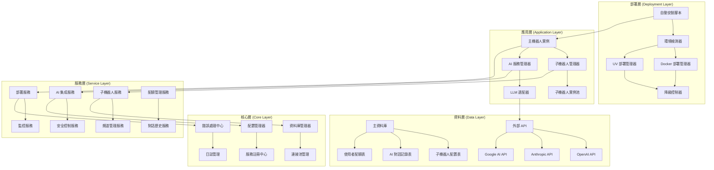

# 設計文件

## 概述

本設計文件描述了 ROAS Discord Bot v2.4.4 的架構設計，專注於三個核心系統的實現：自動化部署和啟動系統、子機器人聊天功能和管理系統、以及 AI LLM 集成和安全控制系統。設計遵循現有的分層架構模式，採用服務導向架構（SOA）和依賴注入模式，確保系統的可擴展性、可維護性和高可用性。

## 架構

### 整體架構圖



### 分層架構設計

#### 1. 部署層 (Deployment Layer)
這一層負責系統的自動化部署、環境檢測和啟動管理。

**職責：**
- 自動檢測和安裝系統依賴（Docker/Python/UV）
- 智能選擇最適合的部署方式
- 提供降級機制確保系統可靠啟動
- 跨平台部署支援（Linux、macOS、Windows）

**設計原則：**
- 容錯性優先：多重降級機制確保啟動成功
- 平台無關：適應不同作業系統的部署需求

#### 2. 應用層 (Application Layer)
這一層管理主機器人和所有子機器人實例，以及 AI 服務的協調。

**職責：**
- 主機器人生命週期管理
- 子機器人實例的創建、監控和管理
- AI 服務的統一接口和路由
- 實例間的隔離和通信

**設計原則：**
- 隔離性：子機器人故障不影響主機器人
- 可擴展性：支援動態創建和銷毀子機器人實例

#### 3. 服務層 (Service Layer)
這一層提供具體的業務邏輯實現和外部系統集成。

**職責：**
- 具體業務邏輯的實現
- 外部 API 的封裝和適配
- 資料處理和業務規則執行
- 服務間的協調和通信

**設計原則：**
- 單一職責：每個服務專注於特定功能
- 鬆耦合：服務間通過介面通信

#### 4. 核心層 (Core Layer)
這一層提供系統基礎設施和共享功能。

**職責：**
- 錯誤處理和異常管理
- 日誌記錄和監控
- 資料庫連接和事務管理
- 配置管理和服務發現

**設計原則：**
- 穩定性：提供可靠的基礎設施服務
- 一致性：統一的錯誤處理和日誌格式

#### 5. 資料層 (Data Layer)
這一層管理所有資料的持久化和外部 API 集成。

**職責：**
- 資料的持久化和檢索
- 外部 AI API 的調用
- 資料一致性和安全性保障
- 效能優化和快取策略

**設計原則：**
- 資料安全：加密敏感資料
- 效能優化：合理的索引和快取策略

## 元件和介面

### 部署管理元件

#### DeploymentManager 抽象類別
```python
from abc import ABC, abstractmethod
from typing import Dict, Any, Optional
from enum import Enum

class DeploymentStatus(Enum):
    """部署狀態枚舉"""
    PENDING = "pending"
    INSTALLING = "installing"
    CONFIGURING = "configuring"
    STARTING = "starting"
    RUNNING = "running"
    FAILED = "failed"
    DEGRADED = "degraded"

class DeploymentMode(Enum):
    """部署模式枚舉"""
    DOCKER = "docker"
    UV_PYTHON = "uv_python"
    FALLBACK = "fallback"

class DeploymentManager(ABC):
    """部署管理器抽象基類"""
    
    def __init__(self):
        self.status = DeploymentStatus.PENDING
        self.mode = None
        self.config = {}
    
    @abstractmethod
    async def detect_environment(self) -> Dict[str, Any]:
        """檢測當前環境"""
        pass
    
    @abstractmethod
    async def install_dependencies(self) -> bool:
        """安裝必要依賴"""
        pass
    
    @abstractmethod
    async def configure_environment(self, config: Dict[str, Any]) -> bool:
        """配置環境"""
        pass
    
    @abstractmethod
    async def start_services(self) -> bool:
        """啟動服務"""
        pass
    
    async def deploy(self) -> DeploymentStatus:
        """執行完整部署流程"""
        try:
            self.status = DeploymentStatus.INSTALLING
            if not await self.install_dependencies():
                return DeploymentStatus.FAILED
            
            self.status = DeploymentStatus.CONFIGURING
            if not await self.configure_environment(self.config):
                return DeploymentStatus.FAILED
            
            self.status = DeploymentStatus.STARTING
            if not await self.start_services():
                return DeploymentStatus.FAILED
            
            self.status = DeploymentStatus.RUNNING
            return self.status
            
        except Exception as e:
            self.status = DeploymentStatus.FAILED
            raise DeploymentError(f"部署失敗: {str(e)}")
```

### 子機器人管理設計

#### SubBotManager (子機器人管理器)
```python
import asyncio
from typing import Dict, List, Optional, Set
from dataclasses import dataclass
from discord.ext import commands

@dataclass
class SubBotConfig:
    """子機器人配置"""
    bot_id: str
    token: str
    name: str
    target_channels: List[int]
    ai_enabled: bool = False
    ai_model: Optional[str] = None
    personality: Optional[str] = None
    rate_limit: int = 10  # 每分鐘最大訊息數

class SubBotInstance:
    """子機器人實例"""
    
    def __init__(self, config: SubBotConfig):
        self.config = config
        self.bot = commands.Bot(command_prefix='!', intents=discord.Intents.all())
        self.status = "offline"
        self.last_activity = None
        self.message_count = 0
        
    async def start(self) -> bool:
        """啟動子機器人"""
        try:
            await self.bot.start(self.config.token)
            self.status = "online"
            return True
        except Exception as e:
            self.status = "error"
            return False
    
    async def stop(self) -> bool:
        """停止子機器人"""
        try:
            await self.bot.close()
            self.status = "offline"
            return True
        except Exception as e:
            return False

class SubBotManager:
    """子機器人管理器"""
    
    def __init__(self):
        self.sub_bots: Dict[str, SubBotInstance] = {}
        self.running_tasks: Dict[str, asyncio.Task] = {}
    
    async def create_sub_bot(self, config: SubBotConfig) -> str:
        """創建新的子機器人"""
        if config.bot_id in self.sub_bots:
            raise ValueError(f"子機器人 {config.bot_id} 已存在")
        
        sub_bot = SubBotInstance(config)
        self.sub_bots[config.bot_id] = sub_bot
        
        # 啟動子機器人
        task = asyncio.create_task(sub_bot.start())
        self.running_tasks[config.bot_id] = task
        
        return config.bot_id
    
    async def remove_sub_bot(self, bot_id: str) -> bool:
        """移除子機器人"""
        if bot_id not in self.sub_bots:
            return False
        
        # 停止子機器人
        await self.sub_bots[bot_id].stop()
        
        # 取消任務
        if bot_id in self.running_tasks:
            self.running_tasks[bot_id].cancel()
            del self.running_tasks[bot_id]
        
        # 移除實例
        del self.sub_bots[bot_id]
        return True
    
    async def get_sub_bot_status(self, bot_id: str) -> Optional[Dict[str, Any]]:
        """獲取子機器人狀態"""
        if bot_id not in self.sub_bots:
            return None
        
        sub_bot = self.sub_bots[bot_id]
        return {
            "bot_id": bot_id,
            "name": sub_bot.config.name,
            "status": sub_bot.status,
            "target_channels": sub_bot.config.target_channels,
            "message_count": sub_bot.message_count,
            "last_activity": sub_bot.last_activity,
            "ai_enabled": sub_bot.config.ai_enabled
        }
    
    async def list_sub_bots(self) -> List[Dict[str, Any]]:
        """列出所有子機器人"""
        result = []
        for bot_id in self.sub_bots:
            status = await self.get_sub_bot_status(bot_id)
            if status:
                result.append(status)
        return result
```

### AI集成服務設計

#### AIService (AI服務)
```python
from abc import ABC, abstractmethod
from typing import Dict, Any, List, Optional
from enum import Enum
import aiohttp
import json

class AIProvider(Enum):
    """AI 提供商枚舉"""
    OPENAI = "openai"
    ANTHROPIC = "anthropic"
    GOOGLE = "google"

class AIModel(Enum):
    """AI 模型枚舉"""
    GPT_4 = "gpt-4"
    GPT_3_5_TURBO = "gpt-3.5-turbo"
    CLAUDE_3_OPUS = "claude-3-opus-20240229"
    CLAUDE_3_SONNET = "claude-3-sonnet-20240229"
    GEMINI_PRO = "gemini-pro"

@dataclass
class AIRequest:
    """AI 請求資料結構"""
    user_id: int
    message: str
    context: Optional[List[Dict[str, str]]] = None
    model: Optional[AIModel] = None
    max_tokens: int = 1000
    temperature: float = 0.7

@dataclass
class AIResponse:
    """AI 回應資料結構"""
    content: str
    provider: AIProvider
    model: AIModel
    tokens_used: int
    cost: float
    response_time: float

class AIAdapter(ABC):
    """AI 適配器抽象基類"""
    
    @abstractmethod
    async def chat_completion(self, request: AIRequest) -> AIResponse:
        """聊天完成 API"""
        pass
    
    @abstractmethod
    async def validate_api_key(self) -> bool:
        """驗證 API 金鑰"""
        pass

class OpenAIAdapter(AIAdapter):
    """OpenAI 適配器"""
    
    def __init__(self, api_key: str):
        self.api_key = api_key
        self.base_url = "https://api.openai.com/v1"
    
    async def chat_completion(self, request: AIRequest) -> AIResponse:
        """OpenAI 聊天完成實現"""
        headers = {
            "Authorization": f"Bearer {self.api_key}",
            "Content-Type": "application/json"
        }
        
        payload = {
            "model": request.model.value,
            "messages": self._build_messages(request),
            "max_tokens": request.max_tokens,
            "temperature": request.temperature
        }
        
        async with aiohttp.ClientSession() as session:
            async with session.post(
                f"{self.base_url}/chat/completions",
                headers=headers,
                json=payload
            ) as response:
                data = await response.json()
                return self._parse_response(data, request)
    
    def _build_messages(self, request: AIRequest) -> List[Dict[str, str]]:
        """構建訊息列表"""
        messages = []
        if request.context:
            messages.extend(request.context)
        messages.append({"role": "user", "content": request.message})
        return messages
    
    def _parse_response(self, data: Dict, request: AIRequest) -> AIResponse:
        """解析 API 回應"""
        choice = data["choices"][0]
        usage = data["usage"]
        
        return AIResponse(
            content=choice["message"]["content"],
            provider=AIProvider.OPENAI,
            model=request.model,
            tokens_used=usage["total_tokens"],
            cost=self._calculate_cost(usage["total_tokens"], request.model),
            response_time=0.0  # 需要在調用時計算
        )
    
    def _calculate_cost(self, tokens: int, model: AIModel) -> float:
        """計算 API 成本"""
        # 簡化的成本計算，實際需要根據最新價格表
        price_per_token = {
            AIModel.GPT_4: 0.00003,
            AIModel.GPT_3_5_TURBO: 0.000002
        }
        return tokens * price_per_token.get(model, 0.000002)

class AIService:
    """AI 服務主類"""
    
    def __init__(self):
        self.adapters: Dict[AIProvider, AIAdapter] = {}
        self.usage_tracker = {}
        self.conversation_history = {}
    
    def register_adapter(self, provider: AIProvider, adapter: AIAdapter):
        """註冊 AI 適配器"""
        self.adapters[provider] = adapter
    
    async def chat(
        self, 
        user_id: int, 
        message: str, 
        provider: AIProvider = AIProvider.OPENAI,
        model: AIModel = AIModel.GPT_3_5_TURBO,
        use_context: bool = True
    ) -> AIResponse:
        """聊天接口"""
        if provider not in self.adapters:
            raise ValueError(f"未註冊的 AI 提供商: {provider}")
        
        # 構建請求
        context = None
        if use_context:
            context = self._get_conversation_history(user_id)
        
        request = AIRequest(
            user_id=user_id,
            message=message,
            context=context,
            model=model
        )
        
        # 調用適配器
        adapter = self.adapters[provider]
        response = await adapter.chat_completion(request)
        
        # 更新會話歷史
        self._update_conversation_history(user_id, message, response.content)
        
        # 記錄使用量
        self._track_usage(user_id, response)
        
        return response
    
    def _get_conversation_history(self, user_id: int) -> List[Dict[str, str]]:
        """獲取會話歷史"""
        if user_id not in self.conversation_history:
            return []
        
        history = self.conversation_history[user_id]
        # 限制歷史長度
        return history[-10:]  # 最近10輪對話
    
    def _update_conversation_history(self, user_id: int, user_message: str, ai_response: str):
        """更新會話歷史"""
        if user_id not in self.conversation_history:
            self.conversation_history[user_id] = []
        
        self.conversation_history[user_id].extend([
            {"role": "user", "content": user_message},
            {"role": "assistant", "content": ai_response}
        ])
    
    def _track_usage(self, user_id: int, response: AIResponse):
        """追蹤使用量"""
        if user_id not in self.usage_tracker:
            self.usage_tracker[user_id] = {
                "total_tokens": 0,
                "total_cost": 0.0,
                "request_count": 0
            }
        
        self.usage_tracker[user_id]["total_tokens"] += response.tokens_used
        self.usage_tracker[user_id]["total_cost"] += response.cost
        self.usage_tracker[user_id]["request_count"] += 1
```

## 資料模型

### 子機器人系統資料模型

#### sub_bots (子機器人配置表)
```sql
CREATE TABLE sub_bots (
    id INTEGER PRIMARY KEY AUTOINCREMENT,
    bot_id VARCHAR(50) UNIQUE NOT NULL,
    name VARCHAR(100) NOT NULL,
    token_hash VARCHAR(255) NOT NULL, -- 加密儲存的 Token
    target_channels TEXT NOT NULL, -- JSON 格式的頻道 ID 列表
    ai_enabled BOOLEAN DEFAULT FALSE,
    ai_model VARCHAR(50),
    personality TEXT,
    rate_limit INTEGER DEFAULT 10,
    status VARCHAR(20) DEFAULT 'offline',
    created_at DATETIME DEFAULT CURRENT_TIMESTAMP,
    updated_at DATETIME DEFAULT CURRENT_TIMESTAMP,
    last_active_at DATETIME,
    message_count INTEGER DEFAULT 0
);
```

#### sub_bot_channels (子機器人頻道關聯表)
```sql
CREATE TABLE sub_bot_channels (
    id INTEGER PRIMARY KEY AUTOINCREMENT,
    sub_bot_id INTEGER NOT NULL,
    channel_id BIGINT NOT NULL,
    channel_type VARCHAR(20) DEFAULT 'text',
    permissions TEXT, -- JSON 格式的權限設定
    created_at DATETIME DEFAULT CURRENT_TIMESTAMP,
    FOREIGN KEY (sub_bot_id) REFERENCES sub_bots(id) ON DELETE CASCADE,
    UNIQUE(sub_bot_id, channel_id)
);
```

### AI系統資料模型

#### ai_conversations (AI 對話記錄表)
```sql
CREATE TABLE ai_conversations (
    id INTEGER PRIMARY KEY AUTOINCREMENT,
    user_id BIGINT NOT NULL,
    sub_bot_id INTEGER,
    provider VARCHAR(20) NOT NULL,
    model VARCHAR(50) NOT NULL,
    user_message TEXT NOT NULL,
    ai_response TEXT NOT NULL,
    tokens_used INTEGER NOT NULL,
    cost DECIMAL(10, 6) NOT NULL,
    response_time DECIMAL(8, 3),
    created_at DATETIME DEFAULT CURRENT_TIMESTAMP,
    FOREIGN KEY (sub_bot_id) REFERENCES sub_bots(id) ON DELETE SET NULL
);
```

#### ai_usage_quotas (AI 使用配額表)
```sql
CREATE TABLE ai_usage_quotas (
    id INTEGER PRIMARY KEY AUTOINCREMENT,
    user_id BIGINT UNIQUE NOT NULL,
    daily_limit INTEGER DEFAULT 50,
    weekly_limit INTEGER DEFAULT 200,
    monthly_limit INTEGER DEFAULT 1000,
    daily_used INTEGER DEFAULT 0,
    weekly_used INTEGER DEFAULT 0,
    monthly_used INTEGER DEFAULT 0,
    total_cost_limit DECIMAL(10, 2) DEFAULT 10.00,
    total_cost_used DECIMAL(10, 2) DEFAULT 0.00,
    last_reset_daily DATE DEFAULT CURRENT_DATE,
    last_reset_weekly DATE DEFAULT CURRENT_DATE,
    last_reset_monthly DATE DEFAULT CURRENT_DATE,
    created_at DATETIME DEFAULT CURRENT_TIMESTAMP,
    updated_at DATETIME DEFAULT CURRENT_TIMESTAMP
);
```

#### ai_providers (AI 提供商配置表)
```sql
CREATE TABLE ai_providers (
    id INTEGER PRIMARY KEY AUTOINCREMENT,
    provider_name VARCHAR(20) UNIQUE NOT NULL,
    api_key_hash VARCHAR(255) NOT NULL, -- 加密儲存的 API Key
    base_url VARCHAR(255),
    is_active BOOLEAN DEFAULT TRUE,
    priority INTEGER DEFAULT 1, -- 優先級，數字越小優先級越高
    rate_limit_per_minute INTEGER DEFAULT 60,
    cost_per_token DECIMAL(10, 8) DEFAULT 0.000002,
    created_at DATETIME DEFAULT CURRENT_TIMESTAMP,
    updated_at DATETIME DEFAULT CURRENT_TIMESTAMP
);
```

### 部署系統資料模型

#### deployment_logs (部署日誌表)
```sql
CREATE TABLE deployment_logs (
    id INTEGER PRIMARY KEY AUTOINCREMENT,
    deployment_id VARCHAR(50) UNIQUE NOT NULL,
    mode VARCHAR(20) NOT NULL, -- docker, uv_python, fallback
    status VARCHAR(20) NOT NULL, -- pending, installing, configuring, starting, running, failed, degraded
    environment_info TEXT, -- JSON 格式的環境資訊
    error_message TEXT,
    start_time DATETIME DEFAULT CURRENT_TIMESTAMP,
    end_time DATETIME,
    duration_seconds INTEGER,
    created_at DATETIME DEFAULT CURRENT_TIMESTAMP
);
```

## 錯誤處理

### 錯誤類別層次結構
```python
class ROASBotError(Exception):
    """ROAS Bot 基礎錯誤類別"""
    def __init__(self, message: str, error_code: str = None):
        super().__init__(message)
        self.error_code = error_code
        self.timestamp = datetime.now()

class DeploymentError(ROASBotError):
    """部署相關錯誤"""
    pass

class EnvironmentError(DeploymentError):
    """環境檢測錯誤"""
    pass

class DependencyInstallError(DeploymentError):
    """依賴安裝錯誤"""
    pass

class ServiceStartupError(DeploymentError):
    """服務啟動錯誤"""
    pass

class SubBotError(ROASBotError):
    """子機器人相關錯誤"""
    pass

class SubBotCreationError(SubBotError):
    """子機器人創建錯誤"""
    pass

class SubBotTokenError(SubBotError):
    """子機器人 Token 錯誤"""
    pass

class SubBotChannelError(SubBotError):
    """子機器人頻道配置錯誤"""
    pass

class AIServiceError(ROASBotError):
    """AI 服務相關錯誤"""
    pass

class AIProviderError(AIServiceError):
    """AI 提供商錯誤"""
    pass

class AIQuotaExceededError(AIServiceError):
    """AI 配額超限錯誤"""
    pass

class AIResponseError(AIServiceError):
    """AI 回應錯誤"""
    pass

class SecurityError(ROASBotError):
    """安全相關錯誤"""
    pass

class ContentFilterError(SecurityError):
    """內容過濾錯誤"""
    pass

class AuthenticationError(SecurityError):
    """身份驗證錯誤"""
    pass
```

### 錯誤處理策略
1. **分層錯誤處理**：每個架構層都有對應的錯誤處理機制
2. **優雅降級**：在部分功能失效時，系統能夠繼續提供基本服務
3. **錯誤恢復**：自動重試機制和故障恢復策略
4. **用戶友善錯誤訊息**：將技術錯誤轉換為用戶可理解的訊息

## 測試策略

### 測試層次
1. **單元測試**：測試個別類別和方法的功能正確性
2. **整合測試**：測試服務間的協作和資料流
3. **端到端測試**：測試完整的用戶使用場景
4. **負載測試**：測試系統在高負載下的表現
5. **安全測試**：測試 AI 內容過濾和權限控制

### 測試工具
- **pytest**：Python 測試框架
- **pytest-asyncio**：異步測試支援
- **dpytest**：Discord.py 測試工具
- **aioresponses**：HTTP 請求模擬
- **factory_boy**：測試資料生成

### 測試資料管理
- 使用記憶體資料庫進行測試，避免污染生產資料
- 提供完整的測試資料固件（fixtures）
- 自動化測試環境的設置和清理

## 效能考量

### 資料庫效能
1. **連接池管理**：使用連接池減少資料庫連接開銷
2. **查詢優化**：為常用查詢添加適當索引
3. **快取策略**：對熱點資料實施記憶體快取

### AI API 效能
1. **請求限流**：實施速率限制避免 API 超限
2. **回應快取**：對相似請求使用快取結果
3. **異步處理**：使用異步 I/O 提高並發處理能力

### 子機器人效能
1. **實例池管理**：合理控制同時運行的子機器人數量
2. **資源監控**：監控每個子機器人的資源使用情況
3. **負載均衡**：在多個子機器人間分配負載

## 安全性

### API 金鑰安全
1. **加密儲存**：所有 API 金鑰使用 AES 加密後儲存
2. **環境變數**：敏感配置通過環境變數傳遞
3. **定期輪換**：支援 API 金鑰的定期更新

### 內容安全
1. **輸入驗證**：對所有用戶輸入進行嚴格驗證
2. **內容過濾**：AI 回應經過敏感詞和有害內容檢測
3. **速率限制**：防止濫用和 DDoS 攻擊

### 資料安全
1. **資料加密**：敏感資料在傳輸和儲存時都進行加密
2. **存取控制**：實施基於角色的存取控制（RBAC）
3. **審計日誌**：記錄所有重要操作的審計追蹤

## 部署和維護

### 容器化部署
1. **Docker 支援**：提供完整的 Docker 部署方案
2. **多階段構建**：優化容器映像大小和安全性
3. **健康檢查**：內建容器健康檢查機制

### 監控和警報
1. **效能監控**：監控系統資源使用和回應時間
2. **錯誤追蹤**：自動收集和分析錯誤資訊
3. **自動警報**：在異常情況下自動發送警報通知

### 備份和恢復
1. **資料備份**：定期自動備份重要資料
2. **配置備份**：備份系統配置和部署腳本
3. **災難恢復**：提供完整的災難恢復程序和文件
