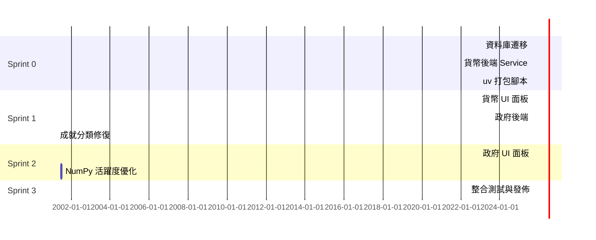

# ROAS Bot Brownfield Enhancement PRD

## Intro Project Analysis and Context

### Existing Project Overview

#### Analysis Source
- IDE-based fresh analysis（基於專案檔案，如 `src/` 目錄結構、`docs/architecture.md`、`README.md` 和 `docs/brief.md`）。

#### Current Project State
ROAS Bot 目前是一個全端 Discord 機器人系統，使用 Python 3.11 與 `discord.py` 2.x 為核心，專注於社群管理功能。核心模組包括：
- **成就系統**：`cogs/achievement/`，處理事件、獎勵與面板。
- **活躍度追蹤**：`cogs/activity_meter/`，計算 0-100 分數，支援衰減、排行榜與進度條渲染。
- **安全防護**：`cogs/protection/`，包含反垃圾訊息、反惡意連結與反執行檔子模組。
- **歡迎系統**：`cogs/welcome/`，自訂訊息、圖片與頻道。
- **訊息日誌**：`cogs/message_listener/`，記錄歷史並渲染 Discord 風格截圖。
- **資料同步**：`cogs/sync_data/`，跨伺服器資料更新。

系統採模組化 cog 結構，核心程式位於 `src/core/`（`bot.py`、`config.py`、`database.py` 等），使用 PostgreSQL 15 資料庫，具備單元測試（`tests/`）。目前無貨幣或政府功能；效能監控（`core/monitor.py`）將在 v2.2 移除。專案現行部署使用 Docker-Compose，但未來將改為 uv 管理的安裝包。

### Available Documentation Analysis
- **Tech Stack Documentation**：`docs/architecture.md`（✓）
- **Source Tree / Architecture**：同上（✓）
- **Coding Standards**：程式碼規範可從 ruff 設定推斷（Partial）
- **API Documentation**：`docs/api/openapi.json`（✓）
- **External API Documentation**：Discord API（✓）
- **UX/UI Guidelines**：缺少專門文件（✗）
- **Technical Debt Documentation**：CHANGELOG.md、測試覆蓋（Partial）
- **Other**：`docs/brief.md`、現行 `docs/prd.md`（✓）

### Enhancement Scope Definition
- **Enhancement Type**：New Feature Addition、Major Feature Modification、Integration with New Systems、Performance Improvements、Bug Fix & Stability。
- **Enhancement Description**：升級至 v2.2，新增貨幣與政府模組、修復成就分類、NumPy 效能優化、uv 安裝包，並移除效能監控。
- **Impact Assessment**：Significant Impact（需擴充資料庫、整合多模組、變更部署流程）。

---

## Goals and Background Context

### Goals
- 修復成就管理面板分類問題並完善所有模組的單元測試。
- 引入貨幣系統（自訂名稱／圖示、轉賬、排行榜、部門賬戶）。
- 新增政府系統（部門／官級管理、角色自動建立、`departments.json` 同步）。
- 改進活躍度與其他面板，使用 NumPy 提高運算效能並顯示真實資料。
- 移除效能監控面板，簡化系統。
- 部署方式改為 uv 打包安裝包，避免 Docker／Kubernetes。

### Background Context
ROAS Bot v2.1 提供基礎社群管理，但成就面板分類損壞、單元測試不足且缺乏經濟及治理功能。伺服器管理員需更完善的工具來提升參與度與行政效率。v2.2 透過貨幣、政府模組與效能優化解決這些痛點，並導入 uv 打包簡化部署流程。

---

## Change Log
| Change | Date | Version | Description | Author |
|--------|------|---------|-------------|--------|
| Initial PRD Creation | 2025-08-02 | v2.2 | 建立初始 PRD，納入貨幣、政府、修復、NumPy、uv 安裝包等需求 | John |
| Achievement Panel Fix | TBD | v2.2 | 修復成就面板分類並完成單元測試 | Dev Team |
| Currency System Addition | TBD | v2.2 | 新增可自訂貨幣系統 | Dev Team |
| Government System Addition | TBD | v2.2 | 實作政府面板與自動角色管理 | Dev Team |
| Performance Monitoring Removal | TBD | v2.2 | 移除效能監控面板 | Dev Team |
| Deployment Packaging Update | TBD | v2.2 | 轉向 uv 管理解決方案 | Dev Team |

---

## Requirements

### Functional Requirements (FR)
1. **FR1**：成就管理面板修復分類功能並支援多層級分類。
2. **FR2**：貨幣系統支援自訂名稱／圖示、餘額管理、轉賬、排行榜。
3. **FR3**：政府系統支援部門與官級管理、自動角色建立、`departments.json` 更新。
4. **FR4**：所有面板必須讀取真實資料來源，不使用模擬資料。
5. **FR5**：資料庫／JSON 自動遷移腳本確保升級平滑。

### Non-Functional Requirements (NFR)
1. **NFR1**：除必要欄位外禁止使用 emoji；貨幣圖示除外。
2. **NFR2**：數據面板展示即時真實資料，測試亦須以真實樣本驅動。
3. **NFR3**：NumPy 加速運算，平均性能提升 ≥ 50%。
4. **NFR4**：部署採 uv 安裝包，安裝流程 ≤ 3 指令，不依賴 Docker／K8s。
5. **NFR5**：升級中斷時間 ≤ 1 分鐘，且可 30 秒內回滾。

### Compatibility Requirements (CR)
1. **CR1**：所有現有 Slash Commands 與事件介面保持相容。
2. **CR2**：資料庫 schema 變更可自動遷移並向下相容。
3. **CR3**：UI 元素保持既有風格一致性。
4. **CR4**：移除效能監控不得影響其他監控或日誌功能。

---

## User Interface Enhancement Goals
### Integration with Existing UI
- 沿用現有 Embed＋View 架構，主題色 `#5865F2`，僅貨幣符號可用 emoji。
- 面板全部讀取即時資料，避免硬編碼。

### Modified / New Screens and Views
1. 貨幣系統－管理員面板
2. 貨幣系統－成員面板
3. 貨幣系統－部門負責人面板
4. 政府系統－管理員面板
5. 政府系統－官級／部門視圖
6. 成就面板多層級分類修復
7. 活躍度面板 NumPy 加速

### UI Consistency Requirements
- 色彩、字體、排版沿用現有面板。
- 互動元件 `custom_id` 前綴 `roas_`，避免衝突。
- Modal 嵌入欄位即時驗證；提供可存取性標籤。
- UI Snapshot 測試保證一致渲染。

---

## Technical Constraints and Integration Requirements

### Existing Technology Stack
**Languages**：Python 3.12.7  
**Frameworks**：discord.py 2.x、NumPy 1.26+、asyncpg、pydantic、uv  
**Database**：PostgreSQL 15  
**Infrastructure**：Linux + systemd + GitHub Actions  
**External Dependencies**：Discord API、Pillow、ffmpeg

### Integration Approach
#### Database Integration Strategy
- 建立 `currency_balances`、`department_accounts` 與索引。
- 使用 Alembic 版本遷移；`uv pip sync` 時自動套用。

#### API Integration Strategy
- 新 Slash 指令 `/貨幣面板`、`/政府面板`；事件註冊保持相容。

#### Frontend Integration Strategy
- 新面板放於 `src/ui/`，繼承 `BasePanel`。

#### Testing Integration Strategy
- `pytest`＋`pytest-asyncio`；新增 `real_db` fixture。

### Code Organization and Standards
- 新模組：`src/cogs/currency/`、`src/cogs/government/`。
- 每個 cog：`commands.py`、`models.py`、`views.py`、`services.py`。
- 檔案／變數 snake_case；類別 PascalCase；`custom_id` 前綴 `roas_`。

### Deployment and Operations
- `make dist` 產出 `.whl`；`uv venv .venv && uv pip install roasbot-v2.2.whl`。
- systemd 服務指向 `.venv/bin/python start_bot.py`。
- Docker Compose 標記 Deprecated。

### Monitoring and Logging
- 保留 `systemd-journald`；新增 NumPy 計算時間 log。

### Configuration Management
- `.env` 管理機密；可設定 `UV_PACKAGES_PATH` 指向私有 PyPI。

### Risk Assessment and Mitigation
| 類別 | 風險 | 緩解措施 |
|------|------|----------|
| Technical | NumPy 與 async 衝突 | 在 Service 使用 `run_in_executor`＋Benchmark Fallback |
| Integration | 指令 / custom_id 衝突 | 前綴化＋CI 靜態掃描 |
| Deployment | 用戶習慣 Docker | 提供 uv 安裝指引與教學影片 |
| Data | Schema 遷移失敗 | Alembic 雙向遷移＋回滾腳本 |
| Performance | NumPy 效果不佳 | 加速門檻 50%，不足則回退舊算法 |

---

## Epic 1：伺服器治理與經濟升級

### Epic Goal
建置整合式貨幣與政府模組、修復既有面板、提升效能，並以 uv 打包簡化部署。

### Integration Requirements
- 與現有 cogs 架構無縫整合。
- 保持 Slash Commands 相容。
- 一次性資料庫遷移可回滾。
- UI 風格一致，僅貨幣符號允許 emoji。
- uv 安裝包為主要部署途徑。

### Story Sequence

#### Story 1.1  資料庫與設定 Schema 遷移
**As a** Developer,
**I want** 升級資料庫與設定檔 Schema 至 v2，以支援後續貨幣與政府模組，
**so that** 系統保持資料一致性並符合新功能需求。

**Acceptance Criteria**
1. Alembic 遷移腳本涵蓋所有 Schema 變更並可成功 upgrade / downgrade。
2. `config/` YAML 與 .env 新增欄位已同步且通過驗證。
3. 現有資料 100% 成功遷移；驗證腳本比對前後筆數一致。
4. 全部單元測試與整合測試通過，涵蓋率 ≥ 85%。
5. CHANGELOG 與相關文件完成更新。

**Key Tasks (摘要)**
- 建立 Alembic Revision `v2_initial_migration`，定義新 Table/Column/Index。
- 更新 SQLAlchemy Model 與 Repository 物件。
- 撰寫遷移與回滾測試（pytest + Testcontainers-Postgres）。
- 備份資料並驗證回滾策略。
- 更新文件與 CHANGELOG。

#### Story 1.2  貨幣系統後端 Service
**As a** Bot Administrator,
**I want** 提供完整的貨幣系統後端 Service（錢包、轉帳、排行榜），
**so that** Discord 伺服器能安全一致地管理經濟並支援 UI 面板與政府模組。

**Acceptance Criteria**
1. 支援使用者餘額初始化、查詢、轉帳與排行榜分頁 API。
2. 交易必須原子性並寫入交易快照；可於 30 秒內回滾。
3. Service 操作透過 InternalEventBus 發佈 `CurrencyTransferEvent`、`CurrencyBalanceUpdateEvent`。
4. 資料持久化於 PostgreSQL，遵循 `CurrencyBalance` 模型。
5. 單元＋整合測試覆蓋率 ≥ 85%。
6. 與現有 Cog 與 Slash Commands 相容，不影響既有功能。

**Key Tasks (摘要)**
- 實作 `CurrencyRepository` 與 `CurrencyService`，含錢包管理、轉帳與排行榜。
- 設計並文件化事件 Payload；整合 InternalEventBus。
- 建立 Currency Cog 指令 stub：`/currency balance`, `transfer`, `top`。
- 撰寫並執行安全性與並發測試（重放攻擊、防餘額負數）。
- 更新 OpenAPI 與 Component Diagram 文件。

### Story 1.3  貨幣系統 UI 面板與管理功能
**As a** Server Member 與 Server Administrator  
**I want** 使用直觀的貨幣面板查看餘額、排行榜並快捷轉帳，同時管理員需要完整的貨幣管理工具，  
**so that** 用戶能輕鬆參與伺服器經濟，管理員能有效監控與管理整體經濟系統。

**Acceptance Criteria**  
1. **用戶端面板**：`/貨幣面板` 指令開啟 Embed＋View，顯示個人餘額、伺服器經濟統計與操作按鈕。  
2. **轉帳功能**：提供「轉帳」Modal，輸入收款人與金額；成功後面板即時更新。  
3. **排行榜功能**：「排行榜」分頁支援分頁檢視並可快速搜尋自己排名。  
4. **管理員面板**：`/貨幣管理面板` 指令開啟管理界面，支援用戶餘額查看、修改、批量操作與交易記錄查詢。  
5. **經濟統計**：管理員面板顯示全伺服器經濟統計、活躍用戶分析、交易趨勢圖表。  
6. **審計功能**：完整的交易記錄查詢與導出，支援時間範圍篩選和用戶篩選。  
7. **效能要求**：面板載入時間 < 200 ms；行動版與桌面版 UI 一致。  
8. **測試覆蓋**：Snapshot 渲染與互動測試覆蓋率 ≥ 85%。  
9. **標識規範**：UI 元件 `custom_id` 前綴 `roas_currency_`，避免衝突。  
10. **指令整合**：面板完成後取消分散的 slash commands，統一透過面板操作。

**Key Tasks (摘要)**  
- 設計 `CurrencyPanelView`（用戶端）與 `CurrencyAdminPanelView`（管理端）。  
- 實作用戶轉帳 Modal、排行榜分頁與即時更新機制。  
- 建立管理員操作介面：餘額修改、批量操作、統計圖表。  
- 實作交易記錄查詢與審計功能，支援篩選與導出。  
- 整合 `CurrencyService` API 並優化查詢效能。  
- 撰寫完整的 Snapshot、互動與效能測試。  
- 更新 UI 文件、API 文檔與管理指南。

#### Story 1.4  政府系統後端與角色自動化
**As a** Server Administrator  
**I want** 建立政府系統後端服務，支援部門／官級 CRUD 並自動建立 Discord 角色，  
**so that** 可以有效管理伺服器治理結構並保持權限一致。

**Acceptance Criteria**  
1. 提供 Service API：建立、更新、刪除 Department 與 Rank。  
2. 當 Department/Rank 變更時，自動於伺服器建立或同步對應角色與權限。  
3. `departments.json` 與資料庫保持雙向同步，支援外部手動編輯。  
4. 透過 InternalEventBus 發佈 `DepartmentChangedEvent`，供其他 Cog 訂閱。  
5. 單元＋整合測試覆蓋率 ≥ 85%，所有操作可於 30 秒內回滾。  
6. 不影響現有角色與權限配置；舊角色不被意外刪除。

**Key Tasks (摘要)**  
- 設計 `GovernmentRepository`、`GovernmentService`，含 Department & Rank CRUD。  
- 整合 Discord API 進行角色建立／更新。  
- 實作 `departments.json` 同步腳本與驗證機制。  
- 撰寫事件模型與文件；更新 OpenAPI 與架構圖。  
- 測試回滾與權限一致性。

#### Story 1.5  政府系統 UI 面板
**As a** Server Member  
**I want** 使用圖形化政府面板查看部門與官級資訊、申請加入或升遷，  
**so that** 我能清楚了解伺服器治理架構並參與其中。

**Acceptance Criteria**  
1. `/政府面板` 指令開啟 Embed＋View，顯示部門列表、官級階層與成員。  
2. 管理員可於面板中快速調整成員官級或部門，並即時同步角色權限。  
3. 面板支援搜尋／篩選；載入時間 < 300 ms。  
4. UI 與互動元件符合同一設計規範，`custom_id` 前綴 `roas_gov_`。  
5. Snapshot 與互動測試覆蓋率 ≥ 85%。  
6. 行動裝置與桌面版顯示一致。

**Key Tasks (摘要)**  
- 設計 `GovernmentPanelView`、分頁切換與權限按鈕。  
- 整合 `GovernmentService` 取得即時部門／官級資料。  
- 實作角色變更後的即時 UI 更新。  
- 撰寫快照與 E2E 測試；確保 Accessibility。  
- 更新 UI 文件與示例截圖。

#### Story 1.6  成就面板分類修復與完整測試
**As a** Server Member  
**I want** 在成就面板中正確瀏覽多層級分類並獲得即時進度，  
**so that** 我能更清楚地了解目標並提升參與度。

**Acceptance Criteria**  
1. 成就面板分類顯示支援不限層級深度，展開／收合互動正常。  
2. 分類與成就資料來源於真實資料庫；不再使用硬編碼。  
3. 修復後的面板通過 Snapshot 測試，與舊版本比較無破壞性變更。  
4. 單元測試覆蓋率 ≥ 90%，整合測試驗證分類→成就→領取流程。  
5. 面板載入時間 ≤ 250 ms；多層級展開後仍 ≤ 400 ms。

**Key Tasks (摘要)**  
- 重構分類查詢與快取策略。  
- 更新 UI 交互邏輯與樣式；加入展開動畫。  
- 撰寫分類資料 Seeder 與測試 Fixture。  
- 補強單元／整合／Snapshot 測試。  
- 更新文件與 CHANGELOG。

#### Story 1.7  活躍度計算 NumPy 最佳化
**As a** Developer  
**I want** 使用 NumPy 重寫活躍度計算邏輯並在背景執行，  
**so that** 計算速度提升 ≥ 50% 且不阻塞事件迴圈。

**Acceptance Criteria**  
1. 使用 NumPy 向量化演算法取代迴圈運算，平均性能提升 ≥ 50%。  
2. 計算過程移至 `run_in_executor` 或後台任務，主事件迴圈無阻塞。  
3. 單元測試覆蓋率 ≥ 85%，性能基準測試報告列入 CI。  
4. 回退機制：若 NumPy 不可用或低效，切回舊算法且記錄警告。  
5. 不影響現有 API 與資料格式。

**Key Tasks (摘要)**  
- 整理計算流程並矩陣化資料結構。  
- 實作性能基準與回退邏輯。  
- 撰寫 Unit + Benchmark 測試，集成至 CI。  
- 更新文件與 Performance Log。

#### Story 1.8  uv 打包與安裝腳本
**As a** DevOps Engineer  
**I want** 提供 uv 打包與安裝腳本，  
**so that** 使用者可透過 3 條指令完成安裝並輕鬆升級／回滾。

**Acceptance Criteria**  
1. `make dist` 生成 `.whl` 與對應 checksums；大小 ≤ 25 MB。  
2. 提供 `install.sh`／`install.ps1` 引導指令：`uv venv .venv && uv pip install <whl>`。  
3. 升級腳本自動備份舊版本並支援 `--rollback` 參數。  
4. CI 於 GitHub Actions 自動產出 artifact 並附 SHA256。  
5. 文件說明 Windows／Linux 安裝步驟與常見錯誤排除。

**Key Tasks (摘要)**  
- 編寫 Makefile 任務與 uv 安裝腳本。  
- 整合 GitHub Actions Workflow 上傳 artifact。  
- 撰寫回滾與版本檢查邏輯。  
- 更新 README 與運維文件。

#### Story 1.9  整合測試與正式發佈
**As a** Release Manager  
**I want** 執行跨模組整合測試並正式發佈 v2.2，  
**so that** 功能完整且相容性無誤。

**Acceptance Criteria**  
1. 整合測試涵蓋所有新功能（貨幣、政府、成就修復、活躍度、uv 打包）。  
2. 測試包含升級／回滾腳本驗證；中斷時間 ≤ 1 分鐘。  
3. QA 確認所有 Acceptance Criteria 皆達成，簽署發佈票。  
4. GitHub Releases 生成 changelog 與 artifact；tag `v2.2.0`.  
5. 部署到 production 伺服器並監控 24 小時無重大錯誤。

**Key Tasks (摘要)**  
- 撰寫 pytest + Testcontainers 全鏈整合測試。  
- 自動化升級／回滾流程腳本。  
- 準備 Release Note 與版本標籤。  
- 監控／日志告警儀表板設定。

> **Story 詳細 Acceptance Criteria 與 Integration Verification** 已在 PRD 上方列出，均納入此 Epic 以確保整體風險最小化。

---

## Sprint Planning

### Sprint 週期
- 迭代長度：**2 週**
- Sprint 0 時間範圍：2025-08-05 → 2025-08-18

### Sprint Goal Mapping
| Sprint | Story | Story Points |
|--------|-------|--------------|
| 0 | 1.1 資料庫遷移 | 5 |
| 0 | 1.2 貨幣後端 Service | 8 |
| 0 | 1.8 uv 打包腳本 | 3 |
| 1 | 1.3 貨幣 UI 面板 | 8 |
| 1 | 1.4 政府後端 | 5 |
| 1 | 1.6 成就面板修復 | 5 |
| 2 | 1.5 政府 UI 面板 | 8 |
| 2 | 1.7 NumPy 活躍度優化 | 5 |
| 3 | 1.9 整合測試與發佈 | 5 |

> Story Point 為初步估算，後續可於 Sprint Planning Meeting 更新。

### 依賴甘特圖

## Definition of Ready (DoR)
本專案 DoR 檢查點（亦獨立保存於 `docs/process/DoR.md`）：
- [ ] 使用者故事已寫成 *“As a … I want … so that …”* 格式
- [ ] 具體且可驗證的 Acceptance Criteria 已列出
- [ ] Story Point 已估點並團隊共識
- [ ] UI/UX mock 或 wireframe 已連結（如適用）
- [ ] 相關依賴明確（前置 Story／外部系統）
- [ ] 無阻塞項或阻塞已紀錄＋預估排解方案
- [ ] 測試策略（單元／整合）描述

## Next Steps
1. 團隊審閱此 PRD，提出修改建議（截止：2025-08-05）。
2. 核准後，依 Story 順序建立 GitHub Issues／Projects。
3. 開始 Story 1.1，啟動 Alembic 遷移分支。
