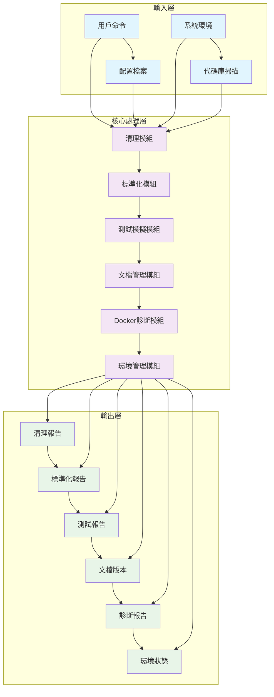

# 設計文件

## 概述

本設計文件描述了 ROAS Bot 代碼庫清理和標準化專案的架構設計。該專案旨在開發一個全面的腳本系統，實現自動化清理、代碼標準化、測試模擬、文檔管理、Docker診斷和虛擬環境管理功能，以提升代碼質量和維護性。

## 架構

### 整體架構圖



### 分層架構設計

#### 1. 輸入層 (Input Layer)

**職責：**
- 接收用戶命令和配置輸入
- 掃描系統環境和代碼庫狀態
- 驗證輸入參數和權限

**設計原則：**
- 保持輸入驗證的嚴格性
- 支持多種輸入格式（命令行、配置文件、環境變數）

#### 2. 核心處理層 (Core Processing Layer)

**職責：**
- 執行系統清理操作
- 進行代碼標準化和修復
- 模擬測試負載
- 管理文檔修訂和更新
- 診斷Docker啟動問題
- 管理虛擬環境

**設計原則：**
- 模塊化設計，每個功能獨立可測試
- 支持並行處理以提高效率
- 實現錯誤處理和重試機制

#### 3. 輸出層 (Output Layer)

**職責：**
- 生成各種操作報告
- 輸出標準化後的文件
- 提供測試結果和分析
- 發布文檔版本
- 輸出診斷信息
- 報告環境狀態

**設計原則：**
- 輸出格式統一且可讀性強
- 支持多種輸出格式（JSON、HTML、文本）
- 包含詳細的執行日誌和錯誤信息

## 元件和介面

### 核心處理器類別

#### CleanupManager 抽象類別
```python
from abc import ABC, abstractmethod
from pathlib import Path
from typing import List, Dict, Set
import logging

class CleanupManager(ABC):
    """清理管理器抽象類別"""
    
    def __init__(self, base_path: Path, dry_run: bool = False):
        self.base_path = base_path
        self.dry_run = dry_run
        self.logger = logging.getLogger(__name__)
        self.deleted_items: List[Path] = []
        self.skipped_items: List[Dict] = []
    
    @abstractmethod
    def identify_targets(self) -> Set[Path]:
        """識別清理目標"""
        pass
    
    @abstractmethod
    def safe_delete(self, target: Path) -> bool:
        """安全刪除文件或目錄"""
        pass
    
    @abstractmethod
    def generate_report(self) -> Dict:
        """生成清理報告"""
        pass
    
    def execute_cleanup(self) -> Dict:
        """執行清理操作"""
        targets = self.identify_targets()
        for target in targets:
            if not self.safe_delete(target):
                self.skipped_items.append({
                    'path': target,
                    'reason': '刪除失敗或跳過'
                })
        return self.generate_report()
```

### 標準化系統設計

#### CodeStandardizer 服務
```python
import subprocess
import sys
from pathlib import Path
from typing import Dict, List, Optional
import logging

class CodeStandardizer:
    """代碼標準化服務"""
    
    def __init__(self, project_root: Path):
        self.project_root = project_root
        self.logger = logging.getLogger(__name__)
        self.results: Dict[str, any] = {}
    
    def run_ruff_check(self) -> Dict:
        """執行 ruff 檢查和修復"""
        try:
            result = subprocess.run([
                sys.executable, '-m', 'ruff', 'check', '.', '--fix'
            ], cwd=self.project_root, capture_output=True, text=True, timeout=300)
            
            return {
                'success': result.returncode == 0,
                'stdout': result.stdout,
                'stderr': result.stderr,
                'returncode': result.returncode
            }
        except subprocess.TimeoutExpired:
            return {'success': False, 'error': '執行超時'}
        except Exception as e:
            return {'success': False, 'error': str(e)}
    
    def run_ruff_format(self) -> Dict:
        """執行 ruff 格式化"""
        try:
            result = subprocess.run([
                sys.executable, '-m', 'ruff', 'format', '.'
            ], cwd=self.project_root, capture_output=True, text=True, timeout=300)
            
            return {
                'success': result.returncode == 0,
                'stdout': result.stdout,
                'stderr': result.stderr,
                'returncode': result.returncode
            }
        except subprocess.TimeoutExpired:
            return {'success': False, 'error': '執行超時'}
        except Exception as e:
            return {'success': False, 'error': str(e)}
    
    def run_mypy_check(self) -> Dict:
        """執行 mypy 類型檢查"""
        try:
            result = subprocess.run([
                sys.executable, '-m', 'mypy', '--strict', '--explicit-package-bases', '.'
            ], cwd=self.project_root, capture_output=True, text=True, timeout=600)
            
            return {
                'success': result.returncode == 0,
                'stdout': result.stdout,
                'stderr': result.stderr,
                'returncode': result.returncode
            }
        except subprocess.TimeoutExpired:
            return {'success': False, 'error': '執行超時'}
        except Exception as e:
            return {'success': False, 'error': str(e)}
    
    def execute_standardization(self) -> Dict:
        """執行完整的標準化流程"""
        self.results['ruff_check'] = self.run_ruff_check()
        self.results['ruff_format'] = self.run_ruff_format()
        self.results['mypy_check'] = self.run_mypy_check()
        
        return self.results
```

## 資料模型

### 清理系統資料模型

#### cleanup_operations 表格 (cleanup_operations)
```sql
CREATE TABLE cleanup_operations (
    id INTEGER PRIMARY KEY AUTOINCREMENT,
    operation_id TEXT NOT NULL UNIQUE,
    start_time TIMESTAMP NOT NULL,
    end_time TIMESTAMP,
    status TEXT NOT NULL CHECK(status IN ('running', 'completed', 'failed', 'cancelled')),
    base_path TEXT NOT NULL,
    dry_run BOOLEAN NOT NULL DEFAULT FALSE,
    total_targets INTEGER DEFAULT 0,
    deleted_count INTEGER DEFAULT 0,
    skipped_count INTEGER DEFAULT 0,
    error_count INTEGER DEFAULT 0,
    report_path TEXT,
    created_at TIMESTAMP DEFAULT CURRENT_TIMESTAMP,
    updated_at TIMESTAMP DEFAULT CURRENT_TIMESTAMP
);

CREATE TABLE cleanup_targets (
    id INTEGER PRIMARY KEY AUTOINCREMENT,
    operation_id TEXT NOT NULL,
    target_path TEXT NOT NULL,
    target_type TEXT NOT NULL CHECK(target_type IN ('file', 'directory', 'cache', 'temp')),
    action TEXT NOT NULL CHECK(action IN ('deleted', 'skipped', 'error')),
    reason TEXT,
    size_bytes INTEGER,
    modified_time TIMESTAMP,
    processed_at TIMESTAMP DEFAULT CURRENT_TIMESTAMP,
    FOREIGN KEY (operation_id) REFERENCES cleanup_operations (operation_id)
);

CREATE INDEX idx_cleanup_operations_status ON cleanup_operations(status);
CREATE INDEX idx_cleanup_operations_time ON cleanup_operations(start_time);
CREATE INDEX idx_cleanup_targets_operation ON cleanup_targets(operation_id);
```

## 錯誤處理

### 錯誤類別層次結構
```python
class CleanupError(Exception):
    """清理操作基礎錯誤"""
    pass

class StandardizationError(Exception):
    """標準化操作基礎錯誤"""
    pass

class TestSimulationError(Exception):
    """測試模擬基礎錯誤"""
    pass

class DocumentationError(Exception):
    """文檔管理基礎錯誤"""
    pass

class DockerDiagnosticError(Exception):
    """Docker診斷基礎錯誤"""
    pass

class EnvironmentError(Exception):
    """環境管理基礎錯誤"""
    pass

# 具體錯誤類別
class FilePermissionError(CleanupError):
    """文件權限錯誤"""
    pass

class RuffExecutionError(StandardizationError):
    """Ruff執行錯誤"""
    pass

class MyPyTypeError(StandardizationError):
    """MyPy類型錯誤"""
    pass

class DockerStartupError(DockerDiagnosticError):
    """Docker啟動錯誤"""
    pass

class VirtualEnvError(EnvironmentError):
    """虛擬環境錯誤"""
    pass
```

### 錯誤處理策略
1. **預防性策略**：在操作前進行驗證和權限檢查，避免潛在錯誤
2. **重試策略**：對於暫時性錯誤（如文件鎖定），實現指數退避重試機制
3. **降級策略**：當非關鍵功能失敗時，繼續執行其他操作並記錄錯誤
4. **報告策略**：所有錯誤都記錄在詳細報告中，便於後續分析

## 測試策略

### 測試層次
1. **單元測試**：針對每個模塊和類別進行獨立測試，確保功能正確性
2. **整合測試**：測試模塊之間的交互和數據流，驗證系統整合性
3. **端到端測試**：模擬真實用戶場景，測試完整的工作流程

### 測試工具
- **pytest**：主要的測試框架，用於單元測試和整合測試
- **unittest**：用於兼容性測試和傳統測試用例
- **tox**：用於多環境測試，確保在不同Python版本下的兼容性
- **Docker Test Containers**：用於Docker相關功能的測試

### 測試資料管理
- 使用臨時目錄和文件進行清理功能測試
- 使用模擬代碼庫進行標準化功能測試
- 使用容器化的測試環境進行Docker診斷測試
- 測試完成後自動清理所有測試資料

## 效能考量

### 處理效能
1. **並行處理**：對於獨立操作（如文件清理），使用多線程或異步處理提高效率
2. **增量處理**：支持增量操作，避免重複處理未變更的文件
3. **資源監控**：實時監控系統資源使用情況，避免過度消耗

### 記憶體管理
1. **流式處理**：對於大文件操作，使用流式處理避免內存溢出
2. **垃圾回收**：及時釋放不再需要的資源，優化內存使用

## 安全性

### 數據安全
1. **權限驗證**：所有文件操作前進行權限檢查，防止未授權訪問
2. **敏感數據處理**：避免在日誌中記錄敏感信息（如密碼、token）
3. **輸入消毒**：所有用戶輸入都進行驗證和消毒，防止注入攻擊

### 系統安全
1. **沙箱環境**：在隔離的環境中執行潛在危險操作
2. **資源限制**：限制單個操作的最大資源使用量，防止資源耗盡

## 部署和維護

### 部署策略
1. **容器化部署**：使用Docker容器打包應用，確保環境一致性
2. **腳本化部署**：提供自動化部署腳本，簡化部署過程
3. **滾動更新**：支持無停機部署和版本更新

### 維護策略
1. **監控日誌**：實現詳細的日誌記錄和監控，便於問題排查
2. **健康檢查**：定期進行系統健康檢查，確保服務可用性
3. **備份機制**：重要數據和配置定期備份，防止數據丟失