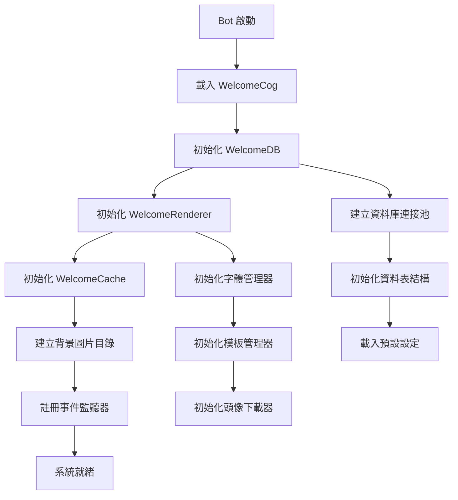
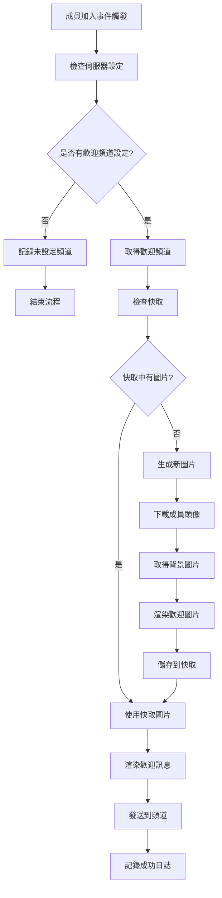
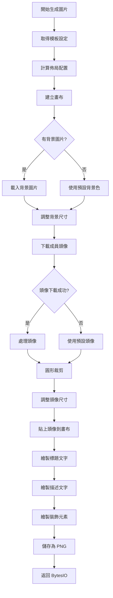
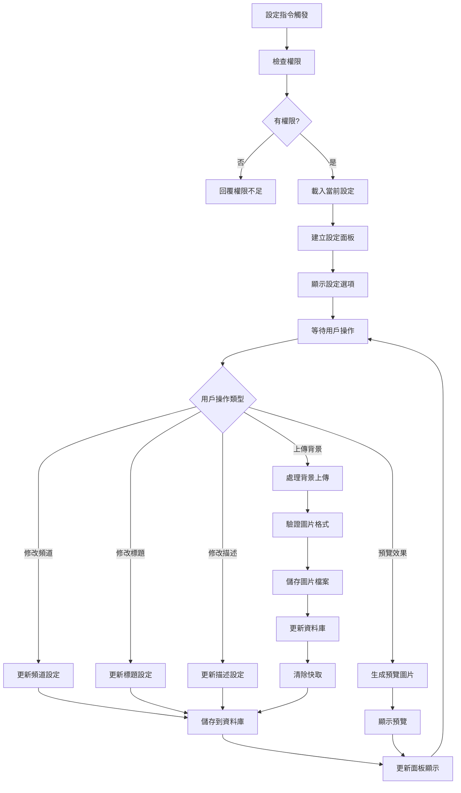
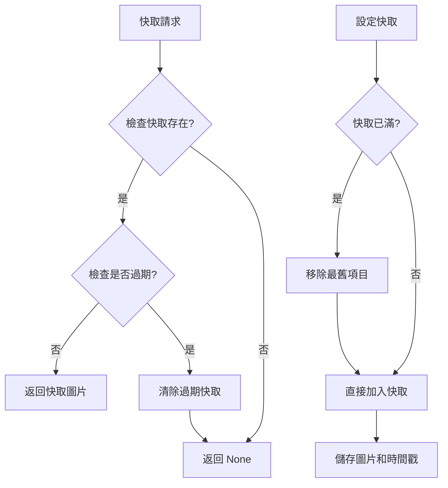
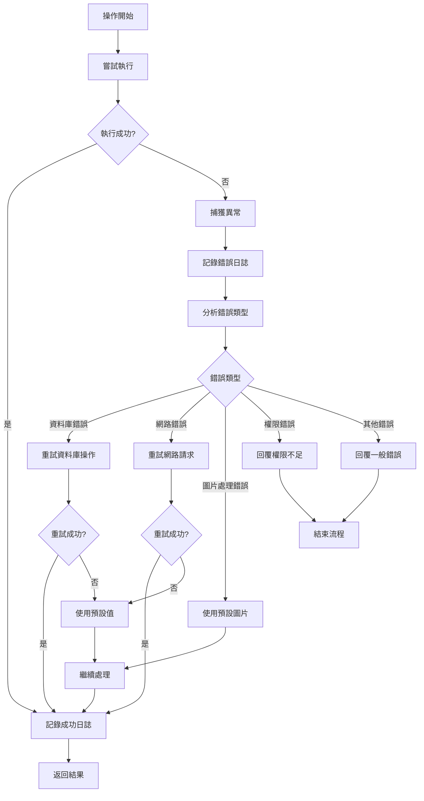

# Discord 歡迎系統流程圖

## 🎯 系統架構概覽

```
┌─────────────────────────────────────────────────────────────────┐
│                    Discord 歡迎系統架構                        │
├─────────────────────────────────────────────────────────────────┤
│  ┌─────────────┐  ┌─────────────┐  ┌─────────────┐          │
│  │  主控制模組  │  │  渲染引擎   │  │  資料庫管理  │          │
│  │ WelcomeCog  │  │  Renderer   │  │   WelcomeDB │          │
│  └─────────────┘  └─────────────┘  └─────────────┘          │
│         │                │                │                  │
│         └────────────────┼────────────────┘                  │
│                          │                                  │
│  ┌─────────────┐  ┌─────────────┐  ┌─────────────┐          │
│  │  快取管理   │  │  配置管理   │  │  面板系統   │          │
│  │   Cache     │  │   Config    │  │    Panel    │          │
│  └─────────────┘  └─────────────┘  └─────────────┘          │
└─────────────────────────────────────────────────────────────────┘
```

## 🔄 主要流程圖

### 1. 系統初始化流程



### 2. 成員加入事件處理流程



### 3. 圖片生成詳細流程



### 4. 設定管理流程



### 5. 快取管理流程



### 6. 錯誤處理流程



## 📊 核心組件職責

### WelcomeCog (主控制模組)
- **職責**: 協調所有組件，處理 Discord 事件
- **主要方法**:
  - `on_member_join()`: 處理成員加入事件
  - `send_welcome_message()`: 發送歡迎訊息
  - `_generate_welcome_image()`: 生成歡迎圖片
  - `handle_background_upload()`: 處理背景上傳

### WelcomeRenderer (渲染引擎)
- **職責**: 生成歡迎圖片
- **主要組件**:
  - `AvatarDownloader`: 下載和處理頭像
  - `FontManager`: 管理字體
  - `TemplateManager`: 管理模板
  - `LayoutCalculator`: 計算佈局

### WelcomeDB (資料庫管理)
- **職責**: 管理設定和背景圖片
- **主要操作**:
  - `get_settings()`: 取得伺服器設定
  - `update_setting()`: 更新設定
  - `update_welcome_background()`: 更新背景圖片

### WelcomeCache (快取管理)
- **職責**: 快取生成的圖片
- **主要功能**:
  - `get()`: 取得快取圖片
  - `set()`: 設定快取圖片
  - `clear()`: 清除快取

## 🔧 技術特點

1. **模組化設計**: 每個組件都有明確的職責
2. **錯誤處理**: 完善的異常捕獲和重試機制
3. **快取優化**: 避免重複生成相同圖片
4. **配置靈活**: 支援自訂背景、文字、位置等
5. **模板系統**: 支援多種視覺風格
6. **字體管理**: 支援多種字體和回退機制

## 📈 性能優化

- **快取機制**: 減少重複圖片生成
- **連接池**: 優化資料庫連接
- **異步處理**: 提高並發性能
- **圖片壓縮**: 優化檔案大小
- **錯誤恢復**: 確保系統穩定性 